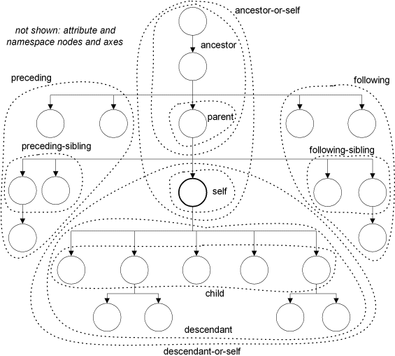

# Коллекция готовых SQL запросов для PostgreSQL

## Содержание

**[Получение пользовательских данных](#Получение-пользовательских-данных)**
   1. [Валидация и домены](#Валидация-и-домены)
      1. [Как проверить email на валидность?](#Как-проверить-email-на-валидность)
      1. [Как проверить CSS цвет на валидность?](#Как-проверить-CSS-цвет-на-валидность)
      1. [Как проверить ИНН на валидность?](#Как-проверить-ИНН-на-валидность)
   1. [Строки](#Строки)
      1. [Агрегатная функция конкатенации строк (аналог `group_concat()` в MySQL)](#Агрегатная-функция-конкатенации-строк-аналог-group_concat-в-MySQL)
      1. [Как транслитерировать русские буквы на английские?](#Как-транслитерировать-русские-буквы-на-английские)
      1. [Как распарсить CSV строку в таблицу?](#Как-распарсить-CSV-строку-в-таблицу)
      1. [Как определить пол по ФИО (фамилии, имени, отчеству) на русском языке?](#Как-определить-пол-по-ФИО-фамилии-имени-отчеству-на-русском-языке)
      1. [Как заквотировать строку для использования в регулярном выражении?](#Как-заквотировать-строку-для-использования-в-регулярном-выражении)
      1. [Как заквотировать строку для использования в операторе LIKE?](#Как-заквотировать-строку-для-использования-в-операторе-LIKE)
   1. [JSON](#JSON)
      1. [Как получить записи, которые удовлетворяют условиям из JSON массива?](#Как-получить-записи-которые-удовлетворяют-условиям-из-JSON-массива)
      1. [Как сравнить 2 JSON и получить отличия?](#Как-сравнить-2-JSON-и-получить-отличия)
   1. [Массивы](#Массивы)
      1. [Агрегатная функция конкатенации (объединения) массивов](#Агрегатная-функция-конкатенации-(объединения)-массивов)
      1. [Как получить одинаковые элементы массивов (пересечение массивов)?](#Как-получить-одинаковые-элементы-массивов-пересечение-массивов)
      1. [Как получить уникальные элементы массива или отсортировать их?](#Как-получить-уникальные-элементы-массива-или-отсортировать-их)
      1. [Как получить отличающиеся элементы двух массивов?](#Как-получить-отличающиеся-элементы-двух-массивов)
      1. [Как сделать внешний ключ на элементы массива?](#Как-сделать-внешний-ключ-на-элементы-массива)
   1. [Поиск по фразе (точный и неточный)](#Поиск-по-фразе-точный-и-неточный)
      1. [Как найти список строк, совпадающих со списком шаблонов?](#Как-найти-список-строк-совпадающих-со-списком-шаблонов)
      1. [Как получить названия сущностей по поисковой фразе с учётом начала слов (поисковые подсказки)?](#Как-получить-названия-сущностей-по-поисковой-фразе-с-учётом-начала-слов-поисковые-подсказки)
      1. [Как для слова с опечаткой (ошибкой) получить наиболее подходящие варианты слов для замены (исправление опечаток)?](#Как-для-слова-с-опечаткой-ошибкой-получить-наиболее-подходящие-варианты-слов-для-замены-исправление-опечаток)
   1. [Деревья и графы](#Деревья-и-графы)
      1. [Как получить список названий предков и наследников для каждого узла дерева (на примере регионов)?](#Как-получить-список-названий-предков-и-наследников-для-каждого-узла-дерева-на-примере-регионов)
      1. [Как получить циклические связи в графе?](#Как-получить-циклические-связи-в-графе)
      1. [Как защититься от циклических связей в графе?](#Как-защититься-от-циклических-связей-в-графе)
      1. [Как получить названия всех уровней сферы деятельности 4-го уровня?](#Как-получить-названия-всех-уровней-сферы-деятельности-4-го-уровня)
   1. [Оптимизация выполнения запросов](#Оптимизация-выполнения-запросов)
      1. [Как посмотреть на план выполнения запроса (EXPLAIN) в наглядном графическом виде?](#Как-посмотреть-на-план-выполнения-запроса-EXPLAIN-в-наглядном-графическом-виде)
      1. [Как ускорить SELECT запросы с тысячами значений в IN(...)?](#Как-ускорить-SELECT-запросы-c-тысячами-значениями-в-IN)
      1. [Как использовать вывод EXPLAIN запроса в другом запросе?](#Как-использовать-вывод-EXPLAIN-запроса-в-другом-запросе)
      1. [Как ускорить SELECT запрос после переезда с PostgreSQL v10 на v12?](#Как-ускорить-SELECT-запрос-после-переезда-с-PostgreSQL-v10-на-v12)
      1. [Как ускорить SELECT COUNT(\*) запрос?](#Как-ускорить-SELECT-COUNT-запрос)
      1. [Как выполнить функцию N тысяч раз и измерить скорость выполнения?](#Как-выполнить-функцию-N-тысяч-раз-и-измерить-скорость-выполнения)
   1. [Как получить записи-дубликаты по значению полей?](#Как-получить-записи-дубликаты-по-значению-полей)
   1. [Как получить время выполнения запроса в его результате?](#Как-получить-время-выполнения-запроса-в-его-результате)
   1. [Как разбить большую таблицу по N тысяч записей, получив диапазоны id?](#Как-разбить-большую-таблицу-по-N-тысяч-записей-получив-диапазоны-id)
   1. [Как выполнить следующий SQL запрос, если предыдущий не вернул результат?](#Как-выполнить-следующий-SQL-запрос-если-предыдущий-не-вернул-результат)
   1. [Как развернуть запись в набор колонок?](#Как-развернуть-запись-в-набор-колонок)
   1. [Как получить итоговую сумму для каждой записи в одном запросе?](#Как-получить-итоговую-сумму-для-каждой-записи-в-одном-запросе)
   1. [Как получить возраст по дате рождения?](#Как-получить-возраст-по-дате-рождения)
   1. [Как получить дату или дату и время в формате ISO-8601?](#Как-получить-дату-или-дату-и-время-в-формате-ISO-8601)
   1. [Как вычислить дистанцию между 2-мя точками на Земле по её поверхности в километрах?](#Как-вычислить-дистанцию-между-2-мя-точками-на-Земле-по-её-поверхности-в-километрах)
   1. [Как найти ближайшие населённые пункты относительно заданных координат?](#Как-найти-ближайшие-населённые-пункты-относительно-заданных-координат)
   1. [Как вычислить приблизительный объём данных для результата SELECT запроса?](#Как-вычислить-приблизительный-объём-данных-для-результата-SELECT-запроса)
   1. [Почему запрос с подзапросом в NOT IN() возвращает 0 записей?](#Почему-запрос-с-подзапросом-в-NOT-IN-возвращает-0-записей)
   1. [Как очень быстро получить количество записей в большой таблице?](#Как-очень-быстро-получить-количество-записей-в-большой-таблице)

  
**[Модификация пользовательских данных (DML)](#Модификация-пользовательских-данных-DML)**
   1. [Как добавить или обновить записи одним запросом (UPSERT)?](#Как-добавить-или-обновить-записи-одним-запросом-UPSERT)
   1. [Как сделать `INSERT ... ON CONFLICT ...` без увеличения последовательности для дубликатов?](#Как-сделать-INSERT--ON-CONFLICT--без-увеличения-последовательности-для-дубликатов)
   1. [Как модифицировать данные в нескольких таблицах и вернуть id затронутых записей в одном запросе?](#Как-модифицировать-данные-в-нескольких-таблицах-и-вернуть-id-затронутых-записей-в-одном-запросе)
   1. [Как модифицировать данные в связанных таблицах одним запросом?](#Как-модифицировать-данные-в-связанных-таблицах-одним-запросом)
   1. [Как добавить запись с id, значение которого нужно сохранить ещё в другом поле в том же INSERT запросе?](#Как-добавить-запись-с-id-значение-которого-нужно-сохранить-ещё-в-другом-поле-в-том-же-INSERT-запросе)
   1. [Как сделать несколько последующих запросов с полученным при вставке id из первого запроса?](#Как-сделать-несколько-последующих-запросов-с-полученным-при-вставке-id-из-первого-запроса)
   1. [Как обновить запись так, чтобы не затереть чужие изменения, уже сделанные кем-то?](#Как-обновить-запись-так-чтобы-не-затереть-чужие-изменения-уже-сделанные-кем-то)
   1. [Как обновить несколько строк по разным условиям в одном запросе?](#Как-обновить-несколько-строк-по-разным-условиям-в-одном-запросе)
   1. [Как обновить или удалить миллионы записей в таблице не блокируя все записи и не нагружая БД?](#Как-обновить-или-удалить-миллионы-записей-в-таблице-не-блокируя-все-записи-и-не-нагружая-БД)
   1. [Как удалить десятки тысяч записей в таблице не блокируя все записи и не нагружая БД?](#Как-удалить-десятки-тысяч-записей-в-таблице-не-блокируя-все-записи-и-не-нагружая-БД)
   1. [Как для одной сущности сделать ограничение на количество вставляемых зависимых сущностей?](#Как-для-одной-сущности-сделать-ограничение-на-количество-вставляемых-зависимых-сущностей)

**[Модификация схемы данных (DDL)](#Модификация-схемы-данных-DDL)**
   1. [Как добавить колонку в существующую таблицу без её блокирования?](#Как-добавить-колонку-в-существующую-таблицу-без-её-блокирования)
   1. [Как добавить ограничение таблицы, если оно ещё не существует?](#Как-добавить-ограничение-таблицы-если-оно-ещё-не-существует)
   1. [Как изменить ограничение внешнего ключа без блокирования таблицы?](#Как-изменить-ограничение-внешнего-ключа-без-блокирования-таблицы)
   1. [Как проверить, что при добавлении или обновлении записи заполнены N полей из M возможных?](#Как-проверить-что-при-добавлении-или-обновлении-записи-заполнены-N-полей-из-M-возможных)
  
**[Индексы](#Индексы)**
   1. [Как создать или пересоздать индекс в существующей таблице без её блокирования?](#Как-создать-или-пересоздать-индекс-в-существующей-таблице-без-её-блокирования)
   1. [Как сделать составной уникальный индекс, где одно из полей может быть null?](#Как-сделать-составной-уникальный-индекс-где-одно-из-полей-может-быть-null)
   1. [Как починить сломаный уникальный индекс, имеющий дубликаты?](#Как-починить-сломаный-уникальный-индекс-имеющий-дубликаты)
   1. [Как временно отключить индекс?](#Как-временно-отключить-индекс)
   1. [Как сделать компактный уникальный индекс на текстовое поле?](#Как-сделать-компактный-уникальный-индекс-на-текстовое-поле)

**[Администрирование](#Администрирование)**
   1. [Как получить список процессов (SQL запросов), выполняющихся сейчас?](#Как-получить-список-процессов-SQL-запросов-выполняющихся-сейчас)
   1. [Как остановить или завершить работу процессов?](#Как-остановить-или-завершить-работу-процессов)
   1. [Как получить список всех функций БД, включая триггерные процедуры?](#Как-получить-список-всех-функций-БД-включая-триггерные-процедуры)
   1. [Как получить список всех зависимостей (внешних ключей) между таблицами БД?](#Как-получить-список-всех-зависимостей-внешних-ключей-между-таблицами-БД)
   1. [Как получить статистику использования индексов?](#Как-получить-статистику-использования-индексов)
   1. [Как получить список установленных расширений (extensions)?](#Как-получить-список-установленных-расширений-extensions)
   1. [Как получить список таблиц с размером занимаемого места и примерным количеством строк?](#Как-получить-список-таблиц-с-размером-занимаемого-места-и-примерным-количеством-строк)
   1. [Как получить список самых ресурсоёмких SQL запросов?](#Как-получить-список-самых-ресурсоёмких-SQL-запросов)
   1. [Как получить и изменить значения параметров конфигурации выполнения?](#Как-получить-и-изменить-значения-параметров-конфигурации-выполнения)
   1. [Как получить все активные в данный момент процессы автовакуумa и время их работы?](#Как-получить-все-активные-в-данный-момент-процессы-автовакуумa-и-время-их-работы)
   1. [Как узнать, почему время ответа от базы периодически падает?](#Как-узнать-почему-время-ответа-от-базы-периодически-падает)
   1. [Как обезопасить приложение от тяжёлых миграций, приводящих к блокированию запросов?](#Как-обезопасить-приложение-от-тяжёлых-миграций-приводящих-к-блокированию-запросов)
   1. [Simple index checking](#Simple-index-checking)
   1. [Как скопировать таблицы из одной базы данных в другую?](#Как-скопировать-таблицы-из-одной-базы-данных-в-другую)
   1. [Как проверить синтаксис SQL кода без его выполнения?](#Как-проверить-синтаксис-SQL-кода-без-его-выполнения)

## Получение пользовательских данных

### Валидация и домены

#### Как проверить email на валидность?

```sql
CREATE DOMAIN email AS text CHECK(length(VALUE) BETWEEN 6 AND 320 AND VALUE = trim(VALUE) AND VALUE LIKE '_%@_%.__%' AND is_email(VALUE));

select 'e@m.ai'::email; --ok
select 'e@m.__'::email; --error
```
Регулярное выражение в файле [`is_email.sql`](functions/is_email.sql) взято и адаптировано [отсюда](https://github.com/rin-nas/regexp-patterns-library/)

#### Как проверить CSS цвет на валидность?

```sql
-- https://developer.mozilla.org/en-US/docs/Web/CSS/color_value
-- https://regex101.com/r/CMQKwv/3/
CREATE DOMAIN css_color AS text CHECK(length(VALUE) BETWEEN 4 AND 9 AND VALUE ~ '^#[a-fA-F\d]{3}(?:[a-fA-F\d]{3})?$|^#[a-fA-F\d]{4}(?:[a-fA-F\d]{4})?$');

select '#777'::css_color; --ok
select '$777'::css_color; --error
```

#### Как проверить ИНН на валидность?

https://ru.wikipedia.org/wiki/Идентификационный_номер_налогоплательщика

```sql
CREATE DOMAIN inn10 AS text CHECK(length(VALUE) = 10 AND VALUE ~ '^\d+$'); -- ИНН юридического лица
CREATE DOMAIN inn12 AS text CHECK(length(VALUE) = 12 AND VALUE ~ '^\d+$'); -- ИНН физического лица и ИП
CREATE DOMAIN inn AS text CHECK(length(VALUE) IN (10, 12) AND VALUE ~ '^\d+$'); -- ИНН юридического или физического лица или ИП

select '1234567890'::inn; --ok
select '123456789012'::inn; --ok
select '1234567890'::inn10; --ok
select '123456789012'::inn12; --ok

select '12345678901'::inn; --error
select '1234567890123'::inn; --error
select '12345678901'::inn10; --error
select '1234567890123'::inn12; --error
```

### Строки

#### Агрегатная функция конкатенации строк (аналог [group_concat()](https://dev.mysql.com/doc/refman/5.7/en/group-by-functions.html#function_group-concat) в MySQL)

```sql
SELECT STRING_AGG(DISTINCT s, ', ' ORDER BY s) AS field_alias FROM (VALUES ('b'), ('a'), ('b')) AS t(s); -- a, b

SELECT ARRAY_TO_STRING(ARRAY_AGG(DISTINCT s ORDER BY s), ', ') AS field_alias FROM (VALUES ('b'), ('a'), ('b')) AS t(s); -- a, b
```

#### Как [транслитерировать](https://ru.wikipedia.org/wiki/%D0%A2%D1%80%D0%B0%D0%BD%D1%81%D0%BB%D0%B8%D1%82%D0%B5%D1%80%D0%B0%D1%86%D0%B8%D1%8F) русские буквы на английские?

[Всё о транслитерации](https://habr.com/ru/post/499574/)

Современные функции транслитерации по правилам библиотеки "[Юлия](https://github.com/nalgeon/iuliia)":
1. [iuliia_translate_mosmetro.sql](functions/iuliia_translate.sql)
2. [iuliia_translate_wikipedia.sql](functions/iuliia_translate.sql)

Устаревшая функции транслитерации [slugify.sql](functions/slugify.sql)

#### Как распарсить CSV строку в таблицу?

PostgreSQL умеет читать и писать CSV в файл на сервере БД. А это парсер CSV из строки. Смотри [`csv_parse.sql`](functions/csv_parse.sql)

Область применения — массовое добавление и обновление записей в таблицах БД через SQL миграции БД и административные интерфейсы.

[Выполнить SQL](http://sqlfiddle.postgrespro.ru/#!22/0/17354) или [Выполнить SQL](https://www.db-fiddle.com/f/eqsGTTqAmH1QoQ8LL63jM/1)

Запрос

```sql
select
    CASE WHEN row[1] ~ '^\d+$' THEN row[1]::integer ELSE NULL END AS id,
    row[2] AS kladr_id,
    row[3] AS name
from csv_parse($$
id; kladr_id; name
501 ; 8300000000000 ; ";Автономный ;"";округ""
  ""Ненецкий"";";unknown
      751;8600800000000; "  Автономный округ ""Ханты-Мансийский"", Район Советский" ;
     1755;8700300000000;  Автономный округ Чукотский, Район Билибинский
     1725;7501900000000;Край Забайкальский, Район Петровск-Забайкальский

  ;;
       711;2302100000000;Край Краснодарский, Район Лабинский
       729;2401600000000;Край Красноярский, Район Иланский
       765;2700700000000;Край Хабаровский, Район Вяземский
       765;;
$$, ';', false) as row;
```

Результат

id|kladr_id|name
-:|:-------|:---
\<null>|kladr_id|name
501|8300000000000|;Автономный ;";округ"\n"Ненецкий";
751|8600800000000|&nbsp;&nbsp;Автономный округ "Ханты-Мансийский"| Район Советский
1755|8700300000000|Автономный округ Чукотский| Район Билибинский
1725|7501900000000|Край Забайкальский| Район Петровск-Забайкальский
711|2302100000000|Край Краснодарский| Район Лабинский
729|2401600000000|Край Красноярский| Район Иланский
765|2700700000000|Край Хабаровский| Район Вяземский
765|\<null>|\<null>


#### Как определить пол по ФИО (фамилии, имени, отчеству) на русском языке?

* [`gender_by_name.sql`](gender_by_name/gender_by_name.sql)
* [`tables.sql`](gender_by_name/tables.sql)
* [`gender_by_ending.csv`](gender_by_name/gender_by_ending.csv)
* [`person_name_dictionary.csv`](gender_by_name/person_name_dictionary.csv)

#### Как заквотировать строку для использования в регулярном выражении?

Смотри [`quote_regexp.sql`](functions/quote_regexp.sql)

#### Как заквотировать строку для использования в операторе LIKE?

Смотри [`quote_like.sql`](functions/quote_like.sql)

### JSON

#### Как получить записи, которые удовлетворяют условиям из JSON массива?

```sql
SELECT * FROM (
    VALUES ('[{"id" : 1, "created_at" : "2003-07-01", "name": "Sony"}, 
              {"id" : 2, "created_at" : "2008-10-27", "name": "Samsung"}]'::jsonb),
           ('[{"id" : 3, "created_at" : "2010-03-30", "name": "LG"},   
             {"id" : 4, "created_at" : "2018-12-09", "name": "Apple"}]'::jsonb)
) AS t
WHERE EXISTS(
          SELECT *
          FROM jsonb_to_recordset(t.column1) AS x(id int, created_at timestamp, name text)
          WHERE x.id IN (1, 3) AND x.created_at > '2000-01-01' AND name NOT LIKE 'P%'
      )
```

#### Как сравнить 2 JSON и получить отличия?

Смотри [`jsonb_diff.sql`](functions/jsonb_diff.sql)

### Массивы

#### Агрегатная функция конкатенации (объединения) массивов

Смотри [`array_cat_agg.sql`](functions/array_cat_agg.sql)

#### Как получить одинаковые элементы массивов (пересечение массивов)?

```sql
-- для 2-х массивов
select array_agg(a) 
from unnest(array[1, 2, 3, 4, 5]) a 
where a = any(array[4, 5, 6, 7, 8]); -- {4,5}

-- для N массивов
select array_agg(a1)
from unnest(array[1, 2, 3, 4, 5]) a1
inner join unnest(array[3, 4, 5, 6, 7]) a2 on a1 = a2
inner join unnest(array[4, 5, 6, 7, 8]) a3 on a1 = a3; -- {4,5}
```

#### Как получить уникальные элементы массива или отсортировать их?

Для `int[]` лучше воспользоваться готовыми функциями `uniq()` и `sort()` из модуля [intarray](https://postgrespro.ru/docs/postgresql/12/intarray).

```sql
-- способ 1
SELECT ARRAY_AGG(DISTINCT a ORDER BY a) FROM UNNEST(ARRAY[1,2,3,2,1]) t(a); -- {1,2,3}

-- способ 2
SELECT ARRAY(SELECT DISTINCT UNNEST(ARRAY[1,2,3,2,1]) ORDER BY 1); -- {1,2,3}

-- готовая функция
CREATE FUNCTION array_unique(anyarray) RETURNS anyarray AS $$
SELECT array_agg(DISTINCT x ORDER BY x) FROM unnest($1) t(x);
$$ LANGUAGE SQL IMMUTABLE;
```

#### Как получить отличающиеся элементы двух массивов?

```sql
create or replace function array_diff(anyarray, anyarray)
    returns anyarray
    language sql
as $$
select array(
    select *
    from (select unnest($1) as element) t
    where element not in (select unnest($2))
);
$$;

-- поведение одинаковое с одноимённой функцией на PHP
select array_diff(array[2, 4, 7, 8], array[1, 2, 3, 4, 5]); -- {7,8}
```

#### Как сделать внешний ключ на элементы массива?

Нелья использовать колонку-массив для хранения элементов, значения которых ссылаются на значения колонки из другой таблицы по внешнему ключу (FK). Это не соответствует [первой нормальной форме](https://ru.wikipedia.org/wiki/%D0%9F%D0%B5%D1%80%D0%B2%D0%B0%D1%8F_%D0%BD%D0%BE%D1%80%D0%BC%D0%B0%D0%BB%D1%8C%D0%BD%D0%B0%D1%8F_%D1%84%D0%BE%D1%80%D0%BC%D0%B0) в реляционной модели данных. Необходимо использовать дополнительную таблицу в отношении "один ко многим". Так же в этом случае для поддержки целостности данных по внешним ключам и исключению дубликатов доступны штатные механизмы.

Однако, технически это возможно. Ниже пример проверки значений массива без триггеров. Протестировано на PostgreSQL 10.5.
Т.к. FK для массивов делать нельзя, код функции годится как шаблон для разработки сложных ограничений для проверки элементов массива (например [ltree](https://postgrespro.ru/docs/postgrespro/12/ltree)).

```sql
create schema if not exists test;

CREATE OR REPLACE FUNCTION test.check_foreign_key_array(data anyarray, ref_schema text, ref_table text, ref_column text)
    RETURNS BOOL
    RETURNS NULL ON NULL INPUT
    LANGUAGE plpgsql
AS
$body$
DECLARE
    fake_id text;
    sql text default format($$
            select id::text
            from unnest($1) as x(id)
            where id is not null
              and id not in (select %3$I
                             from %1$I.%2$I
                             where %3$I = any($1))
            limit 1;
        $$, ref_schema, ref_table, ref_column);
BEGIN
    EXECUTE sql USING data INTO fake_id;

    IF (fake_id IS NOT NULL) THEN
        RAISE NOTICE 'Array element value % does not exist in column %.%.%', fake_id, ref_schema, ref_table, ref_column;
        RETURN false;
    END IF;

    RETURN true;
END
$body$;

drop table if exists test.t1, test.t2;

create table test.t1 (
    id integer generated by default as identity primary key
);

create table test.t2 (
    id integer generated by default as identity primary key,
    t1_ids integer[] not null check (test.check_foreign_key_array(t1_ids, 'test', 't1', 'id'))
);

insert into test.t1 (id) values (default), (default), (default); --ok
insert into test.t2 (id, t1_ids) values (default, array[1,2,3]); --ok
insert into test.t2 (id, t1_ids) values (default, array[1,2,3,555]); --error
```

Пример добавления ограничения для типа поля [ltree](https://postgrespro.ru/docs/postgrespro/12/ltree):
```sql
alter table region
    add constraint region_tree_path_ids_check
        check (
                tree_path_ids::text ~ '^\d+(\.\d+)*$|^$' -- список родительских id через точку
                and check_foreign_key_array(string_to_array(tree_path_ids::text, '.')::int[], 'public', 'region', 'id')
        )
        not valid; --при необходимости
```

### Поиск по фразе (точный и неточный)

#### Как найти список строк, совпадающих со списком шаблонов?
```sql
-- было
SELECT *
FROM (VALUES
      ('foo bar zap bing'),
      ('man foo'),
      ('bar zap'),
      ('bing'),
      ('foo bar')) AS t(words)
WHERE words LIKE '%bar%' OR words LIKE '%zap%' OR words LIKE '%fix%' OR words LIKE '%new%';

-- стало
SELECT *
FROM (VALUES
      ('foo bar zap bing'),
      ('man foo'),
      ('bar zap'),
      ('bing'),
      ('foo bar')) AS t(words)
WHERE words LIKE ANY (ARRAY['%bar%', '%zap%', '%fix%', '%new%']);
```

#### Как получить названия сущностей по поисковой фразе с учётом начала слов (поисковые подсказки)?

См. так же [полнотекстовый поиск](https://postgrespro.ru/docs/postgresql/11/textsearch).

```sql
CREATE INDEX /*CONCURRENTLY*/ t_name_trigram_index ON t USING GIN (lower(name) gin_trgm_ops);

WITH
normalize AS (
    SELECT ltrim(REGEXP_REPLACE(LOWER('бар '), '[^а-яёa-z0-9]+', ' ', 'gi')) AS query
),
vars AS (
    SELECT CONCAT('%', REPLACE(quote_like(trim(normalize.query)), ' ', '_%'), '%') AS query_like,
           CONCAT('(?<![а-яёa-z0-9])', REPLACE(quote_regexp(normalize.query), ' ', '(?:[^а-яёa-z0-9]+|$)')) AS query_regexp
    FROM normalize
)
SELECT 
  t.name,
  lower(t.name) LIKE RTRIM(normalize.query) AS is_leading
FROM t, vars, normalize
WHERE
  length(rtrim(normalize.query)) > 0 -- для скорости
  AND lower(t.name) LIKE vars.query_like -- для скорости
  AND lower(t.name) ~* vars.query_regexp -- для точности
ORDER BY 
  is_leading DESC,
  LENGTH(name), 
  name
LIMIT 100
```
Функции [`quote_like.sql`](functions/quote_like.sql), [`quote_regexp.sql`](functions/quote_regexp.sql)

#### Как для слова с опечаткой (ошибкой) получить наиболее подходящие варианты слов для замены (исправление опечаток)?

Смотри [`typos_correct.sql`](functions/typos_correct.sql)

**Пример результата запроса**

word_num|word_from|is_mistake|can_correct|words_to|words_details
-------:|:--------|:---------|:----------|:-------------|:-------------
1 |вадитль|true|true|\["водитель"]|NULL
2 |дифектолог|true|false|\["дефектолог", "директолог", "диетолог"]|NULL
3 |формовшица|true|true|\["формовщица"]|NULL
4 |фрмовщица|true|true|\["формовщица"]|NULL
5 |бхугалтер|true|true|\["бухгалтер"]|NULL
6 |лктор|true|true|\["лектор"]|NULL
7 |дикто|true|true|\["диктор"]|NULL
8 |вра|true|true|\["врач"]|NULL
9 |прагромист|true|true|\["программист"]|NULL
10|затейник|false|false|NULL|NULL
11|смотритель|false|false|NULL|NULL
12|unknown|true|false|NULL|NULL

**Описание запроса**
1. Запрос так же подходит для получения поисковых подсказок (с учётом начала слов), если его немного модернизировать. Практики пока нет, а в теории нужно убрать ограничение по дистанции Левенштейна.
1. Запрос использует GIN индекс, поэтому работает быстро.
1. Среди пользователей, которые делают опечатки, есть те, которые делают грамматические ошибки. Поэтому, при расчёте расстояния Левенштейна, цена вставки и удаления буквы должна быть выше, чем замены. Цены операций являеются целочисленными числами, которые нам не очень подходят, поэтому приходится делать дополнительный расчёт.
1. Пороговые значения подобраны опытным путём.
1. Если у нескольких кандидатов подряд рейтинг отличается незначительно, то это не точное исправление (автоисправлять нельзя, только предлагать варианты)

Алгоритм исправления ошибок и опечаток основан поиске совпадающих триграмм (учитывается "похожесть" слова) и на вычислении расстояния [Левенштейна](https://ru.wikipedia.org/wiki/Расстояние_Левенштейна).
Точность исправления слова зависит в т.ч. от количества букв в слове.
Получать слова-кандидаты для исправления ошибок необходимо для `R > 0.55` и `D < 5`

Длина слова, букв (L) | Максимальная дистанция Левенштейна (D) | Доля R = (1 − (D ÷ L))
---:|--:|:--
2	|0	|1
3	|1	|0.6666
4	|1	|0.75
5	|2	|0.6
6	|2	|0.6666
7	|3	|0.5714
8	|3	|0.625
9	|3	|0.6666
10	|4	|0.6
11	|4	|0.6363
12	|4	|0.6666
13	|4	|0.6923
14 и более	|4	|0.7142

### Деревья и графы

#### Как получить список названий предков и наследников для каждого узла дерева (на примере регионов)?



```sql
SELECT
    id,
    nlevel(ltree_path) AS level,
    ltree_path AS id_path,
    (SELECT array_agg(st.name ORDER BY nlevel(st.ltree_path)) FROM region AS st WHERE st.ltree_path @> t.ltree_path AND st.ltree_path != t.ltree_path) AS ancestors,
    name AS self,
    (SELECT array_agg(st.name ORDER BY nlevel(st.ltree_path)) FROM region AS st WHERE st.ltree_path <@ t.ltree_path AND st.ltree_path != t.ltree_path) AS descendants
    --, t.*
FROM region AS t
WHERE nlevel(ltree_path) >= 2
ORDER BY nlevel(ltree_path) ASC, ancestors
LIMIT 1000;
```

#### Как получить циклические связи в графе?

```sql
WITH paths_with_cycle(depth, path) AS (
 WITH RECURSIVE search_graph(parent_id, child_id, depth, path, cycle) AS (
   SELECT g.parent_id, g.child_id, 1,
     ARRAY[g.parent_id],
     false
   FROM custom_query_group_relationship AS g
   UNION ALL
   SELECT g.parent_id, g.child_id, sg.depth + 1,
     path || g.parent_id,
     g.parent_id = ANY(path)
   FROM custom_query_group_relationship AS g, search_graph sg
   WHERE g.parent_id = sg.child_id AND cycle IS FALSE
 )
 SELECT depth, path FROM search_graph WHERE cycle IS TRUE
 ORDER BY depth
)
SELECT DISTINCT path FROM paths_with_cycle
WHERE depth = (SELECT MIN(depth) FROM paths_with_cycle)
```

#### Как защититься от циклических связей в графе?

SQL-запросы `WITH RECURSIVE...` должны иметь [защиту от зацикливания](https://stackoverflow.com/questions/51025607/prevent-infinite-loop-in-recursive-query-in-postgresql)! Когда запрос зациклится, он будет выполняться очень долго, съедая ресурсы БД. А ещё таких запросов будет много. Повезёт, если сработает защита самого PostgreSQL.

#### Как получить названия всех уровней сферы деятельности 4-го уровня?

```sql
SELECT ot1.name AS name_1, ot2.name as name_2, ot3.name as name_3, ot4.id as id
    FROM offer_trade ot4
    INNER JOIN offer_trade ot3 ON ot4.order_tree <@ ot3.order_tree AND nlevel(ot3.order_tree) = 3
    INNER JOIN offer_trade ot2 ON ot4.order_tree <@ ot2.order_tree AND nlevel(ot2.order_tree) = 2
    INNER JOIN offer_trade ot1 ON ot4.order_tree <@ ot1.order_tree AND nlevel(ot1.order_tree) = 1
```

### Оптимизация выполнения запросов

#### Как посмотреть на план выполнения запроса (EXPLAIN) в наглядном графическом виде?

1. [Человекопонятное отображение EXPLAIN и советы](https://explain.tensor.ru/)
1. [Postgres Explain Visualizer (Pev)](http://tatiyants.com/pev/) is a tool I wrote to make EXPLAIN output easier to grok. It creates a graphical representation of the query plan
1. [PostgreSQL's explain analyze made readable](https://explain.depesz.com/)

#### Как использовать вывод EXPLAIN запроса в другом запросе?

Смотри [`json_explain.sql`](functions/json_explain.sql)

#### Как ускорить SELECT запросы c тысячами значений в IN(...)?

[Источник](http://highload.guide/blog/query_performance_postgreSQL.html)

Сортировка значений по возрастанию увеличит читабельность кода (TODO: как это повлияет на скорость выполнения запроса?).

```sql
-- было
SELECT * FROM t WHERE id < 1000 AND val IN (1, ..., 10000);

-- стало (способ 1)
SELECT * FROM t WHERE id < 1000 AND val IN (VALUES (1), ..., (10000));

-- стало (способ 2)
SELECT * FROM t JOIN (VALUES (1), ..., (10000)) AS t(val) UGING(val) WHERE id < 1000;

-- стало (способ 3)
SELECT * FROM t JOIN UNNEST(ARRAY[1, ..., 10000]) AS t(val) UGING(val) WHERE id < 1000;

```

#### Как ускорить SELECT запрос после переезда с PostgreSQL v10 на v12?


```sql
-- исходный медленный запрос
SELECT id
FROM t1
WHERE id NOT IN (
    SELECT DISTINCT t2.entity_id FROM t2 WHERE ...
);

-- ключевое слово MATERIALIZED добавлено только в PostgreSQL 12, а у нас пока 10, поэтому см. следующий запрос
WITH t AS MATERIALIZED (
    SELECT DISTINCT t2.entity_id FROM t2 WHERE ...
)
SELECT id
FROM t1
WHERE id NOT IN (SELECT entity_id FROM t);

-- используем массив вместо колонки
SELECT id
FROM t1
WHERE id != ALL(ARRAY( --performance workaround for PostgreSQL 12
    SELECT DISTINCT t2.entity_id FROM t2 WHERE ...
));
```

#### Как ускорить SELECT COUNT(\*) запрос?

Сценарий использования: SQL запрос, вычисляющий кол-во записей по условию или среднее числовое значение.

Объём данных растёт, а ответ клиенту всегда нужно отдавать очень быстро.
Если SQL запрос оптимизиции уже не поддаётся или очень много данных, то его можно ускорить через приближённые вычисления.
В таком запросе будет погрешность вычислений. Чем быстрее вычисление, тем больше погрешность.
На количествах `> 1,000` уже можно использовать приближённые вычисления для задач, требующих немедленного ответа (задачи реального времени).
`1,000` или `1,050` - не так важно. При таких значениях у пользователей сохраняется возможность оценки и принятия решения.
А в GUI перед значениями, при необходимости, значение можно показывать так: `1,000+` или `≈1,050` или `1 тыс.`.

```sql
create schema if not exists test;

drop table if exists test.count_approximate;

create table if not exists test.count_approximate as
select md5(i::text) as s from generate_series(1, 10000000) as t(i);

create unique index on test.count_approximate (i);

select count(*) > 1000 as is_approximate_need
from (
    select
    from test.count_approximate
    where s ~ 'aa$'
    LIMIT 1000 + 1
) t;
--1 row retrieved starting from 1 in 273 ms (execution: 218 ms, fetching: 55 ms)

select count(*) --38823
from test.count_approximate
where s ~ 'aa$';
--1 row retrieved starting from 1 in 6 s 941 ms (execution: 6 s 899 ms, fetching: 42 ms)

select count(*) * 100 --39200
from test.count_approximate tablesample bernoulli(1) repeatable (37)
where s ~ 'aa$';
--1 row retrieved starting from 1 in 528 ms (execution: 489 ms, fetching: 39 ms)

select count(*) * 100 --42500
from test.count_approximate tablesample system(1) repeatable (37)
where s ~ 'aa$';
--1 row retrieved starting from 1 in 139 ms (execution: 100 ms, fetching: 39 ms)

-- PostgreSQL < 9.5 ?
select (count(*) filter (where  s ~ 'aa$')) * 100 --38300
from test.count_approximate
where (i % 100) = 0;
--1 row retrieved starting from 1 in 1 s 790 ms (execution: 1 s 767 ms, fetching: 23 ms)
```
См. [Tablesample In PostgreSQL](https://www.2ndquadrant.com/en/blog/tablesample-in-postgresql-9-5-2/)

#### Как выполнить функцию N тысяч раз и измерить скорость выполнения?

Аналог функции `benchmark()` в MySQL.
Смотри [`benchmark.sql`](functions/benchmark.sql)


### Как получить записи-дубликаты по значению полей?

```sql
-- через подзапрос с EXISTS этой же таблицы
SELECT
    ROW_NUMBER() OVER(PARTITION BY d.name ORDER BY d.id ASC) AS duplicate_num, -- номер дубля
    d.*
FROM person AS d
WHERE EXISTS(SELECT 1
             FROM person AS t
             WHERE t.name = d.name -- в идеале на это поле должен стоять индекс
                   -- если нет первичного ключа, замените "id" на "ctid"
                   AND d.id != t.id -- оригинал и дубликаты
                   -- AND d.id > t.id -- только дубликаты
            )
ORDER BY name, duplicate_num
```

```sql
-- получить ID записей, имеющих дубликаты по полю lower(name)
SELECT id_original, unnest(id_doubles) AS id_double
FROM (
    SELECT min(id) AS id_original,
           (array_agg(id order by id))[2:] AS id_doubles
    FROM skill
    GROUP BY lower(name)
    HAVING count(*) > 1
    ORDER BY count(*) DESC
) AS t;
```

```sql
-- получить ID записей, НЕ имеющих дубликаты по полю slugify(name)
SELECT max(id) AS id
FROM region
GROUP BY slugify(name)
HAVING count(*) = 1;
```

```sql
-- получить разные названия населённых пунктов с одинаковыми kladr_id
SELECT ROW_NUMBER() OVER(PARTITION BY kladr_id ORDER BY address ASC) AS duplicate_num, -- номер дубля
       *
FROM (
    SELECT kladr_id,
           unnest(array_agg(address)) AS address
    FROM d
    GROUP BY kladr_id
    HAVING count(*) > 1
) AS t
ORDER BY kladr_id, duplicate_num
```

### Как получить время выполнения запроса в его результате?

```sql
SELECT extract(seconds FROM clock_timestamp() - now()) AS execution_time FROM pg_sleep(1.5);
```
Это работает, потому что `now()` вычислится ещё на этапе планирования запроса, а `clock_timestamp()` на этапе выполнения.

### Как разбить большую таблицу по N тысяч записей, получив диапазоны id?

Применение: выгрузка из БД большого количества данных примерно одного объёма в каждой пачке. Например, индексирование данных в поисковых движках типа Sphinx, Solr, Elastic Search.

**Вариант 1**

```sql
WITH
-- отфильтровываем лишние записи и оставляем только колонку id
result1 AS (
    SELECT id
    FROM resume
    WHERE is_publish_status = TRUE
      AND is_spam = FALSE
),
-- для каждого id получаем номер пачки
result2 AS (
    SELECT
       id,
       ((row_number() OVER (ORDER BY id) - 1) / 100000)::integer AS part
    FROM result1
)
-- группируем по номеру пачки и получаем минимальное и максимальное значение id
SELECT
    MIN(id) AS min_id,
    MAX(id) AS max_id,
    -- ARRAY_AGG(id) AS ids, -- список id в пачке, при необходимости
    COUNT(id) AS total -- кол-во записей в пачке (для отладки, можно закомментировать эту строку)
FROM result2
GROUP BY part
ORDER BY 1;
```

Пример результата выполнения

№ | min_id | max_id | total
--:|--:|--:|--:
1 | 162655 | 6594323 | 100000 
2 | 6594329 | 6974938 | 100000 
3 | 6974949 | 7332884 | 100000 
... |  ... | ... | ... 
83 | 24276878 | 24427703 | 100000 
84 | 24427705 | 24542589 | 77587 

Далее можно последовательно или параллельно выполнять SQL запросы для каждого диапазона, например:

```sql
SELECT *
FROM resume
WHERE id BETWEEN 162655 AND 6594323
  AND is_publish_status = TRUE
  AND is_spam = FALSE;
```

**Вариант 2**

Если условие в фильтрации данных очень тяжёлое, то лучше выбирать по спискам id для каждого диапазона, например:

```sql

--отфильтровываем лишние записи и оставляем только колонку id, для каждого id получаем номер пачки
CREATE TABLE {table}_{JiraTaskId} AS
SELECT id,
       ((row_number() OVER (ORDER BY id) - 1) / 100000)::integer AS part
FROM company
WHERE is_check_moderator = TRUE
  AND is_spam = FALSE;

--строим индекс для ускорения выборок в последующих запросах
CREATE UNIQUE INDEX {table}_{JiraTaskId}_uniq ON {table}_{JiraTaskId} (part, id);

--далее можно последовательно или параллельно выполнять SQL запросы для каждого диапазона, например:
select *
from company as c
where id in (select id from {table}_{JiraTaskId} where part = 0)
```

### Как выполнить следующий SQL запрос, если предыдущий не вернул результат?

```sql
-- how to execute a sql query only if another sql query has no results
WITH r AS (
  SELECT * FROM film WHERE length = 120
)
SELECT * FROM r
UNION ALL
SELECT * FROM film
WHERE length = 130
AND NOT EXISTS (SELECT * FROM r)
```

### Как развернуть запись в набор колонок?

```sql
SELECT (a).*, (b).* -- unnesting the records again
FROM (
    SELECT
         a, -- nesting the first table as record
         b  -- nesting the second table as record
    FROM (VALUES (1, 'q'), (2, 'w')) AS a (id, name),
         (VALUES (7, 'e'), (8, 'r')) AS b (id, name)
) AS t;
```

### Как получить итоговую сумму для каждой записи в одном запросе?

```sql
SELECT
   array_agg(x) over () as frame,
   x,
   sum(x) over () as total_sum,
   round(x * 100 / sum(x) over (), 2) as percent
FROM generate_series(1, 4) as t (x);
```

### Как получить возраст по дате рождения?

```sql
SELECT EXTRACT(YEAR FROM age('1977-09-10'::date))
```

### Как получить дату или дату и время в формате ISO-8601?

```sql
-- format date or timestamp to ISO 8601
SELECT trim(both '"' from to_json(birthday)::text),
       trim(both '"' from to_json(created_at)::text)
FROM (
    SELECT '1977-10-09'::date AS birthday, now() AS created_at
) AS t
```

Пример результата выполнения:

birthday   | created_at
--         | --
1977-10-09 | 2019-10-24T13:34:38.858211+00:00


### Как вычислить дистанцию между 2-мя точками на Земле по её поверхности в километрах?

Если есть модуль [earthdistance](https://postgrespro.ru/docs/postgresql/10/earthdistance), то `(point(lon1, lat1) <@> point(lon2, lat2)) * 1.609344 AS distance_km`.
Иначе `gc_dist(lat1, lon1, lat2, lon2) AS distance_km`, смотри [`gc_dist.sql`](functions/gc_dist.sql)

```sql
-- select * from pg_available_extensions where installed_version is not null;

with t as (
    SELECT 37.61556 AS msk_x, 55.75222 AS msk_y, -- координаты центра Москвы
           30.26417 AS spb_x, 59.89444 AS spb_y, -- координаты центра Санкт-Петербурга
           1.609344 AS mile_to_kilometre_ratio
)
select (point(msk_x, msk_y) <@> point(spb_x, spb_y)) * mile_to_kilometre_ratio AS dist1_km,
       gc_dist(msk_y, msk_x, spb_y, spb_x) AS dist2_km
from t;
```
Пример результата выполнения:

dist1_km1 | dist2_km
--:       | --:
633.045646835722 | 633.0469500660282

### Как найти ближайшие населённые пункты относительно заданных координат?

```sql
-- координаты (долготу, широту) лучше сразу хранить не в 2-х отдельных полях, а в одном поле с типом point
create index region_point_idx on region using gist(point(map_center_x, map_center_y));

--explain
with t as (
    SELECT 37.61556 AS msk_x, 55.75222 AS msk_y, -- координаты центра Москвы
           1.609344 AS mile_to_kilometre_ratio
)
select (point(msk_x, msk_y) <@> point(map_center_x, map_center_y)) * mile_to_kilometre_ratio AS dist_km,
       name
from region, t
order by (select point(msk_x, msk_y) from t) <-> point(map_center_x, map_center_y)
limit 10;
```

См. так же https://tapoueh.org/blog/2018/05/postgresql-data-types-point/

### Как вычислить приблизительный объём данных для результата SELECT запроса?

```sql
SELECT pg_size_pretty(SUM(OCTET_LENGTH(t::text) + 1))
FROM (
    -- сюда нужно поместить ваш запрос, например:
    SELECT * FROM region LIMIT 50000
) AS t
```

### Почему запрос с подзапросом в NOT IN() возвращает 0 записей?

```sql
SELECT COUNT(*) FROM unnest(ARRAY[1,2,3,4,5,6]) as x(id) WHERE id IN (
    SELECT id FROM unnest(ARRAY[1,2,NULL]) as y(id)
); --2

SELECT COUNT(*) FROM unnest(ARRAY[1,2,3,4,5,6]) as x(id) WHERE id NOT IN (
    SELECT id FROM unnest(ARRAY[1,2,NULL]) as y(id)
); --0 !!!

SELECT COUNT(*) FROM unnest(ARRAY[1,2,3,4,5,6]) as x(id) WHERE id NOT IN (
    SELECT id FROM unnest(ARRAY[1,2,NULL]) as y(id) WHERE id IS NOT NULL
); --4

SELECT COUNT(*) FROM unnest(ARRAY[1,2,3,4,5,6]) as x(id) WHERE NOT EXISTS(
    SELECT FROM unnest(ARRAY[1,2,NULL]) as y(id) WHERE x.id = y.id
); --4
```

### Как очень быстро получить количество записей в большой таблице?

Применение: отображение общего кол-ва записей в админках.

```sql
-- возвращает точное количество записей, но медленно
select count(*) as exact_count from table_name;

-- возвращает приблизительное количество записей, но быстро
-- точность больше, чем в следующем запросе, но от БД требуется актуальная статистика по таблице
select reltuples::bigint as estimate_count
from pg_class
where  oid = 'public.table_name'::regclass;

-- возвращает приблизительное количество записей, но быстро
-- точность меньше, чем в предыдущем запросе, но от БД не требуется актуальная статистика по таблице
-- преимущество этого подхода в том, что можно задавать условие выборки
select 100 * count(*) as estimate_count 
from table_name tablesample system (1)
where ...;
```

## Модификация пользовательских данных (DML)

### Как добавить или обновить записи одним запросом (UPSERT)?

См. [INSERT ... ON CONFLICT DO NOTHING/UPDATE](https://habr.com/post/264281/) (Habr)

### Как сделать `INSERT ... ON CONFLICT ...` без увеличения последовательности для дубликатов?

```sql
drop table if exists t1;

--truncate t1;
--alter sequence t1_id_seq restart with 1;

create table t1 (
   id   integer      GENERATED BY DEFAULT AS IDENTITY PRIMARY KEY, -- последовательность t1_id_seq
   name varchar(255) NOT NULL UNIQUE
);
insert into t1 (name) values ('a'), ('b');
table t1_id_seq; -- "last_value" is 2

-- БЫЛО - при дубликатах последовательность всегда увеличивается,
-- при активной вставке можно достичь её предела, на практике такое бывает!

-- здесь будет ошибка
insert into t1 (name) values ('c'), ('a');

table t1_id_seq; -- "last_value" is 4 (зря увеличили последовательность на 2)

-- здесь ошибки не будет
insert into t1 (name) values ('c'), ('a') 
on conflict do nothing 
returning id;
-- 1 row affected

table t1_id_seq; -- "last_value" is 6 (зря увеличили последовательность на 1)

-- СТАЛО

insert into t1 as t (name)
select *
from (values ('c', 'a')) v(name)
-- при дубликатах последовательность зря не увеличивается, но только в той же транзакции
where not exists (select from t1 AS d where d.name = v.name)
-- при параллельном выполнении возможно увеличение последовательности, но это уже редкая ситуация
on conflict do nothing
-- id возвращаются только для добавленных записей
returning id;
-- 1 row affected

table t1_id_seq; -- "last_value" is 3
```

### Как модифицировать данные в нескольких таблицах и вернуть id затронутых записей в одном запросе?

```sql
WITH
updated AS (
    UPDATE table1
    SET x = 5, y = 6 WHERE z > 7
    RETURNING id
),
inserted AS (
    INSERT INTO table2 (x, y, z) VALUES (5, 7, 10)
    RETURNING id
)
SELECT 'table1_updated' AS action, id
FROM updated
UNION ALL
SELECT 'table2_inserted' AS action, id
FROM inserted;
```

### Как модифицировать данные в связанных таблицах одним запросом?

При сохранении сущностей возникает задача сохранить данные не только в основную таблицу БД, но ещё в связанные. В запросе ниже "старые" связи будут удалены, "новые" — добавлены, а существующие останутся без изменений. Счётчики последовательностей для полей-идентификаторов (id) зря не увеличатся. Приведён пример сохранения регионов вакансии.

```sql
WITH
    -- у таблицы vacancy_region должен быть уникальный ключ vacancy_id+region_id
    -- сначала удаляем все не переданные (несуществующие) регионы размещения для вакансии
    -- для ?l в конец массива идентификаторов регионов нужно добавить 0, чтобы запросы не сломались
    deleted AS (
        DELETE FROM vacancy_region
        WHERE vacancy_id = ?0
        AND region_id NOT IN (?l1)
        -- AND ROW(region_id, some_field) NOT IN (ROW(3, 'a'), ROW(8, 'b'), ...) -- пример для случая, если уникальный ключ состоит из нескольких полей
        RETURNING id
    ),
    -- потом добавляем все регионы размещения для вакансии
    -- несуществующие id регионов и дубликаты будут проигнорированы, ошибки не будет
    -- select нужен, чтобы запрос не сломался по ограничениям внешний ключей, если в списке region_id есть "леваки", они просто проигнорируются
    inserted AS (
        INSERT INTO vacancy_region (vacancy_id, region_id)
        SELECT ?0 AS vacancy_id, id AS region_id FROM region WHERE id IN (?l1)
        ON CONFLICT DO NOTHING
        RETURNING id
    )
SELECT
    -- последовательность пречисления полей важна: сначала удаление, потом добавление, иначе будет ошибка
    (SELECT COUNT(*) FROM deleted) AS deleted, -- количество удалённых записей
    (SELECT COUNT(*) FROM inserted) AS updated -- количество добавленных записей
```

### Как добавить запись с id, значение которого нужно сохранить ещё в другом поле в том же INSERT запросе?

По материалам [Stackoverflow: Reference value of serial column in another column during same INSERT](https://stackoverflow.com/questions/12433075/reference-value-of-serial-column-in-another-column-during-same-insert/12433285). А вообще это ошибка проектирования (нарушение нормальной формы)!

```sql
WITH t AS (
   SELECT nextval(pg_get_serial_sequence('region', 'id')) AS id
)
INSERT INTO region (id, ltree_path, ?r)
SELECT id,
       CAST(?s || '.' || id AS ltree) AS ltree_path,
       ?l
FROM t
RETURNING ltree_path
```

### Как сделать несколько последующих запросов с полученным при вставке id из первого запроса?

```sql
DO $$
DECLARE t1Id integer;
BEGIN
  INSERT INTO t1 (a, b) VALUES ('a', 'b') RETURNING id INTO t1Id;
  INSERT INTO t2 (c, d, t1_id) VALUES ('c', 'd', t1Id);
END $$;
```

### Как обновить запись так, чтобы не затереть чужие изменения, уже сделанные кем-то?
```sql
WITH u AS (
    UPDATE t 
    SET description = 'new text' 
    WHERE id=123 
    AND updated_at = '2019-11-08 00:58:33'
    --AND md5(t::text) = '1BC29B36F623BA82AAF6724FD3B16718' -- если нет колонки updated_at, вычисляем хеш от данных всей записи
    RETURNING *
)
SELECT true AS is_updated, updated_at
FROM u
UNION ALL
SELECT false AS is_updated, updated_at
FROM t
WHERE id = 123 AND NOT EXISTS (SELECT * FROM u)
```

### Как обновить несколько строк по разным условиям в одном запросе?

См. [Stackoverflow](https://stackoverflow.com/questions/18797608/update-multiple-rows-in-same-query-using-postgresql)

```sql
UPDATE users as u SET
  email = v.email,
  first_name = v.first_name,
  last_name = v.last_name
FROM (VALUES
  (1, 'hollis@weimann.biz', 'Hollis', 'O''Connell'),
  (2, 'robert@duncan.info', 'Robert', 'Duncan')
) as v(id, email, first_name, last_name)
WHERE v.id = u.id;
```

### Как обновить или удалить миллионы записей в таблице не блокируя все записи и не нагружая БД?

Данный запрос хорошо подходит для миграциий БД.

Ниже размещён SQL-шаблон для добавления, обновления или удаления миллионов записей, который имеет следующие возможности:

1. Cоздание резервной копии изменяемых данных в отдельную таблицу (для возможности отката)
1. Автоматическая адаптация под нагрузку на БД
1. Минимальные кратковременные блокировки на запись (чтобы не повлиять на стабильность работы БД)
1. Возможность многопоточного выполнения
1. Отображение прогресса выполнения в процентах и оставшегося времени завершения
1. На реплику данные передаются постепенно небольшими порциями, а не одним огромным куском

Рабочий набор файлов-шаблонов и шаги выполнения:

1. [`{JiraTaskId}_prepare.sql`](modify_million_rows/{JiraTaskId}_prepare.sql) — для последующего обновления или удаления сначала необходимо подготовить временную таблицу. Так же эта таблица является резервной копией для возможности отката.
1. [`{JiraTaskId}_do.sql`](modify_million_rows/{JiraTaskId}_do.sql) — запросы этом в файле обрабатывают большую таблицу пачками по несколько (десятки/сотни/тысячи) записей. В процесе работы размер пачки автоматически подстраивается под максимально установленное время работы для одной пачки (несколько секунд).
   1. [`{JiraTaskId}_do.sh`](modify_million_rows/{JiraTaskId}_do.sh) — скрипт для ускорения выполнения [`{JiraTaskId}_do.sql`](modify_million_rows/{JiraTaskId}_do.sql) путём распараллеливания по нескольким ядрам процессора. Запускать лучше в [Screen](https://help.ubuntu.ru/wiki/screen). Отслеживать прогресс выполнения каждого процесса можно командой: `$ tail -f {JiraTaskId}_do_{cpu_num}.log`. Пример отчёта выполненного скрипта в файле [`{JiraTaskId}_do_{cpu_num}.log`](modify_million_rows/{JiraTaskId}_do_{cpu_num}.log).
1. [`{JiraTaskId}_finish.sql`](modify_million_rows/{JiraTaskId}_finish.sql) — завершить обработку (вакуумизация таблицы, удаление временной таблицы)

### Как удалить десятки тысяч записей в таблице не блокируя все записи и не нагружая БД?

[Данный запрос](modify_thousands_rows/demo.sql) хорошо подходит для:

1. обработки большого количества записей в "админках" (программа или веб-страница для администрирования чего-то)
1. периодически выполняемых задач по расписанию
1. небольших миграций БД

Он будет бережно работать, даже если его запустить параллельно (например, запустить в веб-админке из нескольких вкладок браузера одновременно).

Выполнять этот запрос необходимо в цикле приложения.
Исходный лимит `4096` (подобран опытным путём).
Лимит для следующей итерации цикла возвращается в поле `next_limit`.
Если `next_limit = 0`, то прерываем цикл.

### Как для одной сущности сделать ограничение на количество вставляемых зависимых сущностей?

Например, как ограничить клиента максимум N заказами?

Взято из доклада Ивана Фролкова ([презентация](https://pgconf.ru/2021/288643), [видео](https://youtu.be/zJP6FsfAlhI?t=847))

```sql

-- предположим, есть 2 таблицы client(id int, ...) и order(id, client_id, ...)

create or replace function trg_only_5() returns trigger as
$code$
begin
    if tg_op='DELETE' or tg_op='UPDATE' and old.client_id=new.client_id then    
        return;  
    end if;  
    
    -- важный момент с блокировкой для параллельных транзакций:
    perform pg_xact_advisory_lock(hashint8(new.client_id)); -- TODO hashint8 - недокументированная функция, нужно заменить?
    --perform from client c where c.id = new.client_id for update;  -- или альтернативный вариант с блокировкой записи
    
    if (select count(*) from order o where o.client_id = new.client_id) > 5 then
        raise sqlstate '23U01' using message='Too many orders';  
    end if;  
    return new;
end
$code$
language plpgsql;

create or replace trigger only5 before insert or update on order for each row execute procedure trg_only_5();
```

## Модификация схемы данных (DDL)

### Как добавить колонку в существующую таблицу без её блокирования?

См. [Stackoverflow](https://ru.stackoverflow.com/questions/721985/%D0%9A%D0%B0%D0%BA-%D0%B4%D0%BE%D0%B1%D0%B0%D0%B2%D0%B8%D1%82%D1%8C-%D0%BF%D0%BE%D0%BB%D0%B5-%D0%B2-%D0%B1%D0%BE%D0%BB%D1%8C%D1%88%D1%83%D1%8E-%D1%82%D0%B0%D0%B1%D0%BB%D0%B8%D1%86%D1%83-postgresql-%D0%B1%D0%B5%D0%B7-%D0%B1%D0%BB%D0%BE%D0%BA%D0%B8%D1%80%D0%BE%D0%B2%D0%BA%D0%B8)

### Как добавить ограничение таблицы, если оно ещё не существует?

Способ 1.
Реализация команды `ALTER TABLE ... ADD CONSTRAINT IF NOT EXISTS ...`, которая отсутствует в PostgreSQL 11.

```sql
-- Add constraint if it doesn't already exist
DO $$
DECLARE
    exception_message text;
    exception_context text;
BEGIN
    BEGIN
        ALTER TABLE company_awards ADD CONSTRAINT company_awards_year CHECK(year between 1900 and date_part('year', CURRENT_DATE));
    EXCEPTION WHEN duplicate_object THEN
        GET STACKED DIAGNOSTICS
            exception_message = MESSAGE_TEXT,
            exception_context = PG_EXCEPTION_CONTEXT;
        RAISE NOTICE '%', exception_context;
        RAISE NOTICE '%', exception_message;
    END;

END $$;
```

Способ 2.
```sql
ALTER TABLE company_awards 
    DROP CONSTRAINT IF EXISTS company_awards_year,
    ADD CONSTRAINT company_awards_year CHECK(year between 1900 and date_part('year', CURRENT_DATE));
```

### Как изменить ограничение внешнего ключа без блокирования таблицы?

```sql
ALTER TABLE group
    DROP CONSTRAINT group_company_id_fk,
    ADD CONSTRAINT group_company_id_fk
        FOREIGN KEY (company_id)
            REFERENCES company (id)
            ON UPDATE CASCADE
            ON DELETE CASCADE
        NOT VALID; -- https://postgrespro.ru/docs/postgresql/12/sql-altertable#SQL-ALTERTABLE-NOTES

ALTER TABLE group
    VALIDATE CONSTRAINT group_company_id_fk;
```

### Как проверить, что при добавлении или обновлении записи заполнены N полей из M возможных?

```sql
CREATE TABLE table1
(
    field1 integer DEFAULT NULL,
    field2 integer DEFAULT NULL,
    field3 integer DEFAULT NULL,

    -- check that any N fields is required on INSERT or UPDATE
    CONSTRAINT table1 CHECK (
        -- в массиве должны быть данные одного типа!
        array_length(array_remove(ARRAY[field1, field2, field3], null), 1) = 1
    )
);
```


## Индексы

### Как создать или пересоздать индекс в существующей таблице без её блокирования?

Создание или удаление индекса без блокировки обеспечивается конкурентным режимом и флагом [`CONCURRENTLY`](https://postgrespro.ru/docs/postgresql/12/sql-createindex#SQL-CREATEINDEX-CONCURRENTLY). Но у этого способа есть несущественные недостатки:
1. Индекс создаётся/удаляется дольше (2 сканирования таблицы вместо одного).
1. Запускать эти запросы нужно НЕ в транзакции, а вручную последовательно. 
1. В случае неудачи построения индекса в конкурентном режиме будет создан "нерабочий/битый" индекс. В этом случае его нужно удалить и создать заново.

Если процесс создания индекса убить из другого процесса, то индекс точно будет "нерабочий/битый".

Получить список всех "нерабочих/битых" индексов в БД:
```sql
select indexrelid::regclass index_name, indrelid::regclass table_name from pg_index where not indisvalid
```
В момент работы `create index concurrently` в списке будут присутствовать "нерабочие/битые" индексы.

Если БД в SQL запросе упорно не хочет использовать индекс, хотя должна, то нужно проверить, что индекс небитый.

Цель перестроения индекса - уменьшить занимаемый размер из-за [фрагментации](https://github.com/ioguix/pgsql-bloat-estimation). Команда REINDEX имеет опцию [CONCURRENTLY](https://www.postgresql.org/docs/12/sql-reindex.html), которая появилась только в PostgreSQL 12. В более ранних версиях можно сделать так (неблокирующая альтернатива команде REINDEX):


```sql
-- для неуникального индекса:
CREATE INDEX CONCURRENTLY new_index ON ...; -- делаем дубликат индекса old_index
DROP INDEX CONCURRENTLY old_index;
ALTER INDEX new_index RENAME TO old_index;

-- для первичного ключа:
CREATE UNIQUE INDEX CONCURRENTLY new_unique_index ON distributors (dist_id);
ALTER TABLE table_name
    DROP CONSTRAINT old_unique_index,
    ADD CONSTRAINT old_unique_index PRIMARY KEY USING INDEX new_unique_index;
    
-- для уникального индекса (если на ограничение есть ссылающиеся записи по внешнему ключу из других таблиц, то будет ошибка):
CREATE UNIQUE INDEX CONCURRENTLY new_unique_index ON ...;
ALTER TABLE table_name
    DROP CONSTRAINT old_unique_index,
    ADD CONSTRAINT old_unique_index UNIQUE USING INDEX new_unique_index;
```

### Как сделать составной уникальный индекс, где одно из полей может быть null?

```sql
create table test (
    a varchar NOT NULL,
    b varchar default null
);

-- решение 1 (Более предпочтительное решение. Если есть внешние ключи на колонки a и b, то дополнительных индексов делать уже не нужно)
create unique index on test (b, a) where b is not null;
create unique index on test (a) where b is null;

-- решение 2 (Менее предпочтительное решение, т.к. есть зависимость от типа данных, но один индекс компактнее двух)
create unique index on test(a, coalesce(b, '')) -- для чисел вместо '' напишите 0
```

### Как починить сломаный уникальный индекс, имеющий дубликаты?

Чиним битый уникальный индекс на поле `skill.name`

```sql
-- EXPLAIN
WITH
skill AS (
   SELECT min(id) AS id_original,
          (array_agg(id order by id))[2:] AS id_doubles
   FROM skill
   GROUP BY lower(name)
   HAVING count(*) > 1
),

repair_resume_work_skill AS (
    -- собираем связи с дублями в таблицу
    SELECT t.resume_id, t.work_skill_id AS id_double, skill.id_original
    FROM skill
    INNER JOIN resume_work_skill AS t ON t.work_skill_id = ANY (skill.id_doubles)
),
deleted_resume_work_skill AS (
   -- удаляем связи с дублями из таблицы
   DELETE FROM resume_work_skill
   USING repair_resume_work_skill AS t
   WHERE resume_work_skill.resume_id = t.resume_id
     AND resume_work_skill.work_skill_id = t.id_double
   RETURNING id
),
inserted_resume_work_skill AS (
   -- добавляем новые правильные связи, при этом такая связь уже может существовать
   INSERT INTO resume_work_skill (resume_id, work_skill_id)
   SELECT t.resume_id, t.id_original FROM repair_resume_work_skill AS t
   ON CONFLICT DO NOTHING
   RETURNING id
),

-- удаляем дубликаты
deleted_skill AS (
   DELETE FROM skill
   USING skill AS t
   WHERE skill.id = ANY (t.id_doubles)
   RETURNING id
)

         SELECT 'resume_work_skill' AS table_name, 'deleted'  AS action, COUNT(*) FROM deleted_resume_work_skill
UNION ALL SELECT 'resume_work_skill' AS table_name, 'inserted' AS action, COUNT(*) FROM inserted_resume_work_skill

UNION ALL SELECT 'skill' AS table_name, 'deleted' AS action, COUNT(*) FROM deleted_skill
;

-- удаляем битый индекс и создаём новый уникальный индекс
DROP INDEX IF EXISTS skill.uniq_skill_name;
CREATE UNIQUE INDEX uniq_skill_name ON skill (lower(name));
```

### Как временно отключить индекс?

Способ 1 (от пользователя postgres, но без блокировки)
```sql
--Is it possible to temporarily disable an index in Postgres?
update pg_index set indisvalid = false where indexrelid = 'test_pkey'::regclass
```

Способ 2 (в отдельной транзакции, но с блокировкой)
```sql
begin;
drop index foo_ndx;
explain analyze select * from foo;
rollback;
```

### Как сделать компактный уникальный индекс на текстовое поле?
```sql
-- для поля с типом TEXT
-- md5, приведённый к типу uuid занимает 16 байт вместо 32 байт
create unique index on table_name (cast(md5(lower(column_name)) as uuid));

-- для поля с типом TEXT
-- в этом индексе будут учитываться слова (буквы, цифры, точка, дефис) и их позиции в тексте, 
-- но не будет учитываться регистр слов и любые другие символы
create unique index on table_name (cast(md5(cast(to_tsvector('simple', column_name) as text)) as uuid));

-- для поля с типом JSONB
create unique index on partner__partners (cast(md5(lower(cast(column_name as text))) as uuid));
```

## Администрирование

### Как получить список процессов (SQL запросов), выполняющихся сейчас?
В PHPStorm есть возможность настроить для результата запроса значения в колонке `application_name`и вписать туда ПО и свою фамилию для своих SQL запросов. Для этого нужно открыть окно "Data Sources and Drivers", выбрать нужное соединение с БД из секции "Project Data Sources", перейти на вкладку "Advanced", отсортировать таблицу по колонке "Name", для "Name" равному "Application Name", изменить значение в колонке "Value" на что-то типа"PhpStorm Petrov Ivan" (строго на английском языке).

```sql
SELECT pid, application_name, query, NOW() - query_start AS elapsed
FROM pg_stat_activity
ORDER BY elapsed DESC;
```

### Как остановить или завершить работу процессов?

```sql
-- Остановить все процессы, работающие более 1 часа, сигналом SIGINT
SELECT pg_cancel_backend(pid), application_name, query, NOW() - query_start AS elapsed
FROM pg_stat_activity
WHERE NOW() - query_start > (60*60)::text::interval
ORDER BY elapsed DESC

-- Принудительно завершить работу всех процессов, работающих более 1 часа, сигналом SIGTERM, если не помогает SIGINT
SELECT pg_terminate_backend(pid), application_name, query, NOW() - query_start AS elapsed
FROM pg_stat_activity
WHERE NOW() - query_start > (60*60)::text::interval
ORDER BY elapsed DESC
```

### Как получить список всех функций БД, включая триггерные процедуры?

```sql
SELECT n.nspname AS "Schema",
       p.proname AS "Name",
       CASE WHEN p.proretset THEN 'setof ' ELSE '' END
       || pg_catalog.format_type(p.prorettype, NULL) AS "Result data type",
       CASE WHEN proallargtypes IS NOT NULL
           THEN pg_catalog.array_to_string(
               ARRAY(SELECT CASE
                            WHEN p.proargmodes[s.i] = 'i' THEN ''
                            WHEN p.proargmodes[s.i] = 'o' THEN 'OUT '
                            WHEN p.proargmodes[s.i] = 'b' THEN 'INOUT '
                            END || CASE
                                   WHEN COALESCE(p.proargnames[s.i], '') = '' THEN ''
                                   ELSE p.proargnames[s.i] || ' '
                                   END || pg_catalog.format_type(p.proallargtypes[s.i], NULL)
                     FROM
                                 pg_catalog.generate_series(1, pg_catalog.array_upper(p.proallargtypes, 1)) AS s(i)
               ), ', '
           ) ELSE pg_catalog.array_to_string(
           ARRAY(SELECT CASE
                        WHEN COALESCE(p.proargnames[s.i+1], '') = '' THEN ''
                        ELSE p.proargnames[s.i+1] || ' '
                        END || pg_catalog.format_type(p.proargtypes[s.i], NULL)
                 FROM
                             pg_catalog.generate_series(0, pg_catalog.array_upper(p.proargtypes, 1)) AS s(i)
           ), ', '
       )
       END AS "Argument data types",
       CASE WHEN p.provolatile = 'i' THEN 'immutable'
       WHEN p.provolatile = 's' THEN 'stable'
       WHEN p.provolatile = 'v' THEN 'volatile'
       END AS "Volatility",
       r.rolname AS "Owner",
       l.lanname AS "Language",
       p.prosrc AS "Source code",
       pg_catalog.obj_description(p.oid, 'pg_proc') AS "Description"
FROM pg_catalog.pg_proc p
    LEFT JOIN pg_catalog.pg_namespace n ON n.oid = p.pronamespace
    LEFT JOIN pg_catalog.pg_language l ON l.oid = p.prolang
    JOIN pg_catalog.pg_roles r ON r.oid = p.proowner
WHERE p.prorettype <> 'pg_catalog.cstring'::pg_catalog.regtype
      AND (p.proargtypes[0] IS NULL
           OR p.proargtypes[0] <> 'pg_catalog.cstring'::pg_catalog.regtype)
      AND NOT p.proisagg
      AND pg_catalog.pg_function_is_visible(p.oid)
      AND r.rolname <> 'pgsql';
```

### Как получить список всех зависимостей (внешних ключей) между таблицами БД?

Запрос возвращает колонки `from_table`, `from_cols`, `to_table`, `to_cols` и другие.

Для какой-либо таблицы можно получить:

* список исходящих связей (таблицы, которые зависят от текущей таблицы)
* список входящих связей (таблицы, от которых зависит текущая таблица)

[Источник](https://stackoverflow.com/questions/1152260/postgres-sql-to-list-table-foreign-keys/36800049#36800049)

```sql
SELECT
    c.conname AS constraint_name,
    (SELECT n.nspname FROM pg_namespace AS n WHERE n.oid=c.connamespace) AS constraint_schema,

    tf.name AS from_table,
    (
        SELECT STRING_AGG(QUOTE_IDENT(a.attname), ', ' ORDER BY t.seq)
        FROM
            (
                SELECT
                    ROW_NUMBER() OVER (ROWS UNBOUNDED PRECEDING) AS seq,
                    attnum
                FROM UNNEST(c.conkey) AS t(attnum)
            ) AS t
            INNER JOIN pg_attribute AS a ON a.attrelid=c.conrelid AND a.attnum=t.attnum
    ) AS from_cols,

    tt.name AS to_table,
    (
        SELECT STRING_AGG(QUOTE_IDENT(a.attname), ', ' ORDER BY t.seq)
        FROM
            (
                SELECT
                    ROW_NUMBER() OVER (ROWS UNBOUNDED PRECEDING) AS seq,
                    attnum
                FROM UNNEST(c.confkey) AS t(attnum)
            ) AS t
            INNER JOIN pg_attribute AS a ON a.attrelid=c.confrelid AND a.attnum=t.attnum
    ) AS to_cols,

    CASE confupdtype WHEN 'r' THEN 'restrict' WHEN 'c' THEN 'cascade' WHEN 'n' THEN 'set null' WHEN 'd' THEN 'set default' WHEN 'a' THEN 'no action' ELSE NULL END AS on_update,
    CASE confdeltype WHEN 'r' THEN 'restrict' WHEN 'c' THEN 'cascade' WHEN 'n' THEN 'set null' WHEN 'd' THEN 'set default' WHEN 'a' THEN 'no action' ELSE NULL END AS on_delete,
    CASE confmatchtype::text WHEN 'f' THEN 'full' WHEN 'p' THEN 'partial' WHEN 'u' THEN 'simple' WHEN 's' THEN 'simple' ELSE NULL END AS match_type,  -- In earlier postgres docs, simple was 'u'nspecified, but current versions use 's'imple.  text cast is required.

    pg_catalog.pg_get_constraintdef(c.oid, true) as condef
FROM
    pg_catalog.pg_constraint AS c
    INNER JOIN (
                   SELECT pg_class.oid, QUOTE_IDENT(pg_namespace.nspname) || '.' || QUOTE_IDENT(pg_class.relname) AS name
                   FROM pg_class INNER JOIN pg_namespace ON pg_class.relnamespace=pg_namespace.oid
               ) AS tf ON tf.oid=c.conrelid
    INNER JOIN (
                   SELECT pg_class.oid, QUOTE_IDENT(pg_namespace.nspname) || '.' || QUOTE_IDENT(pg_class.relname) AS name
                   FROM pg_class INNER JOIN pg_namespace ON pg_class.relnamespace=pg_namespace.oid
               ) AS tt ON tt.oid=c.confrelid
WHERE c.contype = 'f' ORDER BY 1;
```

### Как получить статистику использования индексов?

Запрос отображает использование индексов. Что позволяет увидеть наиболее часто использованные индексы, а также и наиболее редко (у которых будет index_scans_count = 0).

Учитываются только пользовательские индексы и не учитываются уникальные, т.к. они используются как ограничения (как часть логики хранения данных).

В начале отображаются наиболее часто используемые индексы (отсортированы по колонке index_scans_count)

```sql
SELECT
    idstat.relname                            AS table_name,                  -- имя таблицы
    indexrelname                            AS index_name,                  -- индекс
    idstat.idx_scan                                AS index_scans_count,           -- число сканирований по этому индексу
    pg_size_pretty(pg_relation_size(indexrelid))        AS index_size,                  -- размер индекса
    tabstat.idx_scan                        AS table_reads_index_count,     -- индексных чтений по таблице
    tabstat.seq_scan                        AS table_reads_seq_count,       -- последовательных чтений по таблице
    tabstat.seq_scan + tabstat.idx_scan                AS table_reads_count,           -- чтений по таблице
    n_tup_upd + n_tup_ins + n_tup_del                AS table_writes_count,          -- операций записи
    pg_size_pretty(pg_relation_size(idstat.relid))      AS table_size                   -- размер таблицы
FROM
    pg_stat_user_indexes                        AS idstat
JOIN
    pg_indexes
    ON
    indexrelname = indexname
    AND
    idstat.schemaname = pg_indexes.schemaname
JOIN
    pg_stat_user_tables                        AS tabstat
    ON
    idstat.relid = tabstat.relid
WHERE
    indexdef !~* 'unique'
ORDER BY
    idstat.idx_scan DESC,
    pg_relation_size(indexrelid) DESC
```

### Как получить список установленных расширений (extensions)?

```sql
select * from pg_available_extensions where installed_version is not null;
```

### Как получить список таблиц с размером занимаемого места и примерным количеством строк?

```sql
WITH t AS (
    SELECT n.nspname || '.' || c.relname AS relation,
           pg_total_relation_size(c.oid) AS total_size,
           (select reltuples::bigint
            from pg_class
            where  oid = (n.nspname || '.' || c.relname)::regclass
           ) as rows_estimate_count
    FROM pg_class AS c
    JOIN pg_namespace AS n ON n.oid = c.relnamespace
    WHERE nspname NOT IN ('pg_catalog', 'information_schema')
      AND c.relkind not in ('i', 'S') -- without indexes and sequences
      AND nspname !~ '^pg_toast'
    --AND relname LIKE 'tabe_name%'
)
  (SELECT relation,
          pg_size_pretty(total_size) AS total_size_pretty,
          regexp_replace(rows_estimate_count::text, '(?<=\d)(?<!\.[^.]*)(?=(\d\d\d)+(?!\d))', ',', 'g') as rows_estimate_count_pretty
     FROM t
 --ORDER BY total_size DESC
 ORDER BY rows_estimate_count DESC
      )
UNION ALL
(SELECT 'TOTAL',
        pg_size_pretty(SUM(total_size)),
        regexp_replace(SUM(rows_estimate_count)::text, '(?<=\d)(?<!\.[^.]*)(?=(\d\d\d)+(?!\d))', ',', 'g')
 FROM t);
```

### Как получить список самых ресурсоёмких SQL запросов?

Медленные запросы могут работать в разы быстрее, если их переписать по-другому и/или добавить индексы. 
Гораздо более важным параметром оценки SQL запросов является их **ресурсоёмкость**, т.е. % потребляемых ресурсов конкретным запросом в рамках всего сервера БД.
Для принятия решения об оптимизации (ускорения) запросов нужно учитывать:
* длительность выполнения одного запроса
* кол-во запросов за единицу времени
* объём передаваемых и возвращаемых данных, их структуру и наличие дублирующих значений

Необходимо установить расширение [pgstatstatements](https://postgrespro.ru/docs/postgresql/10/pgstatstatements).

```sql
SELECT
    (total_time / 1000 / 60) as total_time_minutes,
    *
FROM pg_stat_statements
WHERE query ~* '(^|\n)\s*\m(insert\s+into|update|delete|truncate)\M' --только DML запросы
--WHERE query !~* '(^|\n)\s*\m(insert\s+into|update|delete|truncate)\M' --исключая DML запросы
ORDER BY total_time DESC -- самые долгие запросы по общему времени выполнения
--ORDER BY calls DESC      -- самые популярные по кол-ву
--ORDER BY mean_time DESC  -- самые медленные в среднем (total_time / calls)
--ORDER BY max_time DESC   -- самые медленные в пике
--ORDER BY rows DESC       -- больше всего возвращают строк
--LIMIT 100;
```

Очистить статистику:
```sql
SELECT pg_stat_statements_reset(); -- для представления pg_stat_statements
SELECT pg_stat_reset(); -- все представления по этому расширению
```

### Как получить и изменить значения параметров конфигурации выполнения?

#### получение значений параметров

```sql
-- способ 1
SHOW pg_trgm.word_similarity_threshold;
SHOW pg_trgm.similarity_threshold;

-- способ 2
SELECT name, setting AS value
FROM pg_settings
WHERE name IN ('pg_trgm.word_similarity_threshold', 'pg_trgm.similarity_threshold');

-- способ 3
SELECT current_setting('pg_trgm.word_similarity_threshold'), current_setting('pg_trgm.similarity_threshold');
```

#### изменение значений параметров
```sql
-- способ 1
SET pg_trgm.similarity_threshold = 0.3;
SET pg_trgm.word_similarity_threshold = 0.3;

-- способ 2
SELECT set_config('pg_trgm.word_similarity_threshold', 0.2::text, FALSE),
       set_config('pg_trgm.similarity_threshold', 0.2::text, FALSE);
```

### Как получить все активные в данный момент процессы автовакуумa и время их работы?

Вакуумирование — важная процедура поддержания хорошей работоспособности вашей базы.
Если вы видите, что автовакуум процессы всё время работают, это значит что они не успевают за количеством изменений в системе. А это в свою очередь сигнал того что надо срочно принимать меры, иначе есть большой риск “распухания” таблиц и индексов — ситуация когда физический размер объектов в базе очень большой, а при этом полезной информации там в разы меньше.

[Источник](https://dataegret.ru/#_autovacuumWorkers)

```
SELECT (clock_timestamp() - xact_start) AS ts_age,
state, pid, query FROM pg_stat_activity
WHERE query ilike '%autovacuum%' AND NOT pid=pg_backend_pid()
```

### Как узнать, почему время ответа от базы периодически падает?

При неправильно настроенных контрольных точках база будет генерировать избыточную дисковую нагрузку. Это будет происходить с высокой частотой, что будет замедлять общее время отклика системы и базы данных.
Для того, чтобы понять правильность настройки, надо обратить внимание на следующие отклонения в поведении базы данных:
в мониторинге приложения или базы будут видны пики во времени ответа, с хорошо прослеживаемой периодичностью;
в моменты "пиков" в логе базы будет отслеживаться большое количество медленных запросов (в случае если логирование таких запросов настроено).

Запрос покажет статистику по контрольным точкам с момента, когда она в последний раз обнулялась. Важными показателями будут минуты между контрольными точками и объем записываемой информации.
Большое кол-во данных за короткое время — это серьезная нагрузка на систему ввода-вывода. Если это ваш случай, то ситуацию нужно однозначно менять!

[Источник](https://dataegret.ru/#_timeDropsDown)

```sql
SELECT now()-pg_postmaster_start_time() "Uptime",
now()-stats_reset "Minutes since stats reset",
round(100.0*checkpoints_req/checkpoints,1) "Forced
checkpoint ratio (%)",
round(min_since_reset/checkpoints,2) "Minutes between
checkpoints",
round(checkpoint_write_time::numeric/(checkpoints*1000),2) "Average
write time per checkpoint (s)",
round(checkpoint_sync_time::numeric/(checkpoints*1000),2) "Average
sync time per checkpoint (s)",
round(total_buffers/pages_per_mb,1) "Total MB written",
round(buffers_checkpoint/(pages_per_mb*checkpoints),2) "MB per
checkpoint",
round(buffers_checkpoint/(pages_per_mb*min_since_reset*60),2)
"Checkpoint MBps"
FROM (
SELECT checkpoints_req,
checkpoints_timed + checkpoints_req checkpoints,
checkpoint_write_time,
checkpoint_sync_time,
buffers_checkpoint,
buffers_checkpoint + buffers_clean + buffers_backend total_buffers,
stats_reset,
round(extract('epoch' from now() - stats_reset)/60)::numeric
min_since_reset,
(1024.0 * 1024 / (current_setting('block_size')::numeric))pages_per_mb
FROM pg_stat_bgwriter
) bg
```

### Как обезопасить приложение от тяжёлых миграций, приводящих к блокированию запросов?

Вначале каждой миграции, которая выполняется внутри транзакции, нужно изменить настройки конфигурации [`lock_timeout`](https://postgrespro.ru/docs/postgresql/10/runtime-config-client#GUC-LOCK-TIMEOUT) и [`statement_timeout`](https://postgrespro.ru/docs/postgresql/10/runtime-config-client#GUC-STATEMENT-TIMEOUT) и  [`idle_in_transaction_session_timeout`](https://postgrespro.ru/docs/postgresql/11/runtime-config-client#GUC-IDLE-IN-TRANSACTION-SESSION-TIMEOUT) командой [SET LOCAL](https://postgrespro.ru/docs/postgresql/10/sql-set).
Действие SET LOCAL продолжается только до конца текущей транзакции, независимо от того, фиксируется она или нет. 
При выполнении такой команды вне блока транзакции выдаётся предупреждение и больше ничего не происходит.

```sql
/*
Здесь SQL команды для наката (или отката), которые не могут работать внутри транзакции
*/
 
BEGIN;
    -- ВНИМАНИЕ! Замечено в PostgreSQL 10.5, что lock_timeout работает не надёжно и DML запросы могут встать в очередь!
    DO $$
    DECLARE
        exception_message text;
        exception_context text;
    BEGIN
        -- Максимальное время блокирования других SQL запросов (простоя веб-сайта) во время миграции. Если будет превышено, то транзакция откатится.
        SET LOCAL lock_timeout TO '3s';
        -- Максимальное время выполнения любого SQL запроса в этой транзакции. Если будет превышено, то транзакция откатится.
        SET LOCAL statement_timeout TO '30min';
        -- Максимальное время простаивания транзакции, PostgreSQL >= 10. Если будет превышено, то транзакция откатится.
        SET LOCAL idle_in_transaction_session_timeout TO '10s';
    EXCEPTION WHEN undefined_object THEN
        GET STACKED DIAGNOSTICS
            exception_message = MESSAGE_TEXT,
            exception_context = PG_EXCEPTION_CONTEXT;
        RAISE NOTICE '%', exception_context;
        RAISE NOTICE '%', exception_message;
    END $$;
 
 
    /*
    Здесь SQL команды для наката (или отката) внутри транзакции
    */
COMMIT;
 
/*
Здесь SQL команды для наката (или отката), которые не могут работать внутри транзакции
*/
```
Если какие-либо запросы в миграции приведут к долгому [блокированию таблиц](https://github.com/dataegret/pg-utils/blob/master/sql/locktree.sql), то транзакция с миграцией откатится, а ваши пользователи не пострадают.
Если транзакция откатится, то есть 2 варианта: запустить повторно во время меньших нагрузок или оптимизировать код миграции, чтобы свести к минимуму блокировки.

Возможно, есть смысл выставить настройку `lock_timeout = '60s'` прямо в `postgresql.conf`.
Если что-то пойдёт не так, то пользователи пострадают недолго, а проблема может решиться автоматически.

### Simple index checking

[Источник и статья по теме](https://www.compose.com/articles/simple-index-checking-for-postgres/)

```sql
with table_stats as (
select psut.relname,
  psut.n_live_tup,
  1.0 * psut.idx_scan / greatest(1, psut.seq_scan + psut.idx_scan) as index_use_ratio
from pg_stat_user_tables psut
order by psut.n_live_tup desc
),
table_io as (
select psiut.relname,
  sum(psiut.heap_blks_read) as table_page_read,
  sum(psiut.heap_blks_hit)  as table_page_hit,
  sum(psiut.heap_blks_hit) / greatest(1, sum(psiut.heap_blks_hit) + sum(psiut.heap_blks_read)) as table_hit_ratio
from pg_statio_user_tables psiut
group by psiut.relname
order by table_page_read desc
),
index_io as (
select psiui.relname,
  psiui.indexrelname,
  sum(psiui.idx_blks_read) as idx_page_read,
  sum(psiui.idx_blks_hit) as idx_page_hit,
  1.0 * sum(psiui.idx_blks_hit) / greatest(1.0, sum(psiui.idx_blks_hit) + sum(psiui.idx_blks_read)) as idx_hit_ratio
from pg_statio_user_indexes psiui
group by psiui.relname, psiui.indexrelname
order by sum(psiui.idx_blks_read) desc
)
select ts.relname, ts.n_live_tup, ts.index_use_ratio,
  ti.table_page_read, ti.table_page_hit, ti.table_hit_ratio,
  ii.indexrelname, ii.idx_page_read, ii.idx_page_hit, ii.idx_hit_ratio
from table_stats ts
left outer join table_io ti
  on ti.relname = ts.relname
left outer join index_io ii
  on ii.relname = ts.relname
order by ti.table_page_read desc, ii.idx_page_read desc
```

### Как скопировать таблицы из одной базы данных в другую?
   
```bash
pg_dump -U postgres -h 127.0.0.1 --exclude-table=_* --dbname={database_src} --schema=public --verbose | psql -U postgres -h 127.0.0.1 --dbname={database_dst} --single-transaction --set ON_ERROR_ROLLBACK=on 2> errors.txt
```

### Как проверить синтаксис SQL кода без его выполнения?

Готовая функция: [`is_sql.sql`](functions/is_sql.sql)

```sql
-- PostgreSQL syntax check without running the query
DO $SYNTAX_CHECK$ BEGIN
    RETURN;
    -- insert your SQL code here
END; $SYNTAX_CHECK$;
```
