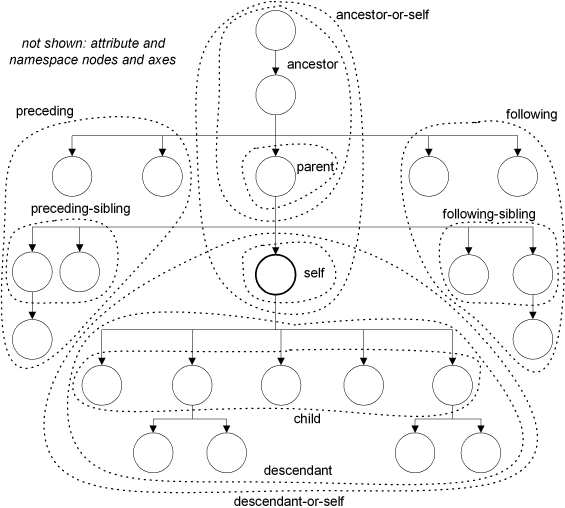

# 🐘 Коллекция готовых SQL запросов для PostgreSQL

## Содержание

**[Получение пользовательских данных](#получение-пользовательских-данных)**
   1. [Валидация и домены](#валидация-и-домены)
      1. [Как проверить email на валидность?](#как-проверить-email-на-валидность)
      1. [Как найти все невалидные email в таблице?](#как-найти-все-невалидные-email-в-таблице)
      1. [Как удалить все невалидные email из большой таблицы?](#как-удалить-все-невалидные-email-из-большой-таблицы)
      1. [Как проверить CSS цвет на валидность?](#как-проверить-css-цвет-на-валидность)
      1. [Как проверить реквизиты компании (ИНН, КПП, ОГРН, ОГРНИП) на валидность?](#как-проверить-реквизиты-компании-инн-кпп-огрн-огрнип-на-валидность)
      1. [Как проверить банковские реквизиты (БИК, расчётный счёт, корреспондентский счёт) на валидность?](#как-проверить-банковские-реквизиты-бик-расчётный-счёт-корреспондентский-счёт-на-валидность)
      1. [Как проверить СНИЛС на валидность?](#как-проверить-снилс-на-валидность)
      1. [Как проверить номер телефона на валидность?](#как-проверить-номер-телефона-на-валидность)
      1. [Как провалидировать значение поля, только если оно явно указано в UPDATE запросе?](#как-провалидировать-значение-поля-только-если-оно-явно-указано-в-update-запросе)
   1. [Переезд из MySQL/MariaDB в PostgreSQL](#переезд-из-mysqlmariadb-в-postgresql)
      1. [Как сделать аналог функции `group_concat()` из MySQL](#как-сделать-аналог-функции-group_concat-из-mysql)
      1. [Как сделать аналог типа `set` из MySQL?](#как-сделать-аналог-типа-set-из-mysql)
      1. [Как сделать аналог функции `make_set()` из MySQL?](#как-сделать-аналог-функции-make_set-из-mysql)
   1. [Файлы](файлы)
      1. [Как выгрузить результат SELECT запроса в `CSV` файл?](#как-выгрузить-результат-select-запроса-в-csv-файл)
      1. [Как загрузить в таблицу данные из `CSV` файла?](#как-загрузить-в-таблицу-данные-из-csv-файла)
      1. [Шпаргалка по выгрузке и загрузке `CSV` файлов в PostgreSQL](#шпаргалка-по-выгрузке-и-загрузке-csv-файлов-в-postgresql)
   1. [Строки](#строки)
      1. [Как транслитерировать русские буквы на английские?](#как-транслитерировать-русские-буквы-на-английские)
      1. [Как распарсить CSV строку в таблицу?](#как-распарсить-csv-строку-в-таблицу)
      1. [Как определить пол по ФИО (фамилии, имени, отчеству) на русском языке?](#как-определить-пол-по-фио-фамилии-имени-отчеству-на-русском-языке)
      1. [Как заквотировать строку для использования в регулярном выражении?](#как-заквотировать-строку-для-использования-в-регулярном-выражении)
      1. [Как заквотировать строку для использования в операторе LIKE?](#как-заквотировать-строку-для-использования-в-операторе-like)
   1. [JSON](#json)
      1. [Как получить записи, которые удовлетворяют условиям из JSON массива?](#как-получить-записи-которые-удовлетворяют-условиям-из-json-массива)
      1. [Как сравнить 2 JSON объекта и получить отличия?](#как-сравнить-2-json-объекта-и-получить-отличия)
   1. [Массивы](#массивы)
      1. [Агрегатная функция конкатенации (объединения) массивов](#агрегатная-функция-конкатенации-объединения-массивов)
      1. [Как получить одинаковые элементы массивов (пересечение массивов)?](#как-получить-одинаковые-элементы-массивов-пересечение-массивов)
      1. [Как получить уникальные элементы массива или отсортировать их?](#как-получить-уникальные-элементы-массива-или-отсортировать-их)
      1. [Как получить отличающиеся элементы двух массивов?](#как-получить-отличающиеся-элементы-двух-массивов)
      1. [Как сделать внешний ключ на элементы массива?](#как-сделать-внешний-ключ-на-элементы-массива)
   1. [Поиск по фразе (точный и неточный)](#поиск-по-фразе-точный-и-неточный)
      1. [Как найти список строк, совпадающих со списком шаблонов?](#как-найти-список-строк-совпадающих-со-списком-шаблонов)
      1. [Как получить названия сущностей по поисковой фразе с учётом начала слов (поисковые подсказки)?](#как-получить-названия-сущностей-по-поисковой-фразе-с-учётом-начала-слов-поисковые-подсказки)
      1. [Как для слова с опечаткой (ошибкой) получить наиболее подходящие варианты слов для замены (исправление опечаток)?](#как-для-слова-с-опечаткой-ошибкой-получить-наиболее-подходящие-варианты-слов-для-замены-исправление-опечаток)
   1. [Деревья и графы](#деревья-и-графы)
      1. [Как получить список названий предков и наследников для каждого узла дерева (на примере регионов)?](#как-получить-список-названий-предков-и-наследников-для-каждого-узла-дерева-на-примере-регионов)
      1. [Как получить циклические связи в графе?](#как-получить-циклические-связи-в-графе)
      1. [Как защититься от циклических связей в графе?](#как-защититься-от-циклических-связей-в-графе)
      1. [Как получить названия всех уровней сферы деятельности 4-го уровня?](#как-получить-названия-всех-уровней-сферы-деятельности-4-го-уровня)
   1. [Оптимизация выполнения запросов](#оптимизация-выполнения-запросов)
      1. [Как посмотреть на план выполнения запроса (EXPLAIN) в наглядном графическом виде?](#как-посмотреть-на-план-выполнения-запроса-explain-в-наглядном-графическом-виде)
      1. [Как ускорить SELECT запросы с тысячами значений в IN(...)?](#как-ускорить-select-запросы-c-тысячами-значений-в-in)
      1. [Как использовать вывод EXPLAIN запроса в другом запросе?](#как-использовать-вывод-explain-запроса-в-другом-запросе)
      1. [Как ускорить SELECT запрос после переезда с PostgreSQL v10 на v12?](#как-ускорить-select-запрос-после-переезда-с-postgresql-v10-на-v12)
      1. [Как ускорить SELECT COUNT(\*) запрос?](#как-ускорить-select-count-запрос)
      1. [Как выполнить функцию N тысяч раз и измерить скорость выполнения?](#как-выполнить-функцию-n-тысяч-раз-и-измерить-скорость-выполнения)
   1. [Как получить записи-дубликаты по значению полей?](#как-получить-записи-дубликаты-по-значению-полей)
   1. [Как получить длительность выполнения запроса в его результате?](#как-получить-длительность-выполнения-запроса-в-его-результате)
   1. [Как разбить большую таблицу по N тысяч записей?](#как-разбить-большую-таблицу-по-n-тысяч-записей)
   1. [Как выполнить следующий SQL запрос, если предыдущий не вернул результат?](#как-выполнить-следующий-sql-запрос-если-предыдущий-не-вернул-результат)
   1. [Как развернуть запись в набор колонок?](#как-развернуть-запись-в-набор-колонок)
   1. [Как получить итоговую сумму и процент для каждой записи в одном запросе?](#как-получить-итоговую-сумму-и-процент-для-каждой-записи-в-одном-запросе)
   1. [Как получить возраст по дате рождения?](#как-получить-возраст-по-дате-рождения)
   1. [Как получить дату или дату и время в формате ISO-8601?](#как-получить-дату-или-дату-и-время-в-формате-iso-8601)
   1. [Как вычислить дистанцию между 2-мя точками на Земле по её поверхности в километрах?](#как-вычислить-дистанцию-между-2-мя-точками-на-земле-по-её-поверхности-в-километрах)
   1. [Как найти ближайшие населённые пункты относительно заданных координат?](#как-найти-ближайшие-населённые-пункты-относительно-заданных-координат)
   1. [Как вычислить приблизительный объём данных для результата SELECT запроса?](#как-вычислить-приблизительный-объём-данных-для-результата-select-запроса)
   1. [Почему запрос с подзапросом в NOT IN() возвращает 0 записей?](#почему-запрос-с-подзапросом-в-not-in-возвращает-0-записей)
   1. [Особенности сравнения record и NULL](#особенности-сравнения-record-и-null)
   1. [Как очень быстро получить количество записей в большой таблице?](#как-очень-быстро-получить-количество-записей-в-большой-таблице)
   1. [Как сделать рекурсивный запрос?](#как-сделать-рекурсивный-запрос)

**[Модификация пользовательских данных (DML)](#модификация-пользовательских-данных-dml)**
   1. [Как добавить или обновить записи одним запросом (UPSERT)?](#как-добавить-или-обновить-записи-одним-запросом-upsert)
   1. [Как сделать `INSERT ... ON CONFLICT ...` без увеличения последовательности для дубликатов?](#как-сделать-insert--on-conflict--без-увеличения-последовательности-для-дубликатов)
   1. [Как ускорить добавление строк через `INSERT ... VALUES ...`?](как-ускорить-добавление-строк-через-insert-values)
   1. [Как модифицировать данные в нескольких таблицах и вернуть id затронутых записей в одном запросе?](#как-модифицировать-данные-в-нескольких-таблицах-и-вернуть-id-затронутых-записей-в-одном-запросе)
   1. [Как модифицировать данные в связанных таблицах одним запросом?](#как-модифицировать-данные-в-связанных-таблицах-одним-запросом)
   1. [Как добавить запись с id, значение которого нужно сохранить ещё в другом поле в том же INSERT запросе?](#как-добавить-запись-с-id-значение-которого-нужно-сохранить-ещё-в-другом-поле-в-том-же-insert-запросе)
   1. [Как сделать несколько последующих запросов с полученным при вставке id из первого запроса?](#как-сделать-несколько-последующих-запросов-с-полученным-при-вставке-id-из-первого-запроса)
   1. [Как не обновлять запись, если данные из UPDATE запроса и в БД совпадают?](#как-не-обновлять-запись-если-данные-из-update-запроса-и-в-бд-совпадают)
   1. [Как обновить запись так, чтобы не затереть чужие изменения, уже сделанные кем-то?](#как-обновить-запись-так-чтобы-не-затереть-чужие-изменения-уже-сделанные-кем-то)
   1. [Как обновить несколько записей разными данными в одном запросе?](#как-обновить-несколько-записей-разными-данными-в-одном-запросе)
   1. [Как обновить или удалить миллионы записей в таблице не блокируя все записи и не нагружая БД?](#как-обновить-или-удалить-миллионы-записей-в-таблице-не-блокируя-все-записи-и-не-нагружая-бд)
   1. [Как удалить десятки тысяч записей в таблице не блокируя все записи и не нагружая БД?](#как-удалить-десятки-тысяч-записей-в-таблице-не-блокируя-все-записи-и-не-нагружая-бд)
   1. [Как для одной сущности сделать ограничение на количество вставляемых зависимых сущностей?](#как-для-одной-сущности-сделать-ограничение-на-количество-вставляемых-зависимых-сущностей)
   1. [Как сделать журналирование изменений таблицы?](#как-сделать-журналирование-изменений-таблицы)
   1. [Как сделать автоматически обновляемое поле `updated_at`?](#как-сделать-автоматически-обновляемое-поле-updated_at)

**[Модификация схемы данных (DDL)](#модификация-схемы-данных-ddl)**
   1. [Как добавить колонку в существующую таблицу без её блокирования?](#как-добавить-колонку-в-существующую-таблицу-без-её-блокирования)
   1. [Как добавить ограничение таблицы, если оно ещё не существует?](#как-добавить-ограничение-таблицы-если-оно-ещё-не-существует)
   1. [Как изменить ограничение внешнего ключа без блокирования таблицы?](#как-изменить-ограничение-внешнего-ключа-без-блокирования-таблицы)
   1. [Как проверить, что при добавлении или обновлении записи заполнены N полей из M возможных?](#как-проверить-что-при-добавлении-или-обновлении-записи-заполнены-n-полей-из-m-возможных)
   1. [Как из enum типа удалить значение?](#как-из-enum-типа-удалить-значение)
   1. [Как найти все упоминания названия объекта БД по всей БД?](#как-найти-все-упоминания-названия-объекта-бд-по-всей-бд)
   1. [Как изменить тип колонки с `int` на `bigint`?](#как-изменить-тип-колонки-с-int-на-bigint)
   1. [Как восстановить значение последовательности, если оно отстало?](#как-восстановить-значение-последовательности-если-оно-отстало)
  
**[Индексы](#индексы)**
   1. [Как создать или пересоздать индекс в существующей таблице без её блокирования?](#как-создать-или-пересоздать-индекс-в-существующей-таблице-без-её-блокирования)
   1. [Как сделать составной уникальный индекс, где одно из полей может быть null?](#как-сделать-составной-уникальный-индекс-где-одно-из-полей-может-быть-null)
   1. [Как починить сломаный уникальный индекс, имеющий дубликаты?](#как-починить-сломаный-уникальный-индекс-имеющий-дубликаты)
   1. [Как временно отключить индекс?](#как-временно-отключить-индекс)
   1. [Как сделать компактный уникальный индекс на текстовое поле?](#как-сделать-компактный-уникальный-индекс-на-текстовое-поле)

**[Администрирование](#администрирование)**
   1. [Как получить список процессов с SQL запросами, выполняющихся сейчас?](#как-получить-список-процессов-с-sql-запросами-выполняющихся-сейчас)
   1. [Как остановить или завершить работу процессов?](#как-остановить-или-завершить-работу-процессов)
   1. [Как получить список всех функций БД, включая триггерные процедуры?](#как-получить-список-всех-функций-бд-включая-триггерные-процедуры)
   1. [Как получить список всех зависимостей (внешних ключей) между таблицами БД?](#как-получить-список-всех-зависимостей-внешних-ключей-между-таблицами-бд)
   1. [Как получить статистику использования индексов?](#как-получить-статистику-использования-индексов)
   1. [Как получить список установленных расширений (extensions)?](#как-получить-список-установленных-расширений-extensions)
   1. [Как получить список таблиц с размером занимаемого места и примерным количеством строк?](#как-получить-список-таблиц-с-размером-занимаемого-места-и-примерным-количеством-строк)
   1. [Как получить список самых ресурсоёмких SQL запросов?](#как-получить-список-самых-ресурсоёмких-sql-запросов)
   1. [Как получить список SQL запросов, создающих временные файлы?](#как-получить-список-sql-запросов-создающих-временные-файлы)
   1. [Как получить и изменить значения параметров конфигурации выполнения?](#как-получить-и-изменить-значения-параметров-конфигурации-выполнения)
   1. [Как получить все активные в данный момент процессы автовакуумa и время их работы?](#как-получить-все-активные-в-данный-момент-процессы-автовакуумa-и-время-их-работы)
   1. [Как узнать, почему время ответа от базы периодически падает?](#как-узнать-почему-время-ответа-от-базы-периодически-падает)
   1. [Как обезопасить приложение от тяжёлых миграций, приводящих к блокированию запросов?](#как-обезопасить-приложение-от-тяжёлых-миграций-приводящих-к-блокированию-запросов)
   1. [Simple index checking](#simple-index-checking)
   1. [Как скопировать базу данных?](#как-скопировать-базу-данных)
   1. [Как проверить синтаксис SQL кода без его выполнения?](#как-проверить-синтаксис-sql-кода-без-его-выполнения)
   1. [Как откатить часть транзакции внутри функции или процедуры?](#как-откатить-часть-транзакции-внутри-функции-или-процедуры)
   1. [Как терминировать долгие простаивающие без дела подключения к БД?](#как-терминировать-долгие-простаивающие-без-дела-подключения-к-бд)
   1. [Как терминировать заблокированные одинаковые запросы, образующие очередь?](#как-терминировать-заблокированные-одинаковые-запросы-образующие-очередь)
   1. [Как журналировать DDL команды в таблицу БД?](#как-журналировать-ddl-команды-в-таблицу-бд)
   1. [Как узнать, какие самые частые действия в таблице совершаются?](#как-узнать-какие-самые-частые-действия-в-таблице-совершаются)
   1. [Как узнать отставание реплик?](#как-узнать-отставание-реплик)
   1. [Как узнать процент достижения своего максимального значения для последовательностей?](#как-узнать-процент-достижения-своего-максимального-значения-для-последовательностей)
   1. [Как удалить неиспользуемые WAL файлы?](#как-удалить-неиспользуемые-wal-файлы)
   1. [Как удалить роль, которая имеет принадлежащие ей объекты?](#как-удалить-роль-которая-имеет-принадлежащие-ей-объекты)
   1. [Как сравнить конфигурации двух СУБД?](#как-сравнить-конфигурации-двух-субд)

## Получение пользовательских данных

### Валидация и домены

#### Как проверить email на валидность?

Домен [`email.sql`](domains/email.sql) (валидация базовая минимальная, но быстрая) и функция [`is_email.sql`](functions/is/is_email.sql) (валидация почти по спецификации, но медленная)

#### Как найти все невалидные email в таблице?

```sql
SELECT email
FROM person_email
WHERE email IS NOT NULL    -- skip NULL
      AND email !~ '^\s*$' -- skip empty (similar NULL for NOT NULL column)
      NOT(
        AND octet_length(email) BETWEEN 6 AND 320 -- https://en.wikipedia.org/wiki/Email_address
        AND email LIKE '_%@_%.__%'                -- rough, but quick check email syntax
        AND is_email(email)                       -- accurate, but slow check email syntax
    );
```

Функция [`is_email.sql`](functions/is/is_email.sql)

#### Как удалить все невалидные email из большой таблицы?

Если строк в таблице немного и запрос работает относительно быстро, то подойдёт простой `DELETE FROM table_name WHERE ...`.
Если в таблице миллионы строк, то процесс может занятуться надолго.
При этом записи в таблице так же заблокируются надолго, а конкурентные запросы на модификацию записей, которые связаны с этой таблицей, выстроятся в очередь.
Решение — удалять нужно не всё сразу, а по частям.
Пример см. [`loop_execute`](procedures/loop_execute)

#### Как проверить CSS цвет на валидность?

Домен: [`css_color.sql`](domains/css_color.sql)

#### Как проверить реквизиты компании (ИНН, КПП, ОГРН, ОГРНИП) на валидность?

##### ИНН
Домены: [`inn.sql`](domains/inn.sql), [`inn10.sql`](domains/inn10.sql), [`inn12.sql`](domains/inn12.sql).
Функции: [`is_inn10.sql`](functions/is/is_inn10.sql), [`is_inn12.sql`](functions/is/is_inn12.sql).

##### КПП
Домен: [`kpp.sql`](domains/kpp.sql).
Функция: [`is_kpp.sql`](functions/is/is_kpp.sql).

##### ОГРН
Домен: [`ogrn.sql`](domains/ogrn.sql).
Функция: [`is_ogrn.sql`](functions/is/is_ogrn.sql).

##### ОГРНИП
Домен: [`ogrnip.sql`](domains/ogrnip.sql).
Функция: [`is_ogrnip.sql`](functions/is/is_ogrnip.sql).

#### Как проверить банковские реквизиты (БИК, расчётный счёт, корреспондентский счёт) на валидность?

##### БИК
Домен: [`bik.sql`](domains/bik.sql).
Функция: [`is_bik.sql`](functions/is/is_bik.sql).

##### Банковский расчётный (клиентский) счёт (р/с)
Домен: [`client_account.sql`](domains/client_account.sql).
Функция: [`is_client_account.sql`](functions/is/is_client_account.sql).

##### Банковский корреспонденткий счёт (к/с)
Домен: [`correspondent_account.sql`](domains/correspondent_account.sql).
Функция: [`is_correspondent_account.sql`](functions/is/is_correspondent_account.sql).

#### Как проверить СНИЛС на валидность?

Домен: [`snils.sql`](domains/snils.sql).
Функция: [`is_snils.sql`](functions/is/is_snils.sql).


#### Как проверить номер телефона на валидность?

Домен [`phone.sql`](domains/phone.sql) для валидации номера телефона в международном формате E.164

См. ещё функции:
  1. [`phone_normalize.sql`](functions/phone/phone_normalize.sql)
  1. [`phone_parse.sql`](functions/phone/phone_parse.sql)
  1. [`phone_format.sql`](functions/phone/phone_format.sql)
  1. [`phone_format_record.sql`](functions/phone/phone_format_record.sql)

#### Как провалидировать значение поля, только если оно явно указано в UPDATE запросе?

Ограничения [`CHECK()`](https://postgrespro.ru/docs/postgresql/12/ddl-constraints#DDL-CONSTRAINTS-CHECK-CONSTRAINTS) для каждого поля таблицы срабатывают каждый раз при добавлении или обновлении записи таблицы. При добавлении записи всё логично — значение нужно проверить, даже если это значение по-умолчанию. Однако, в запросе на обновление даных даже неважно, изменилось значение поля на самом деле или нет (ну почему [так сделано](test/check_constraint_stupid_demo.sql)?). Если в `CHECK` проверка ресурсоёмая, то она может существенно замедлить обновление большого количества записей в таблице. Пример ресурсоёмкой проверки — валидация синтаксиса email функцией [`is_email()`](functions/is/is_email.sql).

Обойти данную проблему можно с использованием триггеров. 
Предположим, есть таблица `person` с колонкой `email`.

```sql
CREATE OR REPLACE FUNCTION person_email_check() RETURNS TRIGGER
    LANGUAGE plpgsql AS
$$
BEGIN
    IF NOT is_email(NEW.email) THEN
        RAISE EXCEPTION 'Email % is not valid', NEW.email;
    END IF;
    RETURN NEW;
END;
$$;

-- добавление
DROP TRIGGER IF EXISTS person_email_check_insert ON person_email;
CREATE TRIGGER person_email_check_insert
    BEFORE INSERT ON person
    FOR EACH ROW
    WHEN (NEW.email IS NOT NULL
          AND NEW.email !~ '^\s*$')
    EXECUTE PROCEDURE person_email_check();

--обновление
DROP TRIGGER IF EXISTS person_email_check_update ON person_email;
CREATE TRIGGER person_email_check_update
    BEFORE UPDATE OF email ON person -- поле явно указано в UPDATE запросе!
    FOR EACH ROW
    WHEN (NEW.email IS NOT NULL
          AND NEW.email !~ '^\s*$'
          AND NEW.email IS DISTINCT FROM OLD.email) -- значение изменилось
    EXECUTE PROCEDURE person_email_check();
```

### Переезд из MySQL/MariaDB в PostgreSQL

>There isn’t anything MySQL can do that PostgreSQL can’t do.
>However, there are things that PostgreSQL can do that MySQL can’t do.
http://mysqltopgsql.com/

#### Как сделать аналог функции `group_concat()` из MySQL

```sql
SELECT STRING_AGG(DISTINCT s, ', ' ORDER BY s) AS field_alias FROM (VALUES ('b'), ('a'), ('b')) AS t(s); -- a, b

SELECT ARRAY_TO_STRING(ARRAY_AGG(DISTINCT s ORDER BY s), ', ') AS field_alias FROM (VALUES ('b'), ('a'), ('b')) AS t(s); -- a, b
```

#### Как сделать аналог типа `set` из MySQL?

Используйте комбинацию перечисляемого типа и массива. Пример: 

```sql
CREATE TYPE finger_type AS ENUM ('one', 'two', 'three', 'four', 'five');
CREATE TABLE my_table (
    fingers finger_type[] CHECK(/*cardinality(fingers) > 0 and*/
                                cardinality(array_unique(fingers)) = cardinality(fingers) --проверка на уникальность
                               )
);
```
Дополнительно смотри [`array_unique.sql`](functions/array/array_unique.sql)

#### Как сделать аналог функции `make_set()` из MySQL?

```sql
select to_json(array_agg(name))
from unnest(array['a','b','c', 'd']::text[]) with ordinality as s(name, num)
where 10 & (1 << (num::int-1)) > 0;

select array_agg(name)
from unnest(string_to_array('a,b,c,d', ',')) with ordinality as s(name, num)
where 10 & (1 << (num::int-1)) > 0;
```

### Файлы

#### Как выгрузить результат SELECT запроса в `CSV` файл?

Файл `select.sql`
```sql
copy (
    select id, send_date::timestamp(0), message
    from my_table
    where send_date > now() - interval '2 month'
    --limit 100
) to stdout (format csv, header false);
```

```bash
# без сжатия
sudo su - postgres -c "psql -qX --csv --file=select.sql" > select.csv
sudo su - postgres -c "psql -qX --csv -c 'select * from pg_stat_activity'" > select.csv

# с сжатием (размер файла больше, но работает быстрее)
cat select.sql | psql -U postgres -qX --dbname=my_database | zstd -19 -T8 -o select.csv.zst

# с сжатием (размер файла меньше, но работает медленнее)
cat select.sql | psql -U postgres -qX --dbname=my_database | xz -zc9 --threads=8 > select.csv.xz
```

#### Как загрузить в таблицу данные из `CSV` файла?

Воспользуйтесь утилитой [`psql`](https://postgrespro.ru/docs/postgresql/18/app-psql).
Особенность мета-команды [`\copy`](https://postgrespro.ru/docs/postgresql/18/app-psql#APP-PSQL-META-COMMANDS-COPY) в том, что она читает файл из ***локальной файловой системы*** и пересылает его на сервер на вход SQL команде [`COPY`](https://postgrespro.ru/docs/postgresql/18/sql-copy).

```sql
# без сжатия
\copy test.regions from '/tmp/regions.csv' with (format csv, header false);

# с сжатием
\copy test.regions from program 'xzcat regions.csv.xz' with (format csv, header false);
```

#### Шпаргалка по выгрузке и загрузке `CSV` файлов в PostgreSQL

```sql
-- выгрузка таблицы в CSV в поток
COPY public.events TO STDOUT WITH (FORMAT csv, HEADER true);
 
-- загрузка из CSV из потока
COPY public.events FROM STDIN WITH (FORMAT csv, HEADER true);
 
-- загрузка из файла на сервере (нужны права)
COPY public.events FROM '/var/lib/postgresql/import.csv' WITH (FORMAT csv, HEADER true);
 
-- через внешнюю программу (распаковка на лету)
COPY public.events FROM PROGRAM 'gzip -dc /data/import.csv.gz' WITH (FORMAT csv, HEADER true);
 
-- выгрузка результата запроса, не всей таблицы
COPY (
  SELECT id, payload, created_at
  FROM public.events
  WHERE created_at >= DATE '2025-01-01'
) TO STDOUT WITH (FORMAT csv, HEADER true);
```

### Строки

#### Как [транслитерировать](https://ru.wikipedia.org/wiki/%D0%A2%D1%80%D0%B0%D0%BD%D1%81%D0%BB%D0%B8%D1%82%D0%B5%D1%80%D0%B0%D1%86%D0%B8%D1%8F) русские буквы на английские?

[Всё о транслитерации](https://habr.com/ru/post/499574/)

Современные функции транслитерации по правилам библиотеки "[Юлия](https://github.com/nalgeon/iuliia)":
1. [iuliia_translate_mosmetro.sql](functions/iuliia_translate.sql)
2. [iuliia_translate_wikipedia.sql](functions/iuliia_translate.sql)

Устаревшая функции транслитерации [slugify_ru.sql](functions/slugify_ru.sql)

#### Как распарсить CSV строку в таблицу?

PostgreSQL умеет читать и писать CSV в файл на сервере БД. А это парсер CSV из строки. Смотри [`csv_parse.sql`](functions/csv_parse.sql)

Область применения — массовое добавление и обновление записей в таблицах БД через SQL миграции БД и административные интерфейсы.

[Выполнить SQL](https://www.db-fiddle.com/f/eqsGTTqAmH1QoQ8LL63jM/1)

Запрос

```sql
select
    CASE WHEN row[1] ~ '^\d+$' THEN row[1]::integer ELSE NULL END AS id,
    row[2] AS kladr_id,
    row[3] AS name
from csv_parse($$
id; kladr_id; name
501 ; 8300000000000 ; ";Автономный ;"";округ""
  ""Ненецкий"";";unknown
      751;8600800000000; "  Автономный округ ""Ханты-Мансийский"", Район Советский" ;
     1755;8700300000000;  Автономный округ Чукотский, Район Билибинский
     1725;7501900000000;Край Забайкальский, Район Петровск-Забайкальский

  ;;
       711;2302100000000;Край Краснодарский, Район Лабинский
       729;2401600000000;Край Красноярский, Район Иланский
       765;2700700000000;Край Хабаровский, Район Вяземский
       765;;
$$, ';', false) as row;
```

Результат

id|kladr_id|name
-:|:-------|:---
\<null>|kladr_id|name
501|8300000000000|;Автономный ;";округ"\n"Ненецкий";
751|8600800000000|&nbsp;&nbsp;Автономный округ "Ханты-Мансийский"| Район Советский
1755|8700300000000|Автономный округ Чукотский| Район Билибинский
1725|7501900000000|Край Забайкальский| Район Петровск-Забайкальский
711|2302100000000|Край Краснодарский| Район Лабинский
729|2401600000000|Край Красноярский| Район Иланский
765|2700700000000|Край Хабаровский| Район Вяземский
765|\<null>|\<null>

#### Как определить пол по ФИО (фамилии, имени, отчеству) на русском языке?

* [`gender_by_name`](functions/gender_by_name/)

#### Как заквотировать строку для использования в регулярном выражении?

Смотри [`quote_regexp.sql`](functions/quote_regexp.sql)

#### Как заквотировать строку для использования в операторе LIKE?

Смотри [`quote_like.sql`](functions/quote_like.sql)

### JSON

#### Как получить записи, которые удовлетворяют условиям из JSON массива?

```sql
SELECT * FROM (
    VALUES ('[{"id" : 1, "created_at" : "2003-07-01", "name": "Sony"}, 
              {"id" : 2, "created_at" : "2008-10-27", "name": "Samsung"}]'::jsonb),
           ('[{"id" : 3, "created_at" : "2010-03-30", "name": "LG"},   
             {"id" : 4, "created_at" : "2018-12-09", "name": "Apple"}]'::jsonb)
) AS t
WHERE EXISTS(
          SELECT *
          FROM jsonb_to_recordset(t.column1) AS x(id int, created_at timestamp, name text)
          WHERE x.id IN (1, 3) AND x.created_at > '2000-01-01' AND name NOT LIKE 'P%'
      );
```

#### Как сравнить 2 JSON объекта и получить отличия?

Смотри [`jsonb_object_diff.sql`](functions/json/jsonb_object_diff.sql)

### Массивы

#### Агрегатная функция конкатенации (объединения) массивов

Смотри [`array_cat_agg.sql`](functions/array/array_cat_agg.sql)

#### Как получить одинаковые элементы массивов (пересечение массивов)?

```sql
-- для 2-х массивов
select array_agg(a) 
from unnest(array[1, 2, 3, 4, 5]) a 
where a = any(array[4, 5, 6, 7, 8]); -- {4,5}

-- для N массивов
select array_agg(a1)
from unnest(array[1, 2, 3, 4, 5]) a1
inner join unnest(array[3, 4, 5, 6, 7]) a2 on a1 = a2
inner join unnest(array[4, 5, 6, 7, 8]) a3 on a1 = a3; -- {4,5}
```

#### Как получить уникальные элементы массива или отсортировать их?

Для `int[]` лучше воспользоваться готовыми функциями `uniq()` и `sort()` из модуля [intarray](https://postgrespro.ru/docs/postgresql/12/intarray).

```sql
-- способ 1
SELECT ARRAY_AGG(DISTINCT a ORDER BY a) FROM UNNEST(ARRAY[1,2,3,2,1]) t(a); -- {1,2,3}

-- способ 2
SELECT ARRAY(SELECT DISTINCT UNNEST(ARRAY[1,2,3,2,1]) ORDER BY 1); -- {1,2,3}

-- готовая функция
CREATE FUNCTION array_unique(anyarray) RETURNS anyarray AS $$
SELECT array_agg(DISTINCT x ORDER BY x) FROM unnest($1) t(x);
$$ LANGUAGE SQL IMMUTABLE;
```

#### Как получить отличающиеся элементы двух массивов?

Смотри [`array_diff.sql`](functions/array/array_diff.sql)

#### Как сделать внешний ключ на элементы массива?

Нельзя использовать колонку-массив для хранения элементов, значения которых ссылаются на значения колонки из другой таблицы по внешнему ключу (FK). Это не соответствует [первой нормальной форме](https://ru.wikipedia.org/wiki/%D0%9F%D0%B5%D1%80%D0%B2%D0%B0%D1%8F_%D0%BD%D0%BE%D1%80%D0%BC%D0%B0%D0%BB%D1%8C%D0%BD%D0%B0%D1%8F_%D1%84%D0%BE%D1%80%D0%BC%D0%B0) в реляционной модели данных. Необходимо использовать дополнительную таблицу в отношении "один ко многим". Так же в этом случае для поддержки целостности данных по внешним ключам и исключению дубликатов доступны штатные механизмы.

Однако, технически это возможно. Ниже пример проверки значений массива без триггеров. Протестировано на PostgreSQL 10.5.
Т.к. FK для массивов делать нельзя, код функции годится как шаблон для разработки сложных ограничений для проверки элементов массива (например [ltree](https://postgrespro.ru/docs/postgrespro/12/ltree)).

```sql
create schema if not exists test;

CREATE OR REPLACE FUNCTION test.check_foreign_key_array(data anyarray, ref_schema text, ref_table text, ref_column text)
    RETURNS BOOL
    RETURNS NULL ON NULL INPUT
    LANGUAGE plpgsql
AS
$body$
DECLARE
    fake_id text;
    sql text default format($$
            select id::text
            from unnest($1) as x(id)
            where id is not null
              and id not in (select %3$I
                             from %1$I.%2$I
                             where %3$I = any($1))
            limit 1;
        $$, ref_schema, ref_table, ref_column);
BEGIN
    EXECUTE sql USING data INTO fake_id;

    IF (fake_id IS NOT NULL) THEN
        RAISE NOTICE 'Array element value % does not exist in column %.%.%', fake_id, ref_schema, ref_table, ref_column;
        RETURN false;
    END IF;

    RETURN true;
END
$body$;

drop table if exists test.t1, test.t2;

create table test.t1 (
    id integer generated by default as identity primary key
);

create table test.t2 (
    id integer generated by default as identity primary key,
    t1_ids integer[] not null check (test.check_foreign_key_array(t1_ids, 'test', 't1', 'id'))
);

insert into test.t1 (id) values (default), (default), (default); --ok
insert into test.t2 (id, t1_ids) values (default, array[1,2,3]); --ok
insert into test.t2 (id, t1_ids) values (default, array[1,2,3,555]); --error
```

Пример добавления ограничения для типа поля [ltree](https://postgrespro.ru/docs/postgrespro/12/ltree):
```sql
alter table region
    add constraint region_tree_path_ids_check
        check (
                tree_path_ids::text ~ '^\d+(\.\d+)*$|^$' -- список родительских id через точку
                and check_foreign_key_array(string_to_array(tree_path_ids::text, '.')::int[], 'public', 'region', 'id')
        )
        not valid; --при необходимости
```

### Поиск по фразе (точный и неточный)

#### Как найти список строк, совпадающих со списком шаблонов?
```sql
-- было
SELECT *
FROM (VALUES
      ('foo bar zap bing'),
      ('man foo'),
      ('bar zap'),
      ('bing'),
      ('foo bar')) AS t(words)
WHERE words LIKE '%bar%' OR words LIKE '%zap%' OR words LIKE '%fix%' OR words LIKE '%new%';

-- стало
SELECT *
FROM (VALUES
      ('foo bar zap bing'),
      ('man foo'),
      ('bar zap'),
      ('bing'),
      ('foo bar')) AS t(words)
WHERE words LIKE ANY (ARRAY['%bar%', '%zap%', '%fix%', '%new%']);
```

#### Как получить названия сущностей по поисковой фразе с учётом начала слов (поисковые подсказки)?

См. так же [полнотекстовый поиск](https://postgrespro.ru/docs/postgresql/11/textsearch).

```sql
CREATE INDEX /*CONCURRENTLY*/ t_name_trigram_index ON t USING GIN (lower(name) gin_trgm_ops);

WITH
normalize AS (
    SELECT ltrim(REGEXP_REPLACE(LOWER('бар '), '[^а-яёa-z0-9]+', ' ', 'gi')) AS query
),
vars AS (
    SELECT CONCAT('%', REPLACE(quote_like(trim(normalize.query)), ' ', '_%'), '%') AS query_like,
           --CONCAT('(?<![а-яёa-z0-9])', REPLACE(quote_regexp(normalize.query), ' ', '(?:[^а-яёa-z0-9]+|$)')) AS query_regexp
           CONCAT('\m', REPLACE(quote_regexp(normalize.query), ' ', '(?:[^а-яёa-z0-9]+|$)')) AS query_regexp
    FROM normalize
)
SELECT 
  t.name,
  lower(t.name) LIKE RTRIM(normalize.query) AS is_leading
FROM t, vars, normalize
WHERE
  length(rtrim(normalize.query)) > 0 -- для скорости
  AND lower(t.name) LIKE vars.query_like -- для скорости
  AND lower(t.name) ~* vars.query_regexp -- для точности
ORDER BY 
  is_leading DESC,
  LENGTH(name), 
  name
LIMIT 100;
```
Функции [`quote_like.sql`](functions/quote_like.sql), [`quote_regexp.sql`](functions/quote_regexp.sql)

#### Как для слова с опечаткой (ошибкой) получить наиболее подходящие варианты слов для замены (исправление опечаток)?

Смотри [`typos_correct`](functions/typos_correct/)

**Пример результата запроса**

word_num|word_from|is_mistake|can_correct|words_to|words_details
-------:|:--------|:---------|:----------|:-------------|:-------------
1 |вадитль|true|true|\["водитель"]|NULL
2 |дифектолог|true|false|\["дефектолог", "директолог", "диетолог"]|NULL
3 |формовшица|true|true|\["формовщица"]|NULL
4 |фрмовщица|true|true|\["формовщица"]|NULL
5 |бхугалтер|true|true|\["бухгалтер"]|NULL
6 |лктор|true|true|\["лектор"]|NULL
7 |дикто|true|true|\["диктор"]|NULL
8 |вра|true|true|\["врач"]|NULL
9 |прагромист|true|true|\["программист"]|NULL
10|затейник|false|false|NULL|NULL
11|смотритель|false|false|NULL|NULL
12|unknown|true|false|NULL|NULL

**Описание запроса**
1. Запрос так же подходит для получения поисковых подсказок (с учётом начала слов), если его немного модернизировать. Практики пока нет, а в теории нужно убрать ограничение по дистанции Левенштейна.
1. Запрос использует GIN индекс, поэтому работает быстро.
1. Среди пользователей, которые делают опечатки, есть те, которые делают грамматические ошибки. Поэтому, при расчёте расстояния Левенштейна, цена вставки и удаления буквы должна быть выше, чем замены. Цены операций являеются целочисленными числами, которые нам не очень подходят, поэтому приходится делать дополнительный расчёт.
1. Пороговые значения подобраны опытным путём.
1. Если у нескольких кандидатов подряд рейтинг отличается незначительно, то это не точное исправление (автоисправлять нельзя, только предлагать варианты)

Алгоритм исправления ошибок и опечаток основан поиске совпадающих триграмм (учитывается "похожесть" слова) и на вычислении расстояния [Левенштейна](https://ru.wikipedia.org/wiki/Расстояние_Левенштейна).
Точность исправления слова зависит в т.ч. от количества букв в слове.
Получать слова-кандидаты для исправления ошибок необходимо для `R > 0.55` и `D < 5`

Длина слова, букв (L) | Максимальная дистанция Левенштейна (D) | Доля R = (1 − (D ÷ L))
---:|--:|:--
2	|0	|1
3	|1	|0.6666
4	|1	|0.75
5	|2	|0.6
6	|2	|0.6666
7	|3	|0.5714
8	|3	|0.625
9	|3	|0.6666
10	|4	|0.6
11	|4	|0.6363
12	|4	|0.6666
13	|4	|0.6923
14 и более	|4	|0.7142

### Деревья и графы

#### Как получить список названий предков и наследников для каждого узла дерева (на примере регионов)?



```sql
SELECT
    id,
    nlevel(ltree_path) AS level,
    ltree_path AS id_path,
    (SELECT array_agg(st.name ORDER BY nlevel(st.ltree_path)) FROM region AS st WHERE st.ltree_path @> t.ltree_path AND st.ltree_path != t.ltree_path) AS ancestors,
    name AS self,
    (SELECT array_agg(st.name ORDER BY nlevel(st.ltree_path)) FROM region AS st WHERE st.ltree_path <@ t.ltree_path AND st.ltree_path != t.ltree_path) AS descendants
    --, t.*
FROM region AS t
WHERE nlevel(ltree_path) >= 2
ORDER BY nlevel(ltree_path) ASC, ancestors
LIMIT 1000;
```

#### Как получить циклические связи в графе?

```sql
WITH paths_with_cycle(depth, path) AS (
 WITH RECURSIVE search_graph(parent_id, child_id, depth, path, cycle) AS (
   SELECT g.parent_id, g.child_id, 1,
     ARRAY[g.parent_id],
     false
   FROM custom_query_group_relationship AS g
   UNION ALL
   SELECT g.parent_id, g.child_id, sg.depth + 1,
     path || g.parent_id,
     g.parent_id = ANY(path)
   FROM custom_query_group_relationship AS g, search_graph sg
   WHERE g.parent_id = sg.child_id AND cycle IS FALSE
 )
 SELECT depth, path FROM search_graph WHERE cycle IS TRUE
 ORDER BY depth
)
SELECT DISTINCT path FROM paths_with_cycle
WHERE depth = (SELECT MIN(depth) FROM paths_with_cycle);
```

#### Как защититься от циклических связей в графе?

SQL-запросы `WITH RECURSIVE...` должны иметь [защиту от зацикливания](https://stackoverflow.com/questions/51025607/prevent-infinite-loop-in-recursive-query-in-postgresql)! Когда запрос зациклится, он будет выполняться очень долго, съедая ресурсы БД. А ещё таких запросов будет много. Повезёт, если сработает защита самого PostgreSQL.

#### Как получить названия всех уровней сферы деятельности 4-го уровня?

```sql
SELECT ot1.name AS name_1, ot2.name as name_2, ot3.name as name_3, ot4.id as id
    FROM offer_trade ot4
    INNER JOIN offer_trade ot3 ON ot4.order_tree <@ ot3.order_tree AND nlevel(ot3.order_tree) = 3
    INNER JOIN offer_trade ot2 ON ot4.order_tree <@ ot2.order_tree AND nlevel(ot2.order_tree) = 2
    INNER JOIN offer_trade ot1 ON ot4.order_tree <@ ot1.order_tree AND nlevel(ot1.order_tree) = 1;
```

### Оптимизация выполнения запросов

#### Как посмотреть на план выполнения запроса (EXPLAIN) в наглядном графическом виде?

1. [Человекопонятное отображение EXPLAIN и советы](https://explain.tensor.ru/)
1. [Postgres Explain Visualizer (PEV2)](explain.dalibo.com) is a tool to show a graphical vizualization of a PostgreSQL execution plan. It creates a graphical representation of the query plan. PEV2 can be run locally without any external internet resource. Simply download [index.html](https://www.github.com/dalibo/pev2/releases/latest/download/index.html), open it in your favorite internet browser.
1. [PostgreSQL's explain analyze made readable](https://explain.depesz.com/)

#### Как использовать вывод EXPLAIN запроса в другом запросе?

Смотри [`explain_json.sql`](functions/explain_json.sql)

#### Как ускорить SELECT запросы c тысячами значений в IN(...)?

[Источник](http://highload.guide/blog/query_performance_postgreSQL.html)

Сортировка значений по возрастанию увеличит читабельность кода (TODO: как это повлияет на скорость выполнения запроса?).

```sql
-- было
SELECT * FROM t WHERE id < 1000 AND val IN (1, ..., 10000);

-- стало (способ 1)
SELECT * FROM t WHERE id < 1000 AND val IN (VALUES (1), ..., (10000));

-- стало (способ 2)
SELECT * FROM t JOIN (VALUES (1), ..., (10000)) AS t(val) UGING(val) WHERE id < 1000;

-- стало (способ 3)
SELECT * FROM t JOIN UNNEST(ARRAY[1, ..., 10000]) AS t(val) UGING(val) WHERE id < 1000;

```

#### Как ускорить SELECT запрос после переезда с PostgreSQL v10 на v12?


```sql
-- исходный медленный запрос
SELECT id
FROM t1
WHERE id NOT IN (
    SELECT DISTINCT t2.entity_id FROM t2 WHERE ...
);

-- ключевое слово MATERIALIZED добавлено только в PostgreSQL 12, а у нас пока 10, поэтому см. следующий запрос
WITH t AS MATERIALIZED (
    SELECT DISTINCT t2.entity_id FROM t2 WHERE ...
)
SELECT id
FROM t1
WHERE id NOT IN (SELECT entity_id FROM t);

-- используем массив вместо колонки
SELECT id
FROM t1
WHERE id != ALL(ARRAY( --performance workaround for PostgreSQL 12
    SELECT DISTINCT t2.entity_id FROM t2 WHERE ...
));
```

#### Как ускорить SELECT COUNT(\*) запрос?


Сценарий использования: SQL запрос, вычисляющий кол-во записей по условию или среднее числовое значение.

Объём данных растёт, а ответ клиенту всегда нужно отдавать очень быстро.
Если SQL запрос оптимизиции уже не поддаётся или очень много данных, то его можно ускорить через приближённые вычисления.
В таком запросе будет погрешность вычислений. Чем быстрее вычисление, тем больше погрешность.
На количествах `> 1,000` уже можно использовать приближённые вычисления для задач, требующих немедленного ответа (задачи реального времени).
`1,000` или `1,050` - не так важно. При таких значениях у пользователей сохраняется возможность оценки и принятия решения.
А в GUI перед значениями, при необходимости, значение можно показывать так: `1,000+` или `≈1,050` или `1 тыс.`.

##### Решение 1

```sql
create schema if not exists test;

drop table if exists test.count_approximate;

create table if not exists test.count_approximate as
select md5(i::text) as s from generate_series(1, 10000000) as t(i);

create unique index on test.count_approximate (i);

select count(*)
from (
    select
    from test.count_approximate
    where s ~ 'aa$'
    LIMIT 1000 + 1
) t;
--1 row retrieved starting from 1 in 273 ms (execution: 218 ms, fetching: 55 ms)

-- если предыдущий запрос вернул <= 1000 записей, то больше ничего делать не нужно
-- иначе считаем приближённое количество запией

select count(*) * 100 --39200
from test.count_approximate tablesample bernoulli(1) repeatable (37)
where s ~ 'aa$';
--1 row retrieved starting from 1 in 528 ms (execution: 489 ms, fetching: 39 ms)

select count(*) * 100 --42500
from test.count_approximate tablesample system(1) repeatable (37)
where s ~ 'aa$';
--1 row retrieved starting from 1 in 139 ms (execution: 100 ms, fetching: 39 ms)

-- PostgreSQL < 9.5 ?
select (count(*) filter (where  s ~ 'aa$')) * 100 --38300
from test.count_approximate
where (i % 100) = 0;
--1 row retrieved starting from 1 in 1 s 790 ms (execution: 1 s 767 ms, fetching: 23 ms)

-- для сравнения, подсчёт точного кол-ва записей работает медленно:
select count(*) --38823
from test.count_approximate
where s ~ 'aa$';
--1 row retrieved starting from 1 in 6 s 941 ms (execution: 6 s 899 ms, fetching: 42 ms)

```
См. [Tablesample In PostgreSQL](https://www.2ndquadrant.com/en/blog/tablesample-in-postgresql-9-5-2/)

##### Решение 2

PostgreSQL [extension](https://github.com/citusdata/postgresql-hll) adding HyperLogLog data structures as a native data type.

#### Как выполнить функцию N тысяч раз и измерить скорость выполнения?

Аналог функции `benchmark()` в MySQL.
Смотри [`benchmark.sql`](functions/benchmark.sql)


### Как получить записи-дубликаты по значению полей?

```sql
-- через подзапрос с EXISTS этой же таблицы
SELECT
    ROW_NUMBER() OVER w AS duplicate_num, -- номер дубля
    *
FROM person AS d
WHERE EXISTS(SELECT
             FROM person AS t
             WHERE t.name = d.name -- в идеале на это поле должен стоять индекс
                   -- если нет первичного ключа, замените "id" на "ctid"
                   AND d.id != t.id -- оригинал и дубликаты
                   -- AND d.id > t.id -- только дубликаты
            )
WINDOW w AS (PARTITION BY name ORDER BY id)
ORDER BY name, duplicate_num;
```

```sql
-- удалить дубликаты по индексу
DELETE FROM person 
WHERE id IN (
    SELECT id 
    FROM (SELECT row_number() OVER (PARTITION BY name), id FROM person) x 
    WHERE x.row_number > 1
);

-- удалить дубликаты без индекса
DELETE FROM person
WHERE (ctid, tableoid) = ANY(ARRAY(
    SELECT (ctid, tableoid) 
    FROM (SELECT row_number() OVER (PARTITION BY name), ctid FROM person) x 
    WHERE x.row_number > 1
));
```

```sql
-- получить ID записей, имеющих дубликаты по полю lower(name)
SELECT id_original, unnest(id_doubles) AS id_double
FROM (
    SELECT min(id) AS id_original,
           (array_agg(id order by id))[2:] AS id_doubles
    FROM skill
    GROUP BY lower(name)
    HAVING count(*) > 1
    ORDER BY count(*) DESC
) AS t;
```

```sql
-- получить ID записей, НЕ имеющих дубликаты по полю slugify(name)
SELECT max(id) AS id
FROM region
GROUP BY slugify(name)
HAVING count(*) = 1;
```

```sql
-- получить разные названия населённых пунктов с одинаковыми kladr_id
SELECT ROW_NUMBER() OVER(PARTITION BY kladr_id ORDER BY address ASC) AS duplicate_num, -- номер дубля
       *
FROM (
    SELECT kladr_id,
           unnest(array_agg(address)) AS address
    FROM d
    GROUP BY kladr_id
    HAVING count(*) > 1
) AS t
ORDER BY kladr_id, duplicate_num;
```

### Как получить длительность выполнения запроса в его результате?

```sql
SELECT extract(seconds FROM clock_timestamp() - now()) AS execution_duration FROM pg_sleep(1.5);
```
Это работает, потому что `now()` вычислится ещё на этапе планирования запроса, а `clock_timestamp()` на этапе выполнения.

### Как разбить большую таблицу по N тысяч записей?

Применение: выгрузка из БД большого количества данных примерно одного объёма в каждой пачке. Например, индексирование данных в поисковых движках типа [Manticore](https://manticoresearch.com/), [Sphinx](http://sphinxsearch.com/), [Solr](https://solr.apache.org/), [Elastic Search](https://www.elastic.co/) и [других](https://typesense.org/typesense-vs-algolia-vs-elasticsearch-vs-meilisearch/). Или выгрузка данных в [DWH](https://en.wikipedia.org/wiki/Data_warehouse).

**Вариант 1**

Способ, когда не нужно заранее вычислять диапазоны id.

```sql
SELECT *
FROM resume
WHERE is_publish_status = TRUE
  AND is_spam = FALSE
  AND id > :id
  --AND use_parallel(id, :core_num, :core_max) -- если нужно распараллелить запрос по ядрам процессора
ORDER BY id
LIMIT 10000;
```

Обязательное условие — для колонки id должен быть первичный или уникальный индекс и он должен использоваться в плане запроса. Значения id могут быть числовыми или текстовыми. Запрос выполняется в приложении в бесконечном цикле. На первой итерации для числового типа вместо `:id` подставляем `0` (или другое значение, меньше минимального в таблице); для текстового типа вместо `:id` подставляем пустое зачение (`''`). На второй и последующих итерациях вместо `:id` подставляем id из последней записи последнего результата запроса (это значение будет являться максимальным в рамках результата запроса). На каждой итерации цикла проверяем: если количество возвращёных записей меньше, чем указано в LIMIT, то цикл прерываем. Для распараллеливания запроса используйте функцию [`use_parallel.sql`](functions/use_parallel.sql).

**Вариант 2a**

Способ, когда нужно заранее вычислять диапазоны id. Этот способ работает медленнее и выглядит сложнее. Но может подойти, если по каким-то причинам первый вариант не подходит (например, когда план запроса упорно не хочет использовать первичный или уникальный индекс по колонке id).

```sql
WITH
-- отфильтровываем лишние записи и оставляем только колонку id
result1 AS (
    SELECT id
    FROM resume
    WHERE is_publish_status = TRUE
      AND is_spam = FALSE
),
-- для каждого id получаем номер пачки
result2 AS (
    SELECT
       id,
       ((row_number() OVER (ORDER BY id) - 1) / 100000)::integer AS part
    FROM result1
)
-- группируем по номеру пачки и получаем минимальное и максимальное значение id
SELECT
    MIN(id) AS min_id,
    MAX(id) AS max_id,
    -- ARRAY_AGG(id) AS ids, -- список id в пачке, при необходимости
    COUNT(id) AS total -- кол-во записей в пачке (для отладки, можно закомментировать эту строку)
FROM result2
GROUP BY part
ORDER BY 1;
```

Пример результата выполнения

№ | min_id | max_id | total
--:|--:|--:|--:
1 | 162655 | 6594323 | 100000 
2 | 6594329 | 6974938 | 100000 
3 | 6974949 | 7332884 | 100000 
... |  ... | ... | ... 
83 | 24276878 | 24427703 | 100000 
84 | 24427705 | 24542589 | 77587 

Далее можно последовательно или параллельно выполнять SQL запросы для каждого диапазона, например:

```sql
SELECT *
FROM resume
WHERE id BETWEEN 162655 AND 6594323
  AND is_publish_status = TRUE
  AND is_spam = FALSE;
```

**Вариант 2b**

Если условие в фильтрации данных очень тяжёлое, то лучше выбирать по спискам id для каждого диапазона, например:

```sql

--отфильтровываем лишние записи и оставляем только колонку id, для каждого id получаем номер пачки
CREATE TABLE {table}_{JiraTaskId} AS
SELECT id,
       ((row_number() OVER (ORDER BY id) - 1) / 100000)::integer AS part
FROM company
WHERE is_check_moderator = TRUE
  AND is_spam = FALSE;

--строим индекс для ускорения выборок в последующих запросах
CREATE UNIQUE INDEX {table}_{JiraTaskId}_uniq ON {table}_{JiraTaskId} (part, id);

--далее можно последовательно или параллельно выполнять SQL запросы для каждого диапазона, например:
select *
from company as c
where id in (select id from {table}_{JiraTaskId} where part = 0);
```

### Как выполнить следующий SQL запрос, если предыдущий не вернул результат?

```sql
-- how to execute a sql query only if another sql query has no results
WITH r AS (
  SELECT * FROM film WHERE length = 120
)
SELECT * FROM r
UNION ALL
SELECT * FROM film
WHERE length = 130
AND NOT EXISTS (SELECT * FROM r);
```

### Как развернуть запись в набор колонок?

```sql
SELECT (a).*, (b).* -- unnesting the records again
FROM (
    SELECT
         a, -- nesting the first table as record
         b  -- nesting the second table as record
    FROM (VALUES (1, 'q'), (2, 'w')) AS a (id, name),
         (VALUES (7, 'e'), (8, 'r')) AS b (id, name)
) AS t;
```

### Как получить итоговую сумму и процент для каждой записи в одном запросе?

```sql
SELECT
   array_agg(x) over() as frame,
   x,
   sum(x) over() as total_sum,
   round(x * 100 / sum(x) over(), 2) as percent
FROM generate_series(1, 4) as t (x);
```

### Как получить возраст по дате рождения?

```sql
SELECT EXTRACT(YEAR FROM age('1977-09-10'::date));
```

### Как получить дату или дату и время в формате ISO-8601?

```sql
-- format date or timestamp to ISO 8601
SELECT trim(both '"' from to_json(birthday)::text),
       trim(both '"' from to_json(created_at)::text)
FROM (
    SELECT '1977-10-09'::date AS birthday, now() AS created_at
) AS t;
```

Пример результата выполнения:

birthday   | created_at
--         | --
1977-10-09 | 2019-10-24T13:34:38.858211+00:00


### Как вычислить дистанцию между 2-мя точками на Земле по её поверхности в километрах?

Если есть модуль [earthdistance](https://postgrespro.ru/docs/postgresql/16/earthdistance), то `(point(lon1, lat1) <@> point(lon2, lat2)) * 1.609344 AS distance_km`.
Иначе `gc_dist(lat1, lon1, lat2, lon2) AS distance_km`, смотри [`gc_dist.sql`](functions/gc_dist.sql)

```sql
-- select * from pg_available_extensions where installed_version is not null;

with t as (
    SELECT 37.61556 AS msk_x, 55.75222 AS msk_y, -- координаты центра Москвы
           30.26417 AS spb_x, 59.89444 AS spb_y, -- координаты центра Санкт-Петербурга
           1.609344 AS mile_to_kilometre_ratio
)
select (point(msk_x, msk_y) <@> point(spb_x, spb_y)) * mile_to_kilometre_ratio AS dist1_km,
       gc_dist(msk_y, msk_x, spb_y, spb_x) AS dist2_km
from t;
```
Пример результата выполнения:

dist1_km | dist2_km
--:       | --:
633.045646835722 | 633.0469500660282

### Как найти ближайшие населённые пункты относительно заданных координат?

```sql
-- координаты (долготу, широту) лучше сразу хранить не в 2-х отдельных полях, а в одном поле с типом point
create index region_point_idx on region using gist(point(map_center_x, map_center_y));

--explain
with t as (
    SELECT 37.61556 AS msk_x, 55.75222 AS msk_y, -- координаты центра Москвы
           1.609344 AS mile_to_kilometre_ratio
)
select (point(msk_x, msk_y) <@> point(map_center_x, map_center_y)) * mile_to_kilometre_ratio AS dist_km,
       name
from region, t
order by (select point(msk_x, msk_y) from t) <-> point(map_center_x, map_center_y)
limit 10;
```

См. так же https://tapoueh.org/blog/2018/05/postgresql-data-types-point/

### Как вычислить приблизительный объём данных для результата SELECT запроса?

```sql
SELECT pg_size_pretty(SUM(OCTET_LENGTH(t::text) + 1))
FROM (
    -- сюда нужно поместить ваш запрос, например:
    SELECT * FROM region LIMIT 50000
) AS t;
```

### Почему запрос с подзапросом в NOT IN() возвращает 0 записей?

```sql
SELECT COUNT(*) FROM unnest(ARRAY[1,2,3,4,5,6]) as x(id) WHERE id IN (
    SELECT id FROM unnest(ARRAY[1,2,NULL]) as y(id)
); --2

SELECT COUNT(*) FROM unnest(ARRAY[1,2,3,4,5,6]) as x(id) WHERE id NOT IN (
    SELECT id FROM unnest(ARRAY[1,2,NULL]) as y(id)
); --0 !!!

SELECT COUNT(*) FROM unnest(ARRAY[1,2,3,4,5,6]) as x(id) WHERE id NOT IN (
    SELECT id FROM unnest(ARRAY[1,2,NULL]) as y(id) WHERE id IS NOT NULL
); --4

SELECT COUNT(*) FROM unnest(ARRAY[1,2,3,4,5,6]) as x(id) WHERE NOT EXISTS(
    SELECT FROM unnest(ARRAY[1,2,NULL]) as y(id) WHERE x.id = y.id
); --4
```

Вместо `NOT IN(...)` лучше использовать `NOT EXISTS(...)`

### Особенности сравнения record и NULL

Testing a ROW expression with IS NULL only reports TRUE if every single column is NULL.
Нужно об этом знать, чтобы на напороться на ошибки в своём коде.

```sql
SELECT 
      (NULL, NULL) IS NULL as "(NULL, NULL) IS NULL", --true
      (NULL, NULL) IS NOT NULL as "(NULL, NULL) IS NOT NULL", --false
      NOT (NULL, NULL) IS NULL as "NOT (NULL, NULL) IS NULL", --false

      (1, NULL) IS NULL as "(1, NULL) IS NULL", --false
      (1, NULL) IS NOT NULL as "(1, NULL) IS NOT NULL", --false --!!!
      NOT (1, NULL) IS NULL as "NOT (1, NULL) IS NULL" --true --!!!
```

См. так же [NULL-значения в PostgreSQL: правила и исключения](https://habr.com/ru/companies/postgrespro/articles/697300/)

### Как очень быстро получить количество записей в большой таблице?

Применение: отображение общего кол-ва записей в админках.

```sql
-- возвращает точное количество записей, но медленно
select count(*) as exact_count from table_name;

-- возвращает приблизительное количество записей, но быстро
-- точность больше, чем в следующем запросе, но от БД требуется актуальная статистика по таблице
select reltuples::bigint as estimate_count
from pg_class
where  oid = 'public.table_name'::regclass;

-- возвращает приблизительное количество записей, но быстро
-- точность меньше, чем в предыдущем запросе, но от БД не требуется актуальная статистика по таблице
-- преимущество этого подхода в том, что можно задавать условие выборки
select 100 * count(*) as estimate_count 
from table_name tablesample system (1)
where ...;
```

### Как сделать рекурсивный запрос?

Пример на [гипотезе Коллатца](https://ru.wikipedia.org/wiki/Гипотеза_Коллатца)

```sql
with recursive t (x) as (
    select 27 --начальное значение
    --select 989345275647
    union all
    select case x % 2 when 0 then x / 2 else 3 * x + 1 end
    from t
    where x > 1
)
select max(x), count(x)
from t
```

[Fibonacci sequence](https://en.wikipedia.org/wiki/Fibonacci_sequence) numbers with recursive in PostgreSQL
```sql
with recursive r(a, b) as (
    select 0::int, 1::int
    union all
    select b, a + b
    from r
    where b < 1000
)
select a from r;
```

## Модификация пользовательских данных (DML)

### Как добавить или обновить записи одним запросом (UPSERT)?

* См. [INSERT ... ON CONFLICT DO NOTHING/UPDATE](https://habr.com/post/264281/) (Habr)
* Элегантная [реализация на PL/pgSQL](https://postgrespro.ru/docs/postgresql/18/plpgsql-control-structures#PLPGSQL-UPSERT-EXAMPLE) из официальной документации PostgreSQL

### Как сделать `INSERT ... ON CONFLICT ...` без увеличения последовательности для дубликатов?

```sql
drop table if exists t1;

--truncate t1;
--alter sequence t1_id_seq restart with 1;

create table t1 (
   id   integer      GENERATED BY DEFAULT AS IDENTITY PRIMARY KEY, -- последовательность t1_id_seq
   name varchar(255) NOT NULL UNIQUE
);
insert into t1 (name) values ('a'), ('b');
table t1_id_seq; -- "last_value" is 2

-- БЫЛО - при дубликатах последовательность всегда увеличивается,
-- при активной вставке можно достичь её предела, на практике такое бывает!

-- здесь будет ошибка
insert into t1 (name) values ('c'), ('a');

table t1_id_seq; -- "last_value" is 4 (зря увеличили последовательность на 2)

-- здесь ошибки не будет
insert into t1 (name) values ('c'), ('a') 
on conflict do nothing 
returning id;
-- 1 row affected

table t1_id_seq; -- "last_value" is 6 (зря увеличили последовательность на 1)

-- СТАЛО

insert into t1 as t (name)
select * from (values ('c'), ('a')) as v(name)
-- при дубликатах последовательность зря не увеличивается, но только в той же транзакции
where not exists (select from t1 as d where d.name = v.name)
-- при параллельном выполнении возможно увеличение последовательности, но это уже редкая ситуация
on conflict do nothing
-- id возвращаются только для добавленных записей
returning id;
-- 1 row affected

table t1_id_seq; -- "last_value" is 3
```

См. так же [find or insert using a single query](https://gitlab.com/postgres-ai/postgresql-consulting/postgres-howtos/-/blob/main/0036_find-or-insert_using_a_single_query.md)

### Как ускорить добавление строк через `INSERT ... VALUES ...`?

Вместо запроса типа

```sql
INSERT INTO t1 (col1, col2, col3)
VALUES
  ($1, $2, $3),
  ($4, $5, $6),
   ...,
  ($2998, $2999, $3000);
```
 
используйте запрос
```sql
INSERT INTO t1 (col1, col2, col3)
  SELECT *
  FROM unnest(
    $1::timestamptz[],
    $2::text[],
    $3::float8[]
)
```
 
Трюк в том, что на `INSERT VALUES` тратится много времени на планирование запроса (обрабатывается каждое значение), а на `INSERT UNNEST` нет.
 
Детальная информация:
* https://www.timescale.com/blog/boosting-postgres-insert-performance
* https://www.timescale.com/blog/benchmarking-postgresql-batch-ingest

### Как модифицировать данные в нескольких таблицах и вернуть id затронутых записей в одном запросе?

```sql
WITH
updated AS (
    UPDATE table1
    SET x = 5, y = 6 WHERE z > 7
    RETURNING id
),
inserted AS (
    INSERT INTO table2 (x, y, z) VALUES (5, 7, 10)
    RETURNING id
)
SELECT 'table1_updated' AS action, id
FROM updated
UNION ALL
SELECT 'table2_inserted' AS action, id
FROM inserted;
```

### Как модифицировать данные в связанных таблицах одним запросом?

При сохранении сущностей возникает задача сохранить данные не только в основную таблицу БД, но ещё в связанные. В запросе ниже "старые" связи будут удалены, "новые" — добавлены, а существующие останутся без изменений. Счётчики последовательностей для полей-идентификаторов (id) зря не увеличатся. Приведён пример сохранения регионов вакансии.

```sql
WITH
    -- у таблицы vacancy_region должен быть уникальный ключ vacancy_id+region_id
    -- сначала удаляем все не переданные (несуществующие) регионы размещения для вакансии
    -- для ?l в конец массива идентификаторов регионов нужно добавить 0, чтобы запросы не сломались
    deleted AS (
        DELETE FROM vacancy_region
        WHERE vacancy_id = ?0
        AND region_id NOT IN (?l1)
        -- AND ROW(region_id, some_field) NOT IN (ROW(3, 'a'), ROW(8, 'b'), ...) -- пример для случая, если уникальный ключ состоит из нескольких полей
        RETURNING id
    ),
    -- потом добавляем все регионы размещения для вакансии
    -- несуществующие id регионов и дубликаты будут проигнорированы, ошибки не будет
    -- select нужен, чтобы запрос не сломался по ограничениям внешний ключей, если в списке region_id есть "леваки", они просто проигнорируются
    inserted AS (
        INSERT INTO vacancy_region (vacancy_id, region_id)
        SELECT ?0 AS vacancy_id, id AS region_id FROM region WHERE id IN (?l1)
        ON CONFLICT DO NOTHING
        RETURNING id
    )
SELECT
    -- последовательность пречисления полей важна: сначала удаление, потом добавление, иначе будет ошибка
    (SELECT COUNT(*) FROM deleted) AS deleted, -- количество удалённых записей
    (SELECT COUNT(*) FROM inserted) AS updated -- количество добавленных записей
```

### Как добавить запись с id, значение которого нужно сохранить ещё в другом поле в том же INSERT запросе?

По материалам [Stackoverflow: Reference value of serial column in another column during same INSERT](https://stackoverflow.com/questions/12433075/reference-value-of-serial-column-in-another-column-during-same-insert/12433285). А вообще это ошибка проектирования (нарушение нормальной формы)!

```sql
WITH t AS (
   SELECT nextval(pg_get_serial_sequence('region', 'id')) AS id
)
INSERT INTO region (id, ltree_path, ?r)
SELECT id,
       CAST(?s || '.' || id AS ltree) AS ltree_path,
       ?l
FROM t
RETURNING ltree_path;
```

### Как сделать несколько последующих запросов с полученным при вставке id из первого запроса?

```sql
DO $$
DECLARE t1Id integer;
BEGIN
  INSERT INTO t1 (a, b) VALUES ('a', 'b') RETURNING id INTO t1Id;
  INSERT INTO t2 (c, d, t1_id) VALUES ('c', 'd', t1Id);
END $$;
```

### Как не обновлять запись, если данные из UPDATE запроса и в БД совпадают?

Запрос типа `UPDATE t SET id = 123 WHERE id = 123` по сути ничего не обновит, но технически БД всё равно удалит старую версию записи и создаст новую. При этом отработают все триггеры (если они есть), а запись на время обновления будет заблокирована. В случае большого количества конкурентных UPDATE запросов они могут встать в очередь. Старые неиспользуемые версии записей некоторое время ещё хранятся в БД, их окончательно удаляет процедура вакуумизации. Всё это лишнее потребление ресурсов, которого можно избежать. Для этого нужно проверить, отличаются ли значения полей, указанные в UPDATE запросе, со значениями, которые хранятся в записи таблицы БД.

```sql
WITH v (col1, col2) AS (
    SELECT 'text1',  'text2'
)
UPDATE t AS u
SET col1 = v.col1, col2 = v.col2
FROM v
WHERE u.id = 123
  AND (u.col1, u.col2) IS DISTINCT FROM (v.col1, v.col2);
```


### Как обновить запись так, чтобы не затереть чужие изменения, уже сделанные кем-то?

Получаем запись для последующего редактирования в GUI:
```sql
SELECT col1, col2, updated_at
--, md5(t::text) AS record_md5 -- если нет колонки updated_at, вычисляем хеш от данных всей записи
FROM t 
WHERE id = 123;
```

После редактирования в GUI обновляем запись в БД:

```sql
UPDATE t
SET col1 = 'val1',  col2 = 'val2', ...
WHERE id = 123
AND updated_at = '2019-11-08 00:58:33' -- сравниваем со значением из предыдущего SELECT запроса
--AND md5(t::text) = '1BC29B36F623BA82AAF6724FD3B16718' -- если нет колонки updated_at, вычисляем хеш от данных всей записи и сравниваем со значением из предыдущего SELECT запроса
RETURNING *;
```

Если запрос вернул результат (одну строку), значит обновление было.
Иначе обновления не было, значит кто-то обновил запись в БД раньше.

### Как обновить несколько записей разными данными в одном запросе?

См. [Stackoverflow](https://stackoverflow.com/questions/18797608/update-multiple-rows-in-same-query-using-postgresql)

```sql
UPDATE users AS u 
SET
  email = v.email,
  first_name = v.first_name,
  last_name = v.last_name
FROM (VALUES
  (1, 'hollis@weimann.biz', 'Hollis', 'O''Connell'),
  (2, 'robert@duncan.info', 'Robert', 'Duncan')
) as v(id, email, first_name, last_name)
WHERE u.id = v.id;
```

### Как обновить или удалить миллионы записей в таблице не блокируя все записи и не нагружая БД?

Используйте процедуру [`loop_execute()`](procedures/loop_execute/) для обработки строк в больших таблицах (тысячи и миллионы строк) с контролируемым временем блокировки строк на запись.
Принцип работы — выполняет в цикле CTE DML запрос, который добавляет, обновляет или удаляет записи в таблице.
В завершении каждого цикла изменения фиксируются (либо откатываются для целей тестирования, это настраивается).
Автоматически адаптируется под нагрузку на БД. На реплику данные передаются постепенно небольшими порциями, а не одним огромным куском.

В процессе обработки показывает в psql консоли:
   * количество модифицированных и обработанных записей в таблице
   * сколько времени прошло, сколько примерно времени осталось до завершения, прогресс выполнения в процентах

Прогресс выполнения в процентах для работающего процесса отображается ещё в колонке `pg_stat_activity.application_name`!

Процедура не предназначена для выполнения в транзакции, т.к. сама делает много маленьких транзакций.

### Как удалить десятки тысяч записей в таблице не блокируя все записи и не нагружая БД?

[Данный запрос](old/modify_thousands_rows/demo.sql) хорошо подходит для:

1. обработки большого количества записей в "админках" (программа или веб-страница для администрирования чего-то)
1. периодически выполняемых задач по расписанию
1. небольших миграций БД

Он будет бережно работать, даже если его запустить параллельно (например, запустить в веб-админке из нескольких вкладок браузера одновременно).

Выполнять этот запрос необходимо в цикле приложения.
Исходный лимит `4096` (подобран опытным путём).
Лимит для следующей итерации цикла возвращается в поле `next_limit`.
Если `next_limit = 0`, то прерываем цикл.

### Как для одной сущности сделать ограничение на количество вставляемых зависимых сущностей?

Например, как ограничить клиента максимум N заказами?

Взято и адаптировано из доклада Ивана Фролкова ([презентация](https://pgconf.ru/2021/288643), [видео](https://youtu.be/zJP6FsfAlhI?t=847))

```sql

-- предположим, есть 2 таблицы client(id int, ...) и order(id, client_id, ...)

create or replace function trg_only_5() returns trigger as
$code$
begin
    if tg_op = 'DELETE' or (tg_op = 'UPDATE' and old.client_id = new.client_id) then
        return;  
    end if;  
    
    -- важный момент с блокировкой параллельных транзакций (они встают в очередь):
    perform pg_advisory_xact_lock('order'::regclass::oid::int, new.client_id);
    --perform from client c where c.id = new.client_id for update;  -- или альтернативный вариант с блокировкой записи, но более медленный, т.к. бликирует строку в таблице от изменений в параллельных транзакциях (они встают в очередь)
    
    if (select count(*) from order o where o.client_id = new.client_id) > 5 then
        /*
        https://postgrespro.ru/docs/postgresql/14/errcodes-appendix - это коды ошибок в БД
        БД умеет кидать ошибки с произвольными кодами, поэтому для 23U01 получается так:
        23 - это класс, U - user defined, 01 - порядковый номер
        Польза таких кодов ошибок в том, что по ним можно быстро найти проблемное место в программном коде приложения.
        */
        raise sqlstate '23U01' using message='Too many orders';  
    end if;  
    return new;
end
$code$
language plpgsql;

create trigger only5 before insert or update on order for each row execute procedure trg_only_5();
```

### Как сделать журналирование изменений таблицы?

Для сохранения истории изменения записей в таблице-журнале используется подход со следующими преимуществами:
* Данные в таблице-журнале хранятся в наглядном формате "было-стало"
* При обновлении данных в основной таблице в таблицу-журнал записываются только старые и новые данные, значения которых отличаются
* Простая схема таблицы-журнала, простой код триггерной функции, только один триггер
* Схему основной таблицы можно менять в любой момент, журналирование не сломается

```sql
drop table if exists test;
create table test (
    id integer generated always as identity primary key,
    t text,
    i integer
);

drop table if exists test_history;
create table test_history
(
    id           integer generated always as identity primary key,
    reference_id integer not null, -- идентификатор связанной сущности, FK быть не должно, т.к. запись м.б. удалена
    created_at   timestamp(0) with time zone not null default now() check (created_at <= now() + interval '10m'),
    old_data     jsonb check(jsonb_typeof(old_data) = 'object'),
    new_data     jsonb check(jsonb_typeof(new_data) = 'object'),
    check (not (old_data is null and new_data is null))
);

create index on test_history (reference_id);
create index on test_history using brin (created_at);

comment on column test_history.id is 'ID';
comment on column test_history.reference_id is 'ID в таблице test (существующий или удалённый)';
comment on column test_history.created_at is 'Дата-время действия';
comment on column test_history.old_data is 'Старые данные (для INSERT всегда NULL)';
comment on column test_history.new_data is 'Новые данные (для DELETE всегда NULL)';

CREATE OR REPLACE FUNCTION test_history_save() RETURNS TRIGGER
    LANGUAGE plpgsql
AS
$$
BEGIN
    IF TG_OP = 'INSERT' THEN
        INSERT INTO test_history (reference_id, new_data) VALUES (NEW.id, to_jsonb(NEW));
    ELSIF TG_OP = 'DELETE' THEN
        INSERT INTO test_history (reference_id, old_data) VALUES (OLD.id, to_jsonb(OLD));
    ELSIF TG_OP = 'UPDATE' AND OLD IS DISTINCT FROM NEW THEN
        INSERT INTO test_history (reference_id, old_data, new_data)
        select OLD.id,
               jsonb_object_agg(o.key, o.value) as old_data,
               jsonb_object_agg(n.key, n.value) as new_data
        from jsonb_each(to_jsonb(OLD)) as o,
             jsonb_each(to_jsonb(NEW)) as n
        where o.key = n.key and o.value is distinct from n.value;
    END IF;

    RETURN NULL;
END;
$$;

DROP TRIGGER IF EXISTS test_history_save ON test;
CREATE TRIGGER test_history_save
    AFTER INSERT OR UPDATE OR DELETE ON test
    FOR EACH ROW
EXECUTE FUNCTION test_history_save();

insert into test (t, i) values ('one', 1), ('two', 2);
update test set t = 'three', i = null where t = 'one';
delete from test where t = 'two';

select * from test;
select * from test_history;
```

Данные в таблицах после выполнения SQL кода:

**`test`**
| id | t | i |
| :--- | :--- | :--- |
| 1 | three | NULL |


**`test_history`**
| id | reference\_id | triggered\_at | old\_data | new\_data |
| :--- | :--- | :--- | :--- | :--- |
| 1 | 1 | 2022-03-29 17:29:58 +03:00 | NULL | {"i": 1, "t": "one", "id": 1} |
| 2 | 2 | 2022-03-29 17:29:58 +03:00 | NULL | {"i": 2, "t": "two", "id": 2} |
| 3 | 1 | 2022-03-29 17:29:58 +03:00 | {"i": 1, "t": "one"} | {"i": null, "t": "three"} |
| 4 | 2 | 2022-03-29 17:29:58 +03:00 | {"i": 2, "t": "two", "id": 2} | NULL |

**Замечание**. 
Для использования этого типа журналирования колонки с типом `json` нужно заменить на колонки с типом `jsonb`, 
потому что для 2-х `json` не работает оператор сравнения (`=`, `!=`) 
и ломается триггер на событие `BEFORE UPDATE` с проверкой `NEW IS DISTINCT FROM OLD`, а `UPDATE` запрос возвращает ошибку: 
`[42883] ERROR: could not identify an equality operator for type json. Where: PL/pgSQL function updated_at_set_now() line 4 at IF`

### Как сделать автоматически обновляемое поле `updated_at`?

Чтобы в поле `updated_at` хранилась настоящая дата-время последнего обновления строки, независимо от того, какое значение пришло от клиента:

```sql
CREATE OR REPLACE FUNCTION updated_at_set_now() RETURNS TRIGGER LANGUAGE plpgsql AS
$$
BEGIN
    -- Обновляем только в случае настоящих изменений в данных
    -- ВНИМАНИЕ! Эта функция вернёт ошибку, если в таблице имеется колонка с типом JSON (он не поддерживает оператор сравнения)
    IF (TG_OP = 'INSERT' OR NEW IS DISTINCT FROM OLD) THEN
        NEW.updated_at = transaction_timestamp(); --Текущая дата и время (на момент начала транзакции) = now()
        --NEW.updated_at = statement_timestamp(); --Текущая дата и время (на момент начала текущего оператора)
        --NEW.updated_at = clock_timestamp(); --Текущая дата и время (меняется в процессе выполнения операторов)
    END IF;
    RETURN NEW;
END;
$$;
 
-- 1 единый триггер
CREATE TRIGGER {table}_updated_at_set_now BEFORE INSERT OR UPDATE ON {table} FOR EACH ROW EXECUTE PROCEDURE updated_at_set_now();
 
-- или 2 отдельных триггера
CREATE TRIGGER {table}_bi_updated_at_set_now BEFORE INSERT ON {table} FOR EACH ROW EXECUTE PROCEDURE updated_at_set_now(); --чтобы не подсунули updated_at = null
CREATE TRIGGER {table}_bu_updated_at_set_now BEFORE UPDATE ON {table} FOR EACH ROW EXECUTE PROCEDURE updated_at_set_now();
```

## Модификация схемы данных (DDL)

### Как добавить колонку в существующую таблицу без её блокирования?

См. [Stackoverflow](https://ru.stackoverflow.com/questions/721985/%D0%9A%D0%B0%D0%BA-%D0%B4%D0%BE%D0%B1%D0%B0%D0%B2%D0%B8%D1%82%D1%8C-%D0%BF%D0%BE%D0%BB%D0%B5-%D0%B2-%D0%B1%D0%BE%D0%BB%D1%8C%D1%88%D1%83%D1%8E-%D1%82%D0%B0%D0%B1%D0%BB%D0%B8%D1%86%D1%83-postgresql-%D0%B1%D0%B5%D0%B7-%D0%B1%D0%BB%D0%BE%D0%BA%D0%B8%D1%80%D0%BE%D0%B2%D0%BA%D0%B8)

### Как добавить ограничение таблицы, если оно ещё не существует?

Способ 1.
Реализация команды `ALTER TABLE ... ADD CONSTRAINT IF NOT EXISTS ...`, которая отсутствует в PostgreSQL 11.

```sql
-- Add constraint if it doesn't already exist
DO $$
DECLARE
    exception_message text;
    exception_context text;
BEGIN
    BEGIN
        ALTER TABLE company_awards 
            ADD CONSTRAINT company_awards_year CHECK(year between 1900 and date_part('year', CURRENT_DATE))
                NOT VALID -- чтобы БД не проверяла ограничение на всех записях в таблице (закомментируйте, при необходимости)
            ;
    EXCEPTION WHEN duplicate_object THEN
        GET STACKED DIAGNOSTICS
            exception_message = MESSAGE_TEXT,
            exception_context = PG_EXCEPTION_CONTEXT;
        RAISE NOTICE '%', exception_context;
        RAISE NOTICE '%', exception_message;
    END;

END $$;
```

Способ 2.
```sql
ALTER TABLE company_awards 
    DROP CONSTRAINT IF EXISTS company_awards_year,
    ADD CONSTRAINT company_awards_year CHECK(year between 1900 and date_part('year', CURRENT_DATE))
        NOT VALID -- чтобы БД не проверяла ограничение на всех записях в таблице (закомментируйте, при необходимости)
    ;
```

### Как изменить ограничение внешнего ключа без блокирования таблицы?

```sql
ALTER TABLE group
    DROP CONSTRAINT group_company_id_fk,
    ADD CONSTRAINT group_company_id_fk
        FOREIGN KEY (company_id)
            REFERENCES company (id)
            ON UPDATE CASCADE
            ON DELETE CASCADE
        NOT VALID; -- https://postgrespro.ru/docs/postgresql/12/sql-altertable#SQL-ALTERTABLE-NOTES

ALTER TABLE group
    VALIDATE CONSTRAINT group_company_id_fk;
```

### Как проверить, что при добавлении или обновлении записи заполнены N полей из M возможных?

```sql
CREATE TABLE table1
(
    field1 integer DEFAULT NULL,
    field2 integer DEFAULT NULL,
    field3 integer DEFAULT NULL,

    -- check that any N fields is required on INSERT or UPDATE
    CONSTRAINT table1 CHECK (
        -- в массиве должны быть данные одного типа!
        array_length(array_remove(ARRAY[field1, field2, field3], null), 1) = 1
    )
);
```

### Как из enum типа удалить значение?

PostgreSQL <= 12

```sql
# rename the existing type
ALTER TYPE status_enum RENAME TO status_enum_old;

# create the new type
CREATE TYPE status_enum AS ENUM('queued', 'running', 'done');

# update the columns to use the new type
ALTER TABLE job ALTER COLUMN job_status TYPE status_enum USING job_status::text::status_enum;
# if you get an error, see bottom of post

# remove the old type
DROP TYPE status_enum_old;
```

**Errors**

* `invalid input value for enum {enum name}: "{some value}"` - One or more rows have a value ("{some value}") that is not in your new type. You must handle these rows before you can update the column type.
* `default for column "{column_name}" cannot be cast automatically to type {enum_name}` - The default value for the column is not in your new type. You must change or remove the default value for the column before you can update the column type.

### Как найти все упоминания названия объекта БД по всей БД?

Используется в задаче удаления неиспользуемых объектов БД (таблиц, колонок, функций и т.д.), чтобы найти зависимые объекты БД. Т.о. минимизируются риски сломать что-либо в БД после накатывания миграции.

Выгружаем схему БД в файл:

`$ pg_dump --user=postgres --dbname=my_database --schema-only > schema.sql`

Ищем упоминания в файле:

`$ reset && cat schema.sql | sed -E 's/^\-\-[^\r\n]*//g' | grep -P -A1 '\btable_name\b'`

### Как изменить тип колонки с `int` на `bigint`?

Если простой alter запрос будет работать > 1-3 секунд, это может привести к очереди запросов, пул которых в БД может закончиться. А это приведёт к отказу в обслуживании.

Поэтому есть обходныек пути:
* https://stackoverflow.com/questions/54795701/migrating-int-to-bigint-in-postgressql-without-any-downtime
* http://zemanta.github.io/2021/08/25/column-migration-from-int-to-bigint-in-postgresql/
* https://engineering.silverfin.com/pg-zero-downtime-bigint-migration/
 
### Как восстановить значение последовательности, если оно отстало?

```sql
select setval(pg_get_serial_sequence('{schema}.{table}', 'id'), max(id), true)
from {schema}.{table};
```

## Индексы

### Как создать или пересоздать индекс в существующей таблице без её блокирования?

Создание или удаление индекса без блокировки обеспечивается конкурентным режимом и флагом [`CONCURRENTLY`](https://postgrespro.ru/docs/postgresql/12/sql-createindex#SQL-CREATEINDEX-CONCURRENTLY). Но у этого способа есть несущественные недостатки:
1. Индекс создаётся/удаляется дольше (2 сканирования таблицы вместо одного).
1. Запускать эти запросы нужно НЕ в транзакции, а вручную последовательно. 
1. В случае неудачи построения индекса или его принудительного терминирования будет создан "нерабочий/битый" индекс. В этом случае его нужно удалить и создать заново.

Если процесс создания индекса убить из другого процесса, то индекс точно будет "нерабочий/битый".

Получить список всех "нерабочих/битых" индексов в БД:
```sql
SELECT n.nspname              AS schemaname,
       c.relname              AS tablename,
       i.relname              AS indexname,
       t.spcname              AS tablespace,
       pg_get_indexdef(i.oid) AS indexdef
FROM pg_index x
JOIN pg_class c ON c.oid = x.indrelid
JOIN pg_class i ON i.oid = x.indexrelid
LEFT JOIN pg_namespace n ON n.oid = c.relnamespace
LEFT JOIN pg_tablespace t ON t.oid = i.reltablespace
WHERE (c.relkind = ANY (ARRAY ['r', 'm', 'p']))
  AND (i.relkind = ANY (ARRAY ['i', 'I']))
  AND not x.indisvalid;
```
В момент работы `create index concurrently` в списке будут присутствовать "нерабочие/битые" индексы!

Удалить все "нерабочие/битые" индексы в БД:
```sql
do $$
declare
    rec record;
begin

    for rec in
        select indrelid::regclass table_name,
               indexrelid::regclass index_name
        from pg_index
        where not indisvalid
        order by 1, 2
    loop
        raise notice 'Table "%", drop index "%"', rec.table_name, rec.index_name;
        execute format('drop index %I', rec.index_name);
    end loop;

end;
$$;
```

Если СУБД в SQL запросе не хочет использовать индекс, хотя должна, то нужно проверить, что индекс небитый.

Цель перестроения индекса - уменьшить занимаемый размер из-за [фрагментации](https://github.com/ioguix/pgsql-bloat-estimation). Команда REINDEX имеет опцию [CONCURRENTLY](https://www.postgresql.org/docs/12/sql-reindex.html), которая появилась только в PostgreSQL 12. В более ранних версиях можно сделать так (неблокирующая альтернатива команде REINDEX):


```sql
-- для неуникального индекса:
CREATE INDEX CONCURRENTLY tmp_index ON ...; -- делаем дубликат индекса my_index
DROP INDEX CONCURRENTLY my_index;
ALTER INDEX tmp_index RENAME TO my_index;

-- для первичного ключа:
-- учитываем случаи, когда на ограничение есть ссылающиеся записи по внешнему ключу из других таблиц
CREATE UNIQUE INDEX CONCURRENTLY tab_pkey_idx2 ON tab(id);
BEGIN;
    ALTER TABLE tab 
        DROP CONSTRAINT tab_pkey CASCADE,
        ADD CONSTRAINT tab_pkey PRIMARY KEY USING INDEX tab_pkey_idx2;
    ALTER TABLE second_tab
        ADD CONSTRAINT second_tab_fkey FOREIGN KEY (tab_id) REFERENCES tab(id) NOT VALID;
COMMIT;

-- для уникального индекса:
-- учитываем случаи, когда на ограничение есть ссылающиеся записи по внешнему ключу из других таблиц
CREATE UNIQUE INDEX CONCURRENTLY tab_ukey_idx2 ON tab(id);
BEGIN;
    ALTER TABLE tab 
        DROP CONSTRAINT tab_ukey CASCADE,
        ADD CONSTRAINT tab_ukey UNIQUE USING INDEX tab_ukey_idx2;
    ALTER TABLE second_tab
        ADD CONSTRAINT second_tab_fkey FOREIGN KEY (tab_id) REFERENCES tab(id) NOT VALID;
COMMIT;
```

### Как сделать составной уникальный индекс, где одно из полей может быть null?

```sql
create table test (
    a varchar not null,
    b varchar default null
);

-- Решение 1. Если есть внешние ключи на колонки a и b, то дополнительных индексов делать уже не нужно.
create unique index on test (b, a) where b is not null;
create unique index on test (a) where b is null;

-- Решение 2. Есть зависимость от типа данных, но один индекс вместо двух.
create unique index on test(a, coalesce(b, '')) -- для чисел вместо '' напишите невозможное значение: 0 или -1
```

### Как починить сломаный уникальный индекс, имеющий дубликаты?

Чиним битый уникальный индекс на поле `skill.name`

```sql
-- EXPLAIN
WITH
skill AS (
   SELECT min(id) AS id_original,
          (array_agg(id order by id))[2:] AS id_doubles
   FROM skill
   GROUP BY lower(concat(name)) --используем concat, чтобы не использовался "битый" уникальный индекс по lower(name)
   HAVING count(*) > 1
),

repair_resume_work_skill AS (
    -- собираем связи с дублями в таблицу
    SELECT t.resume_id, t.work_skill_id AS id_double, skill.id_original
    FROM skill
    INNER JOIN resume_work_skill AS t ON t.work_skill_id = ANY (skill.id_doubles)
),
deleted_resume_work_skill AS (
   -- удаляем связи с дублями из таблицы
   DELETE FROM resume_work_skill
   USING repair_resume_work_skill AS t
   WHERE resume_work_skill.resume_id = t.resume_id
     AND resume_work_skill.work_skill_id = t.id_double
   RETURNING id
),
inserted_resume_work_skill AS (
   -- добавляем новые правильные связи, при этом такая связь уже может существовать
   INSERT INTO resume_work_skill (resume_id, work_skill_id)
   SELECT t.resume_id, t.id_original FROM repair_resume_work_skill AS t
   ON CONFLICT DO NOTHING
   RETURNING id
),

-- удаляем дубликаты
deleted_skill AS (
   DELETE FROM skill
   USING skill AS t
   WHERE skill.id = ANY (t.id_doubles)
   RETURNING id
)

         SELECT 'resume_work_skill' AS table_name, 'deleted'  AS action, COUNT(*) FROM deleted_resume_work_skill
UNION ALL SELECT 'resume_work_skill' AS table_name, 'inserted' AS action, COUNT(*) FROM inserted_resume_work_skill

UNION ALL SELECT 'skill' AS table_name, 'deleted' AS action, COUNT(*) FROM deleted_skill
;

-- создаём новый уникальный индекс
CREATE UNIQUE INDEX uniq_skill_name2 ON skill (lower(name));
-- удаляем старый битый индекс
DROP INDEX IF EXISTS skill.uniq_skill_name;
```

Между удалением строк-дублей и созданием нового уникального индекса на нагруженных таблицах могут опять появиться дубликаты строк.
В таком случае можно создать временный неуникальный индекс с [триггером ограничения](https://postgrespro.ru/docs/postgresql/current/sql-createtrigger), где проверяется уникальность для новых значений.

### Как временно отключить индекс?

Способ 1 (от пользователя postgres, но без блокировки)
```sql
--Is it possible to temporarily disable an index in Postgres?
update pg_index set indisvalid = false where indexrelid = 'test_pkey'::regclass
```

Способ 2 (в отдельной транзакции, но с блокировкой)
```sql
begin;
  drop index foo_ndx;
  explain analyze select * from foo;
rollback;
```
CAUTION: Dropping an index inside a transaction will lock out concurrent selects, inserts, updates, and deletes on the table while the transaction is active. Use with caution in test environments, and avoid on production databases.

### Как сделать компактный уникальный индекс на текстовое поле?
```sql
-- для поля с типом TEXT
-- md5, приведённый к типу uuid занимает 16 байт вместо 32 байт
create unique index on table_name (cast(md5(lower(column_name)) as uuid));

-- для поля с типом TEXT
-- в этом индексе будут учитываться слова (буквы, цифры, точка, дефис) и их позиции в тексте, 
-- но не будет учитываться регистр слов и любые другие символы
create unique index on table_name (cast(md5(cast(to_tsvector('simple', column_name) as text)) as uuid));

-- для поля с типом JSONB
create unique index on table_name (cast(md5(lower(cast(column_name as text))) as uuid));
```

## Администрирование

### Как получить список процессов с SQL запросами, выполняющихся сейчас?
В PHPStorm есть возможность настроить для результата запроса значения в колонке `application_name`и вписать туда ПО и свою фамилию для своих SQL запросов. Для этого нужно открыть окно "Data Sources and Drivers", выбрать нужное соединение с БД из секции "Project Data Sources", перейти на вкладку "Advanced", отсортировать таблицу по колонке "Name", для "Name" равному "Application Name", изменить значение в колонке "Value" на что-то типа"PhpStorm Petrov Ivan" (строго на английском языке).

```sql
select e.*,
       pg_blocking_pids(a.pid),
       -- a.*
       a.usename, a.pid, a.state, a.wait_event,
       trim(regexp_replace(
         a.query, 
         '\s*\m(?<!\|)(FROM|NATURAL|(?:CROSS\s+|LEFT\s+|RIGHT\s+|INNER\s+)?(OUTER\s+)?JOIN|WHERE|HAVING|ON|USING|GROUP BY|ORDER BY|LIMIT|SELECT|UNION|INTERSECT|EXCEPT|CASE|WHEN|ELSE|END)(?!\|)\M',
         E'\n\\1',
         'gi'
       ), E'\n ') as query_pretty
       --, pg_cancel_backend(a.pid) -- Остановить все SQL запросы, работающие более 1 часа, сигналом SIGINT. Подключение к БД для процесса сохраняется.
       --, pg_terminate_backend(a.pid) -- Принудительно завершить работу всех процессов, работающих более 1 часа, сигналом SIGTERM, если не помогает SIGINT. Подключение к БД для процесса теряется.
from pg_stat_activity as a
cross join lateral (
    select statement_timestamp() - a.xact_start as xact_elapsed,  --длительность транзакции или NULL, если транзакции нет
           case when a.state ~ '^idle\M' --idle, idle in transaction, idle in transaction (aborted)
                    then a.state_change - query_start
                else statement_timestamp() - a.query_start
               end as query_elapsed, --длительность выполнения запроса всего
           statement_timestamp() - a.state_change as state_change_elapsed --длительность после изменения состояния (поля state)
) as e
where true
  and a.state_change is not null --исключаем запросы для которых нехватило прав доступа
  --and a.query ~* '\mDELETE\M'
  --and a.application_name ilike '%TEST%'
  --and a.state !~ '^idle\M' --idle, idle in transaction, idle in transaction (aborted)
  --and a.wait_event = 'ClientRead' --https://postgrespro.ru/docs/postgresql/12/monitoring-stats#WAIT-EVENT-TABLE
  --and (e.state_change_elapsed > interval '1 minutes' or xact_elapsed > interval '1 minutes')
order by greatest(e.state_change_elapsed, e.query_elapsed, e.xact_elapsed) desc;
```

### Как остановить или завершить работу процессов?

Из предыдущего запроса раскомментируйте строки:
```sql
--, pg_cancel_backend(pid) -- ИЛИ 
--, pg_terminate_backend(pid)

--and (state_change_elapsed > interval '1 minutes' or xact_elapsed > interval '1 minutes')
```

### Как получить список всех функций БД, включая триггерные процедуры?

```sql
SELECT n.nspname AS "Schema",
       p.proname AS "Name",
       CASE WHEN p.proretset THEN 'setof ' ELSE '' END
       || pg_catalog.format_type(p.prorettype, NULL) AS "Result data type",
       CASE WHEN proallargtypes IS NOT NULL
           THEN pg_catalog.array_to_string(
               ARRAY(SELECT CASE
                            WHEN p.proargmodes[s.i] = 'i' THEN ''
                            WHEN p.proargmodes[s.i] = 'o' THEN 'OUT '
                            WHEN p.proargmodes[s.i] = 'b' THEN 'INOUT '
                            END || CASE
                                   WHEN COALESCE(p.proargnames[s.i], '') = '' THEN ''
                                   ELSE p.proargnames[s.i] || ' '
                                   END || pg_catalog.format_type(p.proallargtypes[s.i], NULL)
                     FROM
                                 pg_catalog.generate_series(1, pg_catalog.array_upper(p.proallargtypes, 1)) AS s(i)
               ), ', '
           ) ELSE pg_catalog.array_to_string(
           ARRAY(SELECT CASE
                        WHEN COALESCE(p.proargnames[s.i+1], '') = '' THEN ''
                        ELSE p.proargnames[s.i+1] || ' '
                        END || pg_catalog.format_type(p.proargtypes[s.i], NULL)
                 FROM
                             pg_catalog.generate_series(0, pg_catalog.array_upper(p.proargtypes, 1)) AS s(i)
           ), ', '
       )
       END AS "Argument data types",
       CASE WHEN p.provolatile = 'i' THEN 'immutable'
       WHEN p.provolatile = 's' THEN 'stable'
       WHEN p.provolatile = 'v' THEN 'volatile'
       END AS "Volatility",
       r.rolname AS "Owner",
       l.lanname AS "Language",
       p.prosrc AS "Source code",
       pg_catalog.obj_description(p.oid, 'pg_proc') AS "Description"
FROM pg_catalog.pg_proc p
    LEFT JOIN pg_catalog.pg_namespace n ON n.oid = p.pronamespace
    LEFT JOIN pg_catalog.pg_language l ON l.oid = p.prolang
    JOIN pg_catalog.pg_roles r ON r.oid = p.proowner
WHERE p.prorettype <> 'pg_catalog.cstring'::pg_catalog.regtype
      AND (p.proargtypes[0] IS NULL
           OR p.proargtypes[0] <> 'pg_catalog.cstring'::pg_catalog.regtype)
      AND NOT p.proisagg
      AND pg_catalog.pg_function_is_visible(p.oid)
      AND r.rolname <> 'pgsql';
```

### Как получить список всех зависимостей (внешних ключей) между таблицами БД?

Запрос возвращает колонки `from_table`, `from_cols`, `to_table`, `to_cols` и другие.

Для какой-либо таблицы можно получить:

* список исходящих связей (таблицы, которые зависят от текущей таблицы)
* список входящих связей (таблицы, от которых зависит текущая таблица)

[Источник](https://stackoverflow.com/questions/1152260/postgres-sql-to-list-table-foreign-keys/36800049#36800049)

```sql
SELECT
    c.conname AS constraint_name,
    (SELECT n.nspname FROM pg_namespace AS n WHERE n.oid=c.connamespace) AS constraint_schema,

    tf.name AS from_table,
    (
        SELECT STRING_AGG(QUOTE_IDENT(a.attname), ', ' ORDER BY t.seq)
        FROM
            (
                SELECT
                    ROW_NUMBER() OVER (ROWS UNBOUNDED PRECEDING) AS seq,
                    attnum
                FROM UNNEST(c.conkey) AS t(attnum)
            ) AS t
            INNER JOIN pg_attribute AS a ON a.attrelid=c.conrelid AND a.attnum=t.attnum
    ) AS from_cols,

    tt.name AS to_table,
    (
        SELECT STRING_AGG(QUOTE_IDENT(a.attname), ', ' ORDER BY t.seq)
        FROM
            (
                SELECT
                    ROW_NUMBER() OVER (ROWS UNBOUNDED PRECEDING) AS seq,
                    attnum
                FROM UNNEST(c.confkey) AS t(attnum)
            ) AS t
            INNER JOIN pg_attribute AS a ON a.attrelid=c.confrelid AND a.attnum=t.attnum
    ) AS to_cols,

    CASE confupdtype WHEN 'r' THEN 'restrict'
                     WHEN 'c' THEN 'cascade'
                     WHEN 'n' THEN 'set null'
                     WHEN 'd' THEN 'set default'
                     WHEN 'a' THEN 'no action'
                     --ELSE NULL
    END AS on_update,

    CASE confdeltype WHEN 'r' THEN 'restrict'
                     WHEN 'c' THEN 'cascade'
                     WHEN 'n' THEN 'set null'
                     WHEN 'd' THEN 'set default'
                     WHEN 'a' THEN 'no action'
                     --ELSE NULL
    END AS on_delete,

    CASE confmatchtype::text WHEN 'f' THEN 'full'
                             WHEN 'p' THEN 'partial'
                             WHEN 'u' THEN 'simple'
                             WHEN 's' THEN 'simple'
                             --ELSE NULL
    END AS match_type,  -- In earlier postgres docs, simple was 'u'nspecified, but current versions use 's'imple.  text cast is required.

    pg_catalog.pg_get_constraintdef(c.oid, true) as condef
FROM
    pg_catalog.pg_constraint AS c
    INNER JOIN (
                   SELECT pg_class.oid, QUOTE_IDENT(pg_namespace.nspname) || '.' || QUOTE_IDENT(pg_class.relname) AS name
                   FROM pg_class INNER JOIN pg_namespace ON pg_class.relnamespace=pg_namespace.oid
               ) AS tf ON tf.oid=c.conrelid
    INNER JOIN (
                   SELECT pg_class.oid, QUOTE_IDENT(pg_namespace.nspname) || '.' || QUOTE_IDENT(pg_class.relname) AS name
                   FROM pg_class INNER JOIN pg_namespace ON pg_class.relnamespace=pg_namespace.oid
               ) AS tt ON tt.oid=c.confrelid
WHERE c.contype = 'f' ORDER BY 1;
```

### Как получить статистику использования индексов?

Запрос отображает использование индексов. Что позволяет увидеть наиболее часто использованные индексы, а также и наиболее редко (у которых будет index_scans_count = 0).

Учитываются только пользовательские индексы и не учитываются уникальные, т.к. они используются как ограничения (как часть логики хранения данных).

В начале отображаются наиболее часто используемые индексы (отсортированы по колонке index_scans_count)

```sql
SELECT
    idstat.schemaname AS schema_name, -- название схемы
    idstat.relname    AS table_name,  -- название таблицы
    indexrelname      AS index_name,  -- название индекса
    idstat.idx_scan   AS index_scans_count, -- число сканирований по этому индексу
    pg_size_pretty(pg_relation_size(indexrelid))AS index_size, -- размер индекса
    pg_size_pretty(pg_relation_size(idstat.relid)) AS table_size, -- размер таблицы
    tabstat.idx_scan AS table_reads_index_count, -- индексных чтений по таблице
    tabstat.seq_scan AS table_reads_seq_count, -- последовательных чтений по таблице
    tabstat.seq_scan + tabstat.idx_scan AS table_reads_count, -- чтений по таблице
    n_tup_upd + n_tup_ins + n_tup_del   AS table_writes_count -- операций записи
FROM pg_stat_user_indexes AS idstat
JOIN pg_indexes ON indexrelname = indexname AND idstat.schemaname = pg_indexes.schemaname
JOIN pg_stat_user_tables AS tabstat ON idstat.relid = tabstat.relid
WHERE indexdef !~* 'unique'
ORDER BY idstat.idx_scan DESC, pg_relation_size(indexrelid) DESC
```

### Как получить список установленных расширений (extensions)?

```sql
select * from pg_available_extension_versions where installed = true
```

### Как получить список таблиц с размером занимаемого места и примерным количеством строк?

Выполните запрос [`pg_table_size_rows_count.sql`](DBA/pg_table_size_rows_count.sql)

В результате вы получите примерно такую таблицу:

| relation | table\_size\_pretty | toast\_size\_pretty | indexes\_size\_pretty | total\_size\_pretty | total\_size\_percent | rows\_estimate\_count\_pretty | rows\_estimate\_count\_percent |
| :--- | :--- | :--- | :--- | :--- | :--- | :--- | :--- |
| public.table_a | 25 GB | 2455 MB | 24 GB | 51 GB | 7.6 | 21,213,390 | 0.72 |
| public.table_b | 26 GB | 7568 kB | 21 GB | 48 GB | 7.06 | 330,934,528 | 11.27 |
| public.table_c | 21 GB | 12 GB | 14 GB | 47 GB | 6.97 | 9,149,683 | 0.31 |
| public.table_d | 35 GB | 324 MB | 3648 MB | 39 GB | 5.76 | 10,418,124 | 0.35 |
| public.table_e | 28 GB | 5317 MB | 3035 MB | 36 GB | 5.31 | 33,890,060 | 1.15 |
| … | … | … | … | … | … | … | … |


### Как получить список самых ресурсоёмких SQL запросов?

Медленные запросы могут работать в разы быстрее, если их переписать по-другому и/или добавить индексы. 
Гораздо более важным параметром оценки SQL запросов является их **ресурсоёмкость**, т.е. % потребляемых ресурсов конкретным запросом в рамках всего сервера БД.
Для принятия решения об оптимизации (ускорения) запросов нужно учитывать:
* длительность выполнения одного запроса
* кол-во запросов за единицу времени
* объём передаваемых и возвращаемых данных, их структуру и наличие дублирующих значений

```sql
create extension if not exists pg_stat_statements;

SELECT
    a.rolname, d.datname,
    round((t.total_time * 100 / sum(t.total_time) over())::numeric, 2) as total_time_percent,
    t.total_time / 1000 / 60 as total_time_minutes,
    s.calls, t.mean_time, t.stddev_time, s.rows,
    s.shared_blks_hit, s.shared_blks_read, s.query
FROM pg_stat_statements as s
INNER JOIN pg_database as d ON d.oid = s.dbid
INNER JOIN pg_authid as a ON a.oid = s.userid
--Add CROSS JOIN LATERAL for PG14+
CROSS JOIN LATERAL (
    SELECT s.total_plan_time  + s.total_exec_time  AS total_time,
           s.mean_plan_time   + s.mean_exec_time   AS mean_time,
           s.stddev_plan_time + s.stddev_exec_time AS stddev_time,
           s.max_plan_time    + s.max_exec_time    AS max_time
) AS t
--WHERE query ~* '(^|\n)\s*\m(insert\s+into|update|delete|truncate)\M' --только DML запросы
WHERE s.query !~* '(^|\n)\s*\m(insert\s+into|update|delete|truncate)\M' --исключая DML запросы
ORDER BY t.total_time DESC  -- самые долгие запросы по общему времени выполнения
--ORDER BY t.mean_time DESC -- самые медленные в среднем (total_time / calls)
--ORDER BY t.max_time DESC  -- самые медленные в пике
--ORDER BY s.calls DESC       -- самые популярные по кол-ву
--ORDER BY s.rows DESC        -- больше всего возвращают строк
LIMIT 100;
```

Очистить статистику:
```sql
SELECT pg_stat_statements_reset(); -- для представления pg_stat_statements
SELECT pg_stat_reset(); -- все представления по этому расширению
```
См. так же https://youtu.be/uaQoa61LH1g?t=1489

### Как получить список SQL запросов, создающих временные файлы?

SELECT запросы, которые активно пишут на диск десятками и сотнями мегабайт потребляют лишние ресурсы БД и замедляют выполнение других запросов, которые выполняются параллельно.

Сначала посмотрим по каждой БД
```sql
select datname, temp_files, pg_size_pretty(temp_bytes) as temp_file_size
FROM pg_stat_database
WHERE temp_files > 0
ORDER BY temp_bytes DESC;
```

Теперь посмотрим на SQL запросы
```sql
create extension if not exists pg_stat_statements;

SELECT (SELECT datname FROM pg_database as d WHERE d.oid = s.dbid) AS dbname,
       interval '1 ms' * total_time AS exec_time_total,
       interval '1 ms' * (total_time / calls) AS exec_time_avg,
       rows,
       calls,
       pg_size_pretty(temp_blks_written * current_setting('block_size')::int) AS temp_written_total,
       pg_size_pretty(temp_blks_written * current_setting('block_size')::int / calls) AS temp_written_avg,
       query
FROM pg_stat_statements AS s
--Add CROSS JOIN LATERAL for PG14+
CROSS JOIN LATERAL (
    SELECT s.total_plan_time + s.total_exec_time AS total_time,
           s.mean_plan_time + s.mean_exec_time AS mean_time,
           s.stddev_plan_time + s.stddev_exec_time AS stddev_time
) AS t
WHERE temp_blks_written > 0
ORDER BY temp_blks_written / calls DESC
LIMIT 20;
```

### Как получить и изменить значения параметров конфигурации выполнения?

#### получение значений параметров

```sql
-- способ 1
SHOW pg_trgm.word_similarity_threshold;
SHOW pg_trgm.similarity_threshold;

-- способ 2
SELECT name, setting AS value
FROM pg_settings
WHERE name IN ('pg_trgm.word_similarity_threshold', 'pg_trgm.similarity_threshold');

-- способ 3
SELECT current_setting('pg_trgm.word_similarity_threshold'), current_setting('pg_trgm.similarity_threshold');
```

#### изменение значений параметров
```sql
-- способ 1
SET pg_trgm.similarity_threshold = 0.3;
SET pg_trgm.word_similarity_threshold = 0.3;

-- способ 2
SELECT set_config('pg_trgm.word_similarity_threshold', 0.2::text, FALSE),
       set_config('pg_trgm.similarity_threshold', 0.2::text, FALSE);
```

### Как получить все активные в данный момент процессы автовакуумa и время их работы?

Вакуумирование — важная процедура поддержания хорошей работоспособности вашей базы.
Если вы видите, что автовакуум процессы всё время работают, это значит что они не успевают за количеством изменений в системе. А это в свою очередь сигнал того что надо срочно принимать меры, иначе есть большой риск “распухания” таблиц и индексов — ситуация когда физический размер объектов в базе очень большой, а при этом полезной информации там в разы меньше.

[Источник](https://dataegret.ru/#_autovacuumWorkers)

```sql
SELECT (clock_timestamp() - xact_start) AS ts_age,
state, pid, query FROM pg_stat_activity
WHERE query ilike '%autovacuum%' AND NOT pid=pg_backend_pid();
```

### Как узнать, почему время ответа от базы периодически падает?

При неправильно настроенных контрольных точках база будет генерировать избыточную дисковую нагрузку. Это будет происходить с высокой частотой, что будет замедлять общее время отклика системы и базы данных.
Для того, чтобы понять правильность настройки, надо обратить внимание на следующие отклонения в поведении базы данных:
в мониторинге приложения или базы будут видны пики во времени ответа, с хорошо прослеживаемой периодичностью;
в моменты "пиков" в логе базы будет отслеживаться большое количество медленных запросов (в случае если логирование таких запросов настроено).

Запрос покажет статистику по контрольным точкам с момента, когда она в последний раз обнулялась. Важными показателями будут минуты между контрольными точками и объём записываемой информации.
Большое кол-во данных за короткое время — это серьезная нагрузка на систему ввода-вывода. Если это ваш случай, то ситуацию нужно однозначно менять!

[Источник](https://dataegret.ru/#_timeDropsDown)

```sql
SELECT now()-pg_postmaster_start_time() "Uptime",
now()-stats_reset "Minutes since stats reset",
round(100.0*checkpoints_req/checkpoints,1) "Forced
checkpoint ratio (%)",
round(min_since_reset/checkpoints,2) "Minutes between
checkpoints",
round(checkpoint_write_time::numeric/(checkpoints*1000),2) "Average
write time per checkpoint (s)",
round(checkpoint_sync_time::numeric/(checkpoints*1000),2) "Average
sync time per checkpoint (s)",
round(total_buffers/pages_per_mb,1) "Total MB written",
round(buffers_checkpoint/(pages_per_mb*checkpoints),2) "MB per
checkpoint",
round(buffers_checkpoint/(pages_per_mb*min_since_reset*60),2)
"Checkpoint MBps"
FROM (
    SELECT checkpoints_req,
    checkpoints_timed + checkpoints_req checkpoints,
    checkpoint_write_time,
    checkpoint_sync_time,
    buffers_checkpoint,
    buffers_checkpoint + buffers_clean + buffers_backend total_buffers,
    stats_reset,
    round(extract('epoch' from now() - stats_reset)/60)::numeric
    min_since_reset,
    (1024.0 * 1024 / (current_setting('block_size')::numeric))pages_per_mb
    FROM pg_stat_bgwriter
) bg;
```

### Как обезопасить приложение от тяжёлых миграций, приводящих к блокированию запросов?

Этот код не даёт 100% гарантии, а только уменьшает количество заблокированных запросов.
После того, как блокировка взята, другие запросы, могут встать в очередь, ожидая отпускания блокировки.

Вначале каждой миграции, которая выполняется внутри транзакции, нужно изменить настройки конфигурации [`lock_timeout`](https://postgrespro.ru/docs/postgresql/16/runtime-config-client#GUC-LOCK-TIMEOUT) и [`statement_timeout`](https://postgrespro.ru/docs/postgresql/16/runtime-config-client#GUC-STATEMENT-TIMEOUT) и [`idle_in_transaction_session_timeout`](https://postgrespro.ru/docs/postgresql/11/runtime-config-client#GUC-IDLE-IN-TRANSACTION-SESSION-TIMEOUT) командой [SET LOCAL](https://postgrespro.ru/docs/postgresql/16/sql-set).
Действие SET LOCAL продолжается только до конца текущей транзакции, независимо от того, фиксируется она или нет. 
При выполнении такой команды вне блока транзакции выдаётся предупреждение и больше ничего не происходит.

```sql
/*
Здесь SQL команды для наката (или отката), которые не могут работать внутри транзакции
*/
 
BEGIN;
    DO $$
    DECLARE
        exception_message text;
        exception_context text;
    BEGIN
        /*
        Задаёт максимальную длительность ожидания любым оператором получения блокировки таблицы, индекса, строки или другого объекта базы данных.
        Если ожидание не закончилось за указанное время, оператор прерывается.
        Это ограничение действует на каждую попытку получения блокировки по отдельности и применяется как к явным запросам блокировки
        (например, LOCK TABLE или SELECT FOR UPDATE без NOWAIT), так и к неявным.
        Если это значение задаётся без единиц измерения, оно считается заданным в миллисекундах.
        */
        SET LOCAL lock_timeout TO '3s';
        -- Максимальное время выполнения любого SQL запроса в этой транзакции. Если будет превышено, то транзакция откатится.
        SET LOCAL statement_timeout TO '30min';
        -- Максимальное время простаивания транзакции, PostgreSQL >= 10. Если будет превышено, то транзакция откатится.
        SET LOCAL idle_in_transaction_session_timeout TO '10s';
    EXCEPTION WHEN undefined_object THEN
        GET STACKED DIAGNOSTICS
            exception_message = MESSAGE_TEXT,
            exception_context = PG_EXCEPTION_CONTEXT;
        RAISE NOTICE '%', exception_context;
        RAISE NOTICE '%', exception_message;
    END $$;
 
 
    /*
    Здесь SQL команды для наката (или отката) внутри транзакции
    */
COMMIT;
 
/*
Здесь SQL команды для наката (или отката), которые не могут работать внутри транзакции
*/
```
Если транзакция откатится, то есть 2 варианта: запустить повторно во время меньших нагрузок или оптимизировать код миграции, чтобы свести к минимуму блокировки.

См. ещё:
* [запрос для получения дерева заблокированных запросов](https://postgres.ai/blog/20211018-postgresql-lock-trees)
* [execute_attempt.sql](procedures/execute_attempt/execute_attempt.sql)


### Simple index checking

[Источник и статья по теме](https://www.compose.com/articles/simple-index-checking-for-postgres/)

```sql
with table_stats as (
select psut.relname,
  psut.n_live_tup,
  1.0 * psut.idx_scan / greatest(1, psut.seq_scan + psut.idx_scan) as index_use_ratio
from pg_stat_user_tables psut
order by psut.n_live_tup desc
),
table_io as (
select psiut.relname,
  sum(psiut.heap_blks_read) as table_page_read,
  sum(psiut.heap_blks_hit)  as table_page_hit,
  sum(psiut.heap_blks_hit) / greatest(1, sum(psiut.heap_blks_hit) + sum(psiut.heap_blks_read)) as table_hit_ratio
from pg_statio_user_tables psiut
group by psiut.relname
order by table_page_read desc
),
index_io as (
select psiui.relname,
  psiui.indexrelname,
  sum(psiui.idx_blks_read) as idx_page_read,
  sum(psiui.idx_blks_hit) as idx_page_hit,
  1.0 * sum(psiui.idx_blks_hit) / greatest(1.0, sum(psiui.idx_blks_hit) + sum(psiui.idx_blks_read)) as idx_hit_ratio
from pg_statio_user_indexes psiui
group by psiui.relname, psiui.indexrelname
order by sum(psiui.idx_blks_read) desc
)
select ts.relname, ts.n_live_tup, ts.index_use_ratio,
  ti.table_page_read, ti.table_page_hit, ti.table_hit_ratio,
  ii.indexrelname, ii.idx_page_read, ii.idx_page_hit, ii.idx_hit_ratio
from table_stats ts
left outer join table_io ti
  on ti.relname = ts.relname
left outer join index_io ii
  on ii.relname = ts.relname
order by ti.table_page_read desc, ii.idx_page_read desc;
```

### Как скопировать базу данных?

Без промежуточных файлов, одной командой:
```bash
pg_dump -U postgres -h 127.0.0.1 --dbname=my_database_src --verbose \
    | psql -X -U postgres -h 127.0.0.1 --dbname=my_database_dst 2> my_database.stderr.log
```

Через промежуточный сжатый файл.

См. [`db_dump.sh`](DBA/db_dump.sh) и [`db_restore.sh`](DBA/db_restore.sh).

### Как выгрузить таблицы из БД?

Выгружаем:
`pg_dump -U postgres --db=my_database --table=public.my_table1 --table=public.my_table2 > my_tables.sql`

Cжимаем:
`zstd -19 -T8 my_tables.sql -o my_tables.sql.zst`

Одной командой:
`pg_dump -U postgres --db=my_database --table=public.my_table1 --table=public.my_table2 | zstd -19 -T8 -o my_tables.sql.zst`

### Как проверить синтаксис SQL кода без его выполнения?

Готовая функция: [`is_sql.sql`](functions/is/is_sql.sql)

```sql
-- PostgreSQL syntax check without running the query
DO $SYNTAX_CHECK$ BEGIN
    RETURN;
    -- insert your SQL code here
END; $SYNTAX_CHECK$;
```

### Как откатить часть транзакции внутри функции или процедуры?

На `SQL` вы можете сделать так:
```sql
BEGIN;
    INSERT INTO table1 VALUES (1);
    SAVEPOINT my_savepoint;
    INSERT INTO table1 VALUES (2);
    ROLLBACK TO SAVEPOINT my_savepoint; --rollback previous command
    INSERT INTO table1 VALUES (3);
COMMIT;
```

Внутри функции или процедуры код выше завершится с ошибкой, например в [`is_sql.sql`](functions/is/is_sql.sql).
Но вы можете откатить часть SQL команд в транзакции через подтранзакции:
```sql
DO $TEST$
BEGIN
    -- here you can write DDL commands, for example, adding or deleting a table or its section
    -- and/or
    -- here you can write DML commands that modify data in tables and, thus, check the operation of triggers

    -- rollback all test queries
    raise exception using errcode = 'query_canceled';

EXCEPTION WHEN query_canceled THEN
    --don't do anything
END
$TEST$;
```

### Как терминировать долгие простаивающие без дела подключения к БД?

Цель — защита тестовой БД или производственной реплики БД от сбоев из-за ошибок в коде приложений.

Чтобы реплике забрать изменения с мастера, она принудительно терминирует по таймауту все очень долгие запросы и транзакции, которые выполняются на реплике.

Пример команд, которые нужно выполнить на мастере (под суперпользователем):
```sql
alter system set idle_session_timeout = '20m'; --PostgreSQL v14+
alter system set idle_in_transaction_session_timeout = '50m'; --PostgreSQL v9.6+
```

Пример команд, которые нужно выполнить на реплике (под суперпользователем):
```sql
alter system set max_standby_archive_delay = '1h';
alter system set max_standby_streaming_delay = '1h';
```

Не забудьте внести изменения в файл конфигурации `postgresql.conf` (узнать, где он находится можно командой `show config_file`).

Параметр `idle_session_timeout` появился только PostgreSQL v14+. 
В PgBouncer есть параметр [`server_idle_timeout`](https://www.pgbouncer.org/config.html), который по сути является аналогом `idle_session_timeout`.
Для PostgreSQL версий < 14 cоздайте файл [`pg_terminate_idle_timeout.sql`](old/pg_terminate/pg_terminate_idle_timeout.sql).
Запрос необходимо выполнять 1 раз в минуту (например, из крона).
```
$ crontab -l
# m h dom mon dow command
* * * * * psql -U postgres --file=/path/to/pg_terminate_idle_timeout.sql
```


### Как терминировать заблокированные одинаковые запросы, образующие очередь?

Цель — защита тестовой БД или производственной реплики БД от сбоев из-за ошибок в коде приложений.

Одинаковые запросы могут блокировать друг-друга и образовывать очередь.
Когда кол-во допустимых соединений к БД будет превышено, она принудительно терминирует все запросы и транзакции.
Среди этих запросов могут быть "невиновные" запросы.
Но можно терминировать только проблемные запросы и транзакции.

Создайте файл [`pg_terminate_duplicate_locked.sql`](old/pg_terminate/pg_terminate_duplicate_locked.sql):

Запрос необходимо выполнять 1 раз в 15 секунд (например, из крона).

```
$ crontab -l
# m h dom mon dow command
* * * * *               psql -U postgres --file=/path/to/pg_terminate_duplicate_locked.sql
* * * * * ( sleep 15 && psql -U postgres --file=/path/to/pg_terminate_duplicate_locked.sql )
* * * * * ( sleep 30 && psql -U postgres --file=/path/to/pg_terminate_duplicate_locked.sql )
* * * * * ( sleep 45 && psql -U postgres --file=/path/to/pg_terminate_duplicate_locked.sql )
```

### Как журналировать DDL команды в таблицу БД?

Готовое решение: [`DDL_log_to_table`](DDL_log_to_table)

### Как узнать, какие самые частые действия в таблице совершаются?

Одна из целей — установить значение [`fillfactor`](https://www.cybertec-postgresql.com/en/what-is-fillfactor-and-how-does-it-affect-postgresql-performance/) для таблиц с частыми UPDATE, чтобы задействовать [Heap-Only Tuple update](https://www.cybertec-postgresql.com/en/hot-updates-in-postgresql-for-better-performance/) для увеличения скорости работы.

Готовое решение: [`pg_stat_user_tables_usage.sql`](DBA/pg_stat_user_tables_usage.sql)

Колонка `usage` содержит набор букв:
|Действие |Много |Мало|
|---------|------|----|
|Чтение     | `S` (>80%) | `s` (>50%) |
|Вставка    | `I` (>90%) | `i` (>30%) |
|Обновление | `U` (>90%) | `u` (>30%) |
|Удаление   | `D` (>90%) | `d` (>30%) |


### Как узнать отставание реплик?

На мастере:
```sql
SELECT
    client_addr,
    usename AS user,
    application_name,
    state,
    sync_state AS mode,
    pg_current_wal_lsn() - sent_lsn   AS pending_bytes,    -- объём данных к отправке, который состоит из всех журнальных записей, накопленных на основном узле, но еще не переданных на реплику
    sent_lsn - write_lsn              AS write_lag_bytes,  -- объём данных, отправленных с основного узла, но еще не записанных на стороне реплики
    write_lsn - flush_lsn             AS flush_lag_bytes,  -- объём данных, записанных, но еще не синхронизированных на реплике
    flush_lsn - replay_lsn            AS replay_lag_bytes, -- объём данных, готовых для воспроизведения процессом startup
    pg_current_wal_lsn() - replay_lsn AS total_lag_bytes,
    write_lag,  -- время, прошедшее между локальной синхронизацией журнала и получением уведомления о том, что изменения записаны (но еще не синхронизированы) на реплике
    flush_lag,  -- время, прошедшее между локальной синхронизацией журнала и получением уведомления о том, что изменения записаны и синхронизированы на реплике
    replay_lag, -- время, прошедшее между локальной синхронизацией журнала и получением уведомления о том, что изменения записаны, синхронизированы и применены
    reply_time  -- отметка времени о получении последнего служебного сообщения от реплики, в котором и содержатся данные по обработке журнала
FROM pg_stat_replication;
```

На реплике:
```sql
select case when not pg_is_in_recovery() then null -- not standby
            when not exists(select from pg_stat_wal_receiver where status = 'streaming') then null -- primary lost
            when pg_last_wal_receive_lsn() = pg_last_wal_replay_lsn() then '0'::interval -- no lag
            else coalesce(now() - pg_last_xact_replay_timestamp(), '0'::interval)
       end as replication_lag_interval,
       current_setting('max_standby_archive_delay') as max_standby_archive_delay,
       current_setting('max_standby_streaming_delay') as max_standby_streaming_delay;
```
При простое мастера без нагрузки запрос может выдавать некорректное значение с отставанием реплики. В таком случае нужно выполнить соответствующий запрос на мастере.

### Как узнать процент достижения своего максимального значения для последовательностей?

```sql
select schemaname as schema,
       sequencename as sequence_name,
       data_type,
       used_percent
from pg_sequences
cross join round(last_value * 100.0 / max_value, 2) as used_percent
where last_value is not null /*null means access denied*/ and used_percent > 33
order by used_percent desc; 
```

Пример результата:

|schema |sequence_name  |data_type | used_percent|
|-------|---------------|----------|-------------|
|public |table_a_id_seq |integer   |100          |
|public |table_b_id_seq |integer   |37.13        |

### Как удалить неиспользуемые WAL файлы?

Если PostgreSQL запущен:

```sql
-- выявляем неактивные слоты репликации, которые уже не нужны
SELECT *,
       pg_wal_lsn_diff(
          pg_current_wal_lsn(),
          restart_lsn
       ) AS bytes_behind
FROM pg_replication_slots
ORDER BY restart_lsn;

-- удяляем такие слоты репликации
select pg_drop_replication_slot('slot_name');

-- сохраняем контрольную точку, в этот момент ненужные WAL файлы будут удалены
checkpoint;
```

Если PostgreSQL уже не запускается из-за нехватки места на диске:

```bash
# /usr/pgsql-12/bin/pg_controldata -D /var/lib/pgsql/12/data | grep "Latest checkpoint's REDO WAL file" | cut -d: -f2 | tr -d " "
000000020001CD9E0000006F

# /usr/pgsql-12/bin/pg_archivecleanup -n /var/lib/pgsql/12/data/pg_wal 000000020001CD9E0000006F # посмотреть, что будет удалено
# /usr/pgsql-12/bin/pg_archivecleanup -d /var/lib/pgsql/12/data/pg_wal 000000020001CD9E0000006F # удалить

```

См. [Почему мой `pg_wal` продолжает расти?](https://www.cybertec-postgresql.com/en/why-does-my-pg_wal-keep-growing/) (и как остановить рост?)

### Как удалить роль, которая имеет принадлежащие ей объекты?

```sql
-- удалите все объекты, принадлежащей роли, выполните для каждой БД
DROP OWNED BY role_name;
-- удалите БД, принадлежащей роли, под суперпользователем, подключившись к БД postgres
DROP DATABASE db_name;
 
-- альтернативой удалению объектов является смена их владельца на другую роль
REASSIGN OWNED BY old_role TO new_role;
 
-- удалите роль (её можно удалить только если она не имеет привилегий или связей с объектами БД)
DROP ROLE role_name;
```

### Как сравнить конфигурации двух СУБД?

**Экспортируем настройки СУБД в CSV файл**

Выполнить в `bash`
```bash
psql -U postgres -qX --csv --pset=null=¤ -c 'table pg_catalog.pg_settings' > /tmp/pg_settings.csv
```
Или выполнить в `psql`
```sql
\copy (table pg_catalog.pg_settings) to '/tmp/pg_settings.csv' with (format csv, header true);
```

**Сравниваем текущие настройки СУБД с настройками из CVS файла**

Файл `/tmp/pg_settings_diff.sql`

```sql
WITH s AS (
    SELECT
        CASE
            WHEN t1.name IS NULL THEN 't2'
            WHEN t2.name IS NULL THEN 't1'
            ELSE 'both'
        END AS diff_type,
        COALESCE(t1.name, t2.name) AS name,
        LEFT(COALESCE(t1.setting, '¤'), 1000) AS t1_setting,
        LEFT(COALESCE(t2.setting, '¤'), 1000) AS t2_setting
    FROM
        pg_catalog.pg_settings t1
    FULL JOIN
        public.pg_settings t2 ON t1.name = t2.name
    WHERE
        t1.setting IS DISTINCT FROM t2.setting
    ORDER BY 1, 2
)
select
  row_number() over () as "#", *
from s
--where name ~ 'temp_file_limit'
;
```

Выполнить в `psql`
```sql
--create database if not exists test;
SELECT 'CREATE DATABASE test' WHERE NOT EXISTS (SELECT FROM pg_database WHERE datname = 'test')\gexec

\connect test;
 
drop table if exists public.pg_settings;
 
create table public.pg_settings (like pg_catalog.pg_settings);
 
-- импорт настроек СУБД из CSV файла (с ФС сервера, на котором запущен psql)
\copy public.pg_settings from '/tmp/pg_settings.csv' with (format csv, header true);
 
\include /tmp/pg_settings_diff.sql
```

Выполнить в `bash`
```bash
# Выгрузить отличия в конфигурациях СУБД в CSV файл
psql -U postgres -qX --csv -d test -f /tmp/pg_settings_diff.sql > /tmp/pg_settings_diff.csv
```

**Колонки таблицы:**
1. `diff_type` – тип отличия (`both` - настройка установлена в обоих конфигах, иначе только в `t1` или только в `t2`)
1. `name` – название настройки
1. `t1_setting` – значения в текущей СУБД
1. `t2_setting` – значения в СУБД у заказчика (из `/tmp/pg_settings.csv`)

Если в `t1_setting` или `t2_setting` указано `¤`, то такой настройки в конфиге СУБД не существовало.
