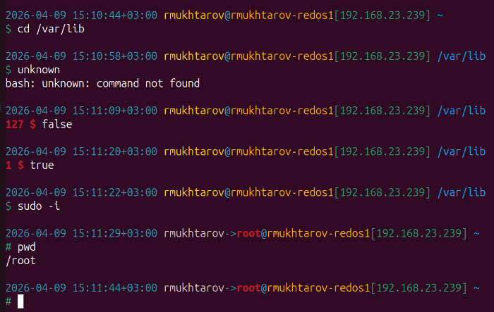

# Удобное цветное приглашение командной строки в `bash` (Convenient colored command line prompt in `bash`)

## Пример снимка экрана



## Что отображается

1. дата и время с часовой зоной
1. пользователь (`root` отображается красным цветом)
1. хост
1. IP адреса
1. путь и каталог

Часть приглашения на второй строке:
* подсвечивается зелёным цветом, если последняя команда выполнилась без ошибок (нулевой код возврата)
* подсвечивается красным цветом, если последняя команда вернула ошибку, дополнительно отображается код ошибки

## Как установить?

Добавьте код ниже в конец файла `~/.bashrc` и перезапустите терминал.

Протестировано в `RHEL 8.9`.

```bash
# Last version and documentation: https://github.com/rin-nas/postgresql-patterns-library/tree/master/bashrc

alias patronictl='patronictl -c /etc/patroni/patroni.yaml'

export EDITOR=nano
export HISTFILESIZE=5000
export HISTCONTROL="ignoredups"
export HISTTIMEFORMAT="%Y-%m-%d %T %z "

# Protect command history loose on exit within parallel terminals
shopt -s histappend

PROMPT_COMMAND=__prompt_command  # function to generate PS1 after CMDs

__prompt_command() {
    local EXIT="$?" # this needs to be first

    # Append the new history lines to the history file
    history -a

    # https://robotmoon.com/bash-prompt-generator/
    local Red='\[\e[1;31m\]'
    local Green='\[\e[0;32m\]'
    local Yellow='\[\e[38;5;220m\]'
    local Blue='\[\e[38;5;39m\]'
    local Orange='\[\e[38;5;214m\]'
    local Magenta='\[\e[0;35m\]'
    local Cyan='\[\e[0;36m\]'
    local Gray='\[\e[0;37m\]'
    local White='\[\e[1;37m\]'
    local Reset='\[\e[0m\]'

    PS1="\n" #newline
    PS1+="${Cyan}$(date --rfc-3339=seconds) " #datetime

    # https://stackoverflow.com/questions/18215973/how-to-check-if-running-as-root-in-a-bash-script
    if [ "${EUID:-$(id -u)}" -eq 0 ]; then
        local REALUSER=$(who -m | cut -f1 -d' ')
        PS1+="${Gray}${REALUSER}${Cyan}->${Red}\u" #user
    else
        PS1+="${Yellow}\u" #user
    fi

    PS1+="${Cyan}@"
    PS1+="${Orange}\h" #host
    PS1+="${Green}[$(hostname -I | xargs)] " # IP list
    PS1+="${Blue}\w" #directory
    PS1+="\n"

    if [ $EXIT != 0 ]; then
        PS1+="${Red}${EXIT}\a \\$ ${Reset}"
    else
        PS1+="${Green}\\$ ${Reset}"
    fi
}
```

## Как сделать так, чтобы при взятии `root` (`sudo su -`) профиль брался от исходного аутентифицированого пользователя?

Отредактируйте файл `/root/.bash_profile`.

Замените 
```bash
if [ -f ~/.bashrc ]; then
    . ~/.bashrc
fi
```

на
```bash
REALUSER_NAME=$(who -m | cut -f1 -d' ')
REALUSER_HOME=$(eval echo "~${REALUSER_NAME}")

if [ -f $REALUSER_HOME/.bashrc ]; then
    . $REALUSER_HOME/.bashrc
elif [ -f ~/.bashrc ]; then
    . ~/.bashrc
fi
```

## Ссылки по теме

* [Удобное цветное приглашение командной строки в `psql`](../psqlrc)
