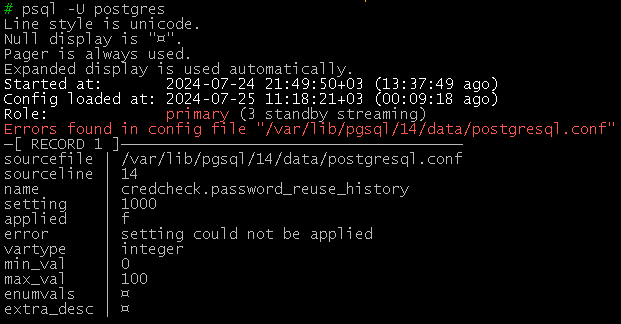

# Удобное цветное приглашение командной строки в `psql` (Convenient colored command line prompt in `psql`)

## Пример снимка экрана основного PostgreSQL

## Пример снимка экрана резервного PostgreSQL

## Что отображается при запуске `psql`

1. дата и время, когда был запущен сервер (и сколько времени прошло)
1. дата и время, когда в последний раз сервер загружал файлы конфигурации (и сколько времени прошло)
1. роль сервера: основной мастер `primary` или резервный реплика `standby`
   1. для `primary` внутри круглых скобок: количество реплик в статусе `streaming`
   1. для `standby` внутри круглых скобок: длительность отставания, название или IP primary сервера

## Что отображается в командной строке `psql`

1. дата и время с часовой зоной
1. версия мажорная и минорная
1. роль сервера: основной мастер `primary` или резервный реплика `standby`
1. пользователь
1. хост
1. порт
1. база данных
1. схема

## Валидация при запуске `psql`

1. Отображаются ошибки в конфигурационном файле `postgresql.conf`, если такие имеются. Выводится название конфигурационного файла и номер строки, название параметра, текст ошибки.
1. Отображаются ошибки в конфигурационном файле `pg_hba.conf`, если такие имеются. Выводится название конфигурационного файла и номера строки, название параметра, текст ошибки.
1. При необходимости перезагрузить СУБД отображается предупреждение. Выводится название конфигурационного файла и номер строки, название параметра, его текущее и будущее значение.
1. При необходимости перечитать конфигурацию СУБД отображается замечание. Выводится название конфигурационного файла и номер строки, название параметра, его текущее и будущее значение.
1. Отображается замечание в случае наличия неиспользуемых (неактивных) слотов репликации, которые могут быть причиной разрастания количества WAL файлов.

Пример отображения ошибки

## Поддержка внешнего ПО

Используется пейджер [`pspg`](https://github.com/okbob/pspg), если он установлен. Иначе используется [`less`](https://en.wikipedia.org/wiki/Less_(Unix)).

## Как установить

* Требования к версиям: `psql 12+`, `PostgreSQL 12+`
* Документация: https://postgrespro.ru/docs/postgresql/16/app-psql#APP-PSQL-FILES-PSQLRC
* Файл с конфигурацией: [`psqlrc`](psqlrc)

## Ссылки по теме

* [Удобное цветное приглашение командной строки в `bash`](../bashrc)
* https://wiki.postgresql.org/wiki/Psqlrc
* [Как использовать `pspg`, видео на русском языке](https://pgconf.ru/talk/1589147)
