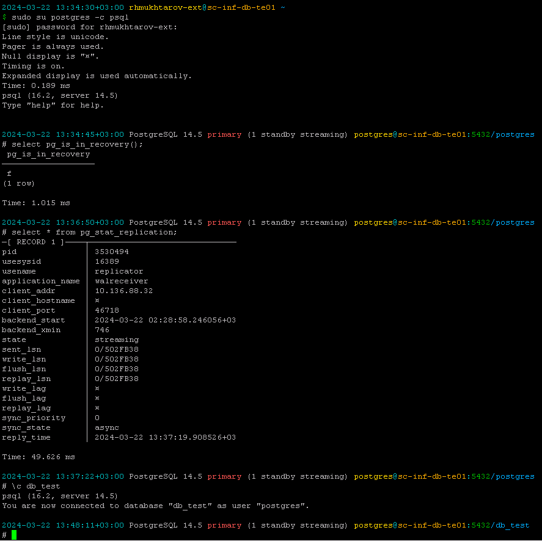
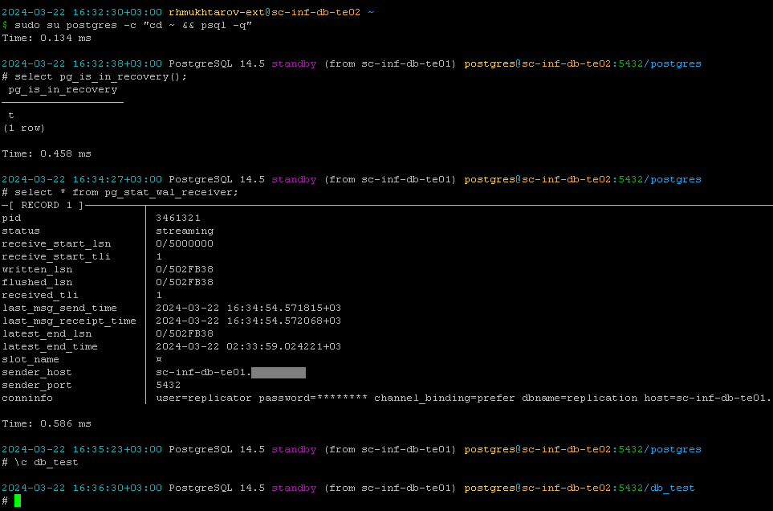

# Удобное цветное приглашение командной строки в `psql`

## Пример снимка экрана основного PostgreSQL

## Пример снимка экрана резервного PostgreSQL

## Что отображается

1. дата-время с часовой зоной
1. версия мажорная и минорная
1. роль сервера: основной мастер `primary` или резервный реплика `standby`
   1. для `primary` внутри круглых скобок количество реплик в статусе `streaming`
   1. для `standby` внутри круглых скобок название или IP primary сервера
1. имя пользователя, под которым подключились
1. название хоста
1. порт
1. название базы данных

## Поддержка внешнего ПО

Используется пейджер [`pspg`](https://github.com/okbob/pspg), если он установлен. Иначе используется [`less`](https://en.wikipedia.org/wiki/Less_(Unix)).

## Как установить

* Документация: https://postgrespro.ru/docs/postgresql/16/app-psql#APP-PSQL-FILES-PSQLRC
* Файл с конфигурацией: [`psqlrc`](psqlrc)
