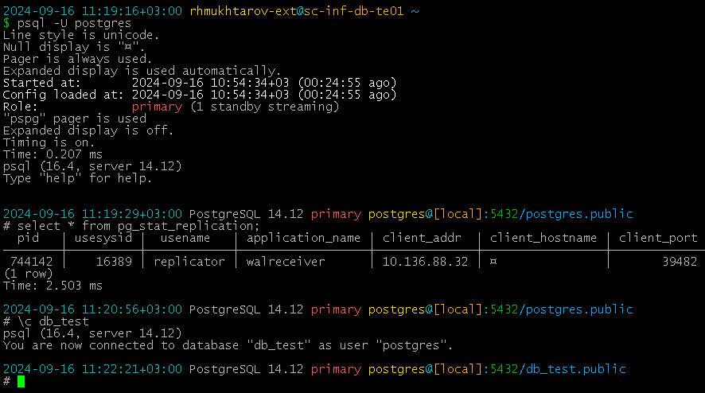
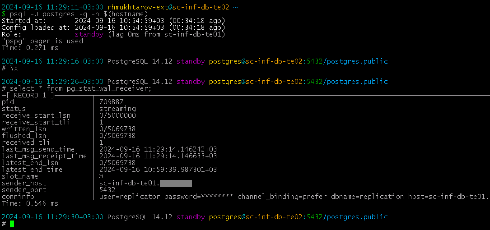
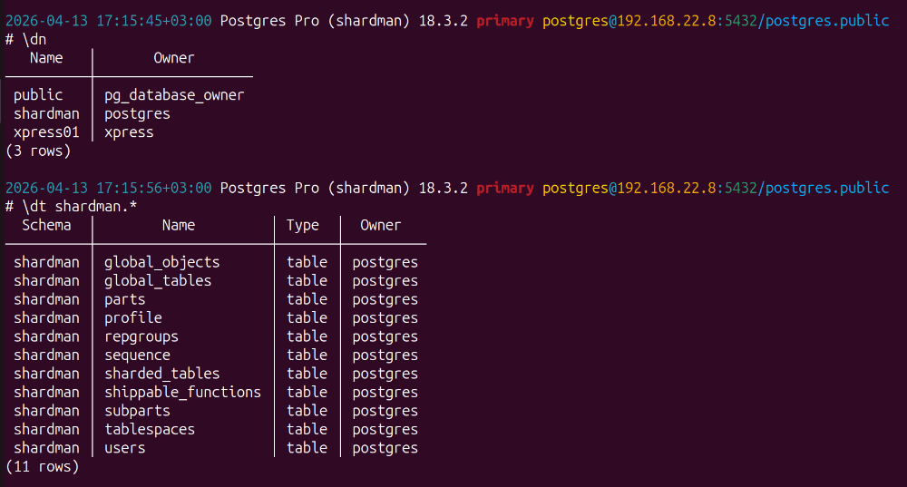
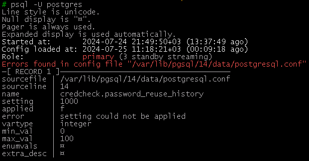
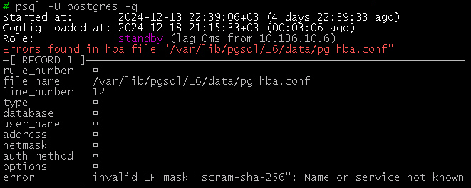
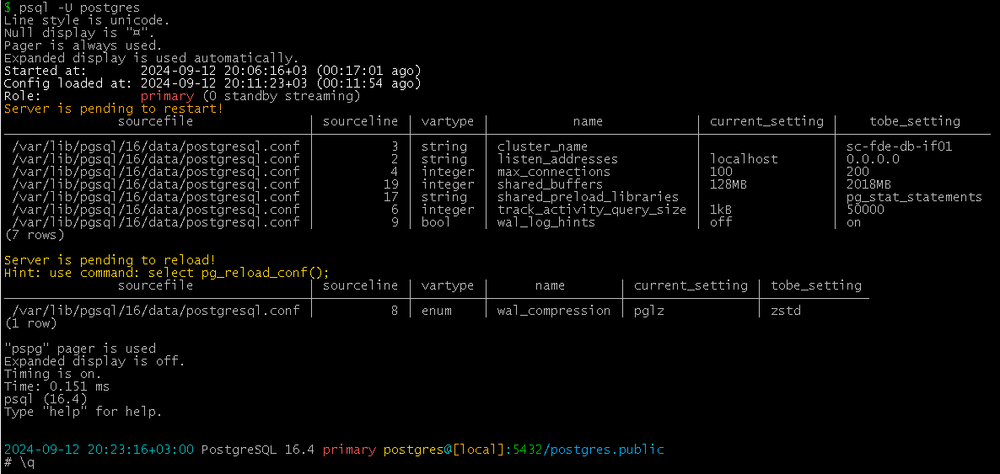

# Удобное цветное приглашение командной строки в `psql` (Convenient colored command line prompt in `psql`)

## Введение

Функциональность предназначена для администраторов СУБД PostgreSQL.
Необходимо использовать учётную запись `postgres`, иначе будет работать не полностью (из-за нехватки прав доступа к объектам СУБД).

## Пример снимка экрана основного PostgreSQL (мастер)



## Пример снимка экрана резервного PostgreSQL (реплика)



## Пример снимка экрана продуктов Postgres Pro



### Пример для `.psql.simple`

```
[postgres@rmukhtarov-redos1 ~]$ psql demo --no-psqlrc
psql (18.3, server 17.9)
Type "help" for help.

demo=# \d+
                                                             List of relations
  Schema  |         Name          |   Type   |  Owner   | Persistence | Access method |    Size    |              Description               
----------+-----------------------+----------+----------+-------------+---------------+------------+----------------------------------------
 bookings | airplanes             | view     | postgres | permanent   |               | 0 bytes    | Airplanes
 bookings | airplanes_data        | table    | postgres | permanent   | heap          | 16 kB      | Airplanes (internal multilingual data)
 bookings | airports              | view     | postgres | permanent   |               | 0 bytes    | Airports
 bookings | airports_data         | table    | postgres | permanent   | heap          | 1288 kB    | Airports (internal multilingual data)
 bookings | axedemo_flights       | view     | postgres | permanent   |               | 0 bytes    | 
 bookings | boarding_passes       | table    | postgres | permanent   | heap          | 839 MB     | Boarding passes
 bookings | bookings              | table    | postgres | permanent   | heap          | 246 MB     | Bookings
 bookings | flights               | table    | postgres | permanent   | heap          | 5928 kB    | Flights
 bookings | flights_flight_id_seq | sequence | postgres | permanent   |               | 8192 bytes | 
 bookings | routes                | table    | postgres | permanent   | heap          | 552 kB     | Routes
 bookings | seats                 | table    | postgres | permanent   | heap          | 120 kB     | Seats
 bookings | segments              | table    | postgres | permanent   | heap          | 933 MB     | Flight segment (leg)
 bookings | tickets               | table    | postgres | permanent   | heap          | 876 MB     | Tickets
 bookings | timetable             | view     | postgres | permanent   |               | 0 bytes    | Detailed info about flights
(14 rows)

demo=# 
```

```
[postgres@rmukhtarov-redos1 ~]$ psql demo
Server role:      standalone
Started at:       2026-05-28 19:11:54+03 (21:46:56 ago)
Config loaded at: 2026-05-29 15:34:16+03 (01:24:34 ago)
psql (18.3, server 17.9)
Type "help" for help.


2026-05-29 16:58:49+03:00  Postgres Pro (enterprise) 17.9.2  postgres@[local]:5432/demo
=# \d+
                                                             List of relations
  Schema  │         Name          │   Type   │  Owner   │ Persistence │ Access method │    Size    │              Description               
──────────┼───────────────────────┼──────────┼──────────┼─────────────┼───────────────┼────────────┼────────────────────────────────────────
 bookings │ airplanes             │ view     │ postgres │ permanent   │ ¤             │ 0 bytes    │ Airplanes
 bookings │ airplanes_data        │ table    │ postgres │ permanent   │ heap          │ 16 kB      │ Airplanes (internal multilingual data)
 bookings │ airports              │ view     │ postgres │ permanent   │ ¤             │ 0 bytes    │ Airports
 bookings │ airports_data         │ table    │ postgres │ permanent   │ heap          │ 1288 kB    │ Airports (internal multilingual data)
 bookings │ axedemo_flights       │ view     │ postgres │ permanent   │ ¤             │ 0 bytes    │ ¤
 bookings │ boarding_passes       │ table    │ postgres │ permanent   │ heap          │ 839 MB     │ Boarding passes
 bookings │ bookings              │ table    │ postgres │ permanent   │ heap          │ 246 MB     │ Bookings
 bookings │ flights               │ table    │ postgres │ permanent   │ heap          │ 5928 kB    │ Flights
 bookings │ flights_flight_id_seq │ sequence │ postgres │ permanent   │ ¤             │ 8192 bytes │ ¤
 bookings │ routes                │ table    │ postgres │ permanent   │ heap          │ 552 kB     │ Routes
 bookings │ seats                 │ table    │ postgres │ permanent   │ heap          │ 120 kB     │ Seats
 bookings │ segments              │ table    │ postgres │ permanent   │ heap          │ 933 MB     │ Flight segment (leg)
 bookings │ tickets               │ table    │ postgres │ permanent   │ heap          │ 876 MB     │ Tickets
 bookings │ timetable             │ view     │ postgres │ permanent   │ ¤             │ 0 bytes    │ Detailed info about flights
(14 rows)


2026-05-29 16:58:51+03:00  Postgres Pro (enterprise) 17.9.2  postgres@[local]:5432/demo
=# 
```

## Что отображается при запуске `psql`

1. дата и время, когда был запущен сервер (и сколько времени прошло)
1. дата и время, когда в последний раз сервер загружал файлы конфигурации (и сколько времени прошло)
1. роль сервера: основной (мастер) `primary` или резервный (реплика) `standby`
   1. для `primary` внутри круглых скобок: количество реплик в статусе `streaming`
   1. для `standby` внутри круглых скобок: длительность отставания, название или IP primary сервера

## Что отображается в командной строке `psql`

1. дата и время с часовой зоной
1. версия сервера: основная (мажорная) и дополнительная (минорная)
1. роль сервера: основной (мастер) `primary` или резервный (реплика) `standby`
1. пользователь
1. хост
1. порт
1. база данных
1. схема

## Валидация при запуске `psql`

1. Отображаются ошибки в конфигурационном файле `postgresql.conf`, если такие имеются. Выводится название конфигурационного файла и номер строки, название параметра, текст ошибки.
1. Отображаются ошибки в конфигурационном файле `pg_hba.conf`, если такие имеются. Выводится название конфигурационного файла и номера строки, название параметра, текст ошибки.
1. При необходимости перезагрузить СУБД отображается предупреждение. Выводится название конфигурационного файла и номер строки, название параметра, его текущее и будущее значение.
1. При необходимости перечитать конфигурацию СУБД отображается замечание. Выводится название конфигурационного файла и номер строки, название параметра, его текущее и будущее значение.
1. Отображается замечание в случае наличия неиспользуемых (неактивных) слотов репликации, которые могут быть причиной разрастания количества WAL файлов.

Пример отображения ошибок





Пример отображения предупреждений и замечаний



## Поддержка внешнего ПО

Используется пейджер [`pspg`](https://github.com/okbob/pspg), если он установлен. Иначе используется [`less`](https://en.wikipedia.org/wiki/Less_(Unix)).

## Как установить

* Требования к версиям: `psql 12+`, `PostgreSQL 12+`
* Документация: https://postgrespro.ru/docs/postgresql/current/app-psql#APP-PSQL-FILES-PSQLRC
* Файл с продвинутой конфигурацией: [`~/.psqlrc`](.psqlrc.advanced)
* Файл с простой конфигурацией: [`~/.psqlrc`](.psqlrc.simple)

```bash
nano ~/.psqlrc
```

## Ссылки по теме

* [Удобное цветное приглашение командной строки в `bash`](../bashrc)
* https://wiki.postgresql.org/wiki/Psqlrc
* [Как использовать `pspg`, видео на русском языке](https://pgconf.ru/talk/1589147)
